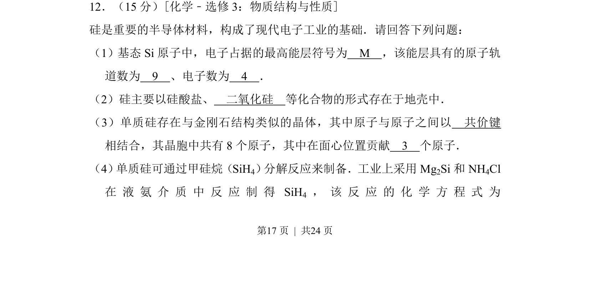
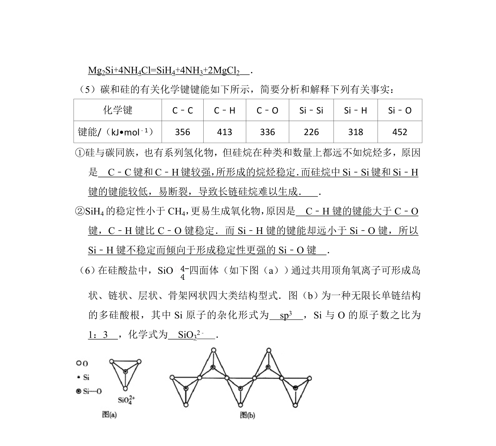
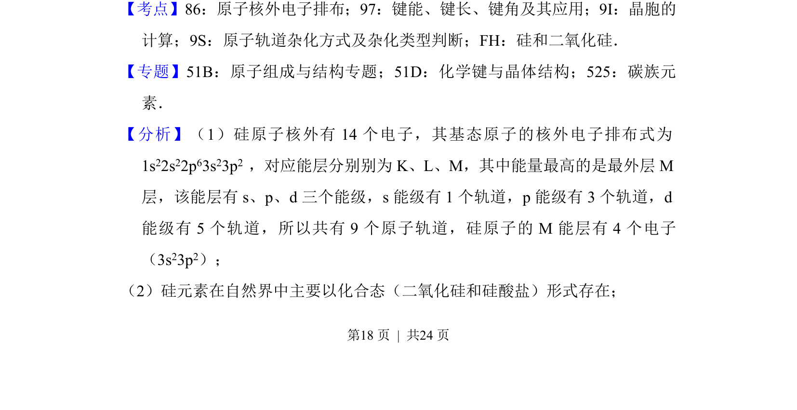
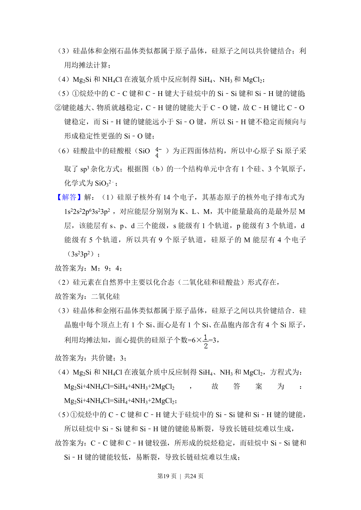
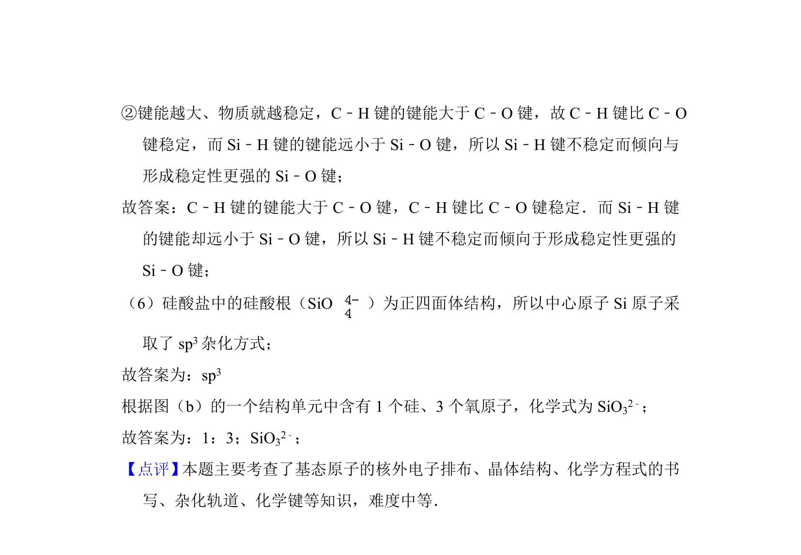

## 题面

## 摘要

考查硅的原子结构、存在形式、晶体结构及甲硅烷制备的化学方程式书写。

## 关联考点

- [[384-原子轨道|原子轨道]]
- [[394-能层|能层]]
- [[晶体结构]]
- [[052-化学方程式|化学方程式]]

## 答案与解析

> 📄 原 PDF 第 17 页：`素材/真题/湖南/2008-2024·（湖南）化学高考真题/2013年高考化学试卷（新课标Ⅰ）（解析卷）.pdf`
