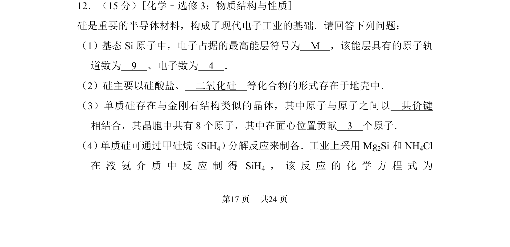
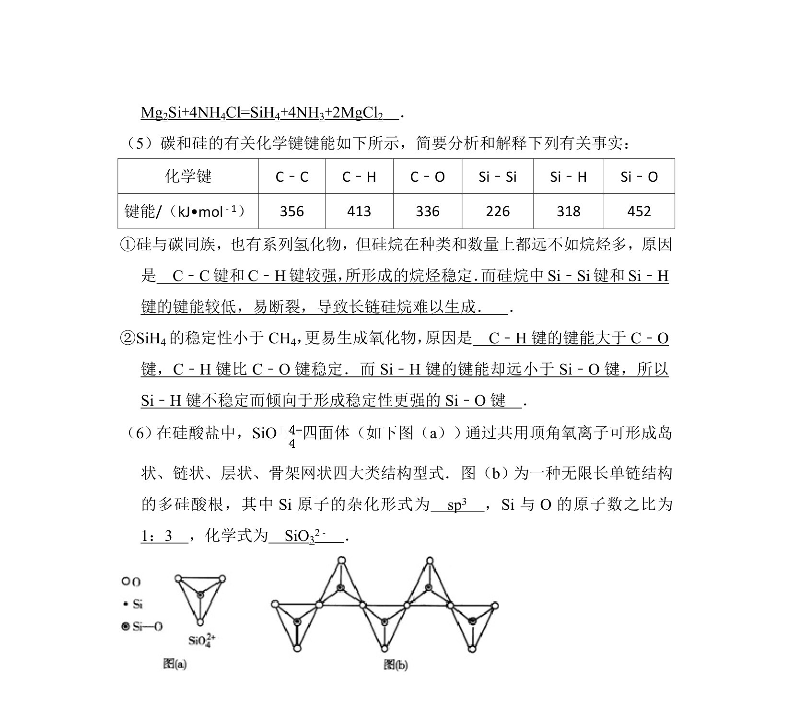
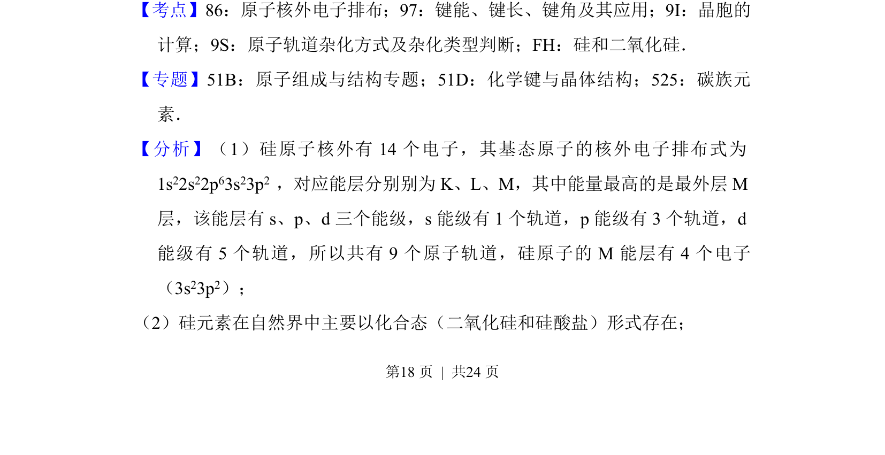
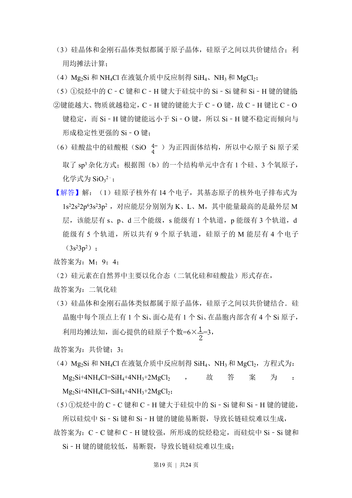
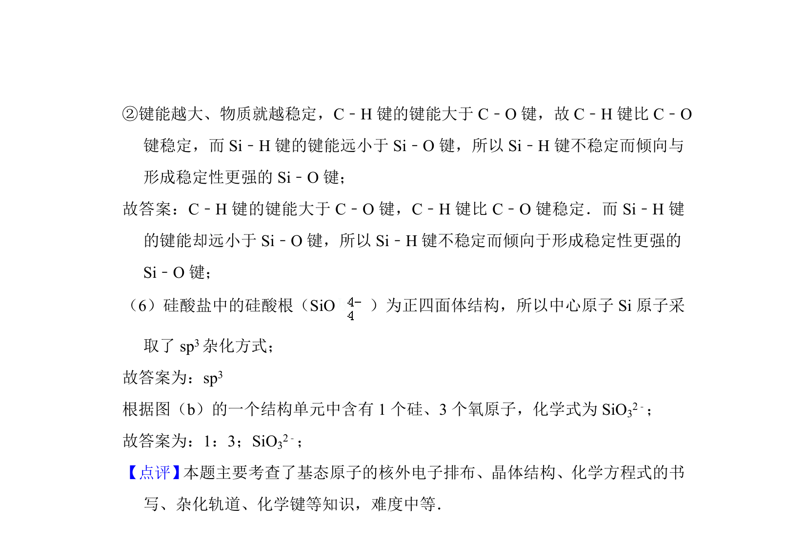

## 题面

## 摘要

考查硅的原子结构、存在形式、晶体结构及甲硅烷制备的化学方程式书写。

## 关联考点

- [[384-原子轨道|原子轨道]]
- [[394-能层|能层]]
- [[晶体结构]]
- [[052-化学方程式|化学方程式]]

## 答案与解析

> 📄 原 PDF 第 17 页：`素材/真题/湖南/2008-2024·（湖南）化学高考真题/2013年高考化学试卷（新课标Ⅰ）（解析卷）.pdf`

<!-- 题干文本-start -->
## 题干文本
12．（15分）[化学﹣选修3：物质结构与性质]
硅是重要的半导体材料，构成了现代电子工业的基础．请回答下列问题：
（1）基态Si原子中，电子占据的最高能层符号为　M　，该能层具有的原子轨
道数为　9　、电子数为　4　．
（2）硅主要以硅酸盐、　二氧化硅　等化合物的形式存在于地壳中．
（3）单质硅存在与金刚石结构类似的晶体，其中原子与原子之间以　共价键　
相结合，其晶胞中共有8个原子，其中在面心位置贡献　3　个原子．
（4） 单质硅可通过甲硅烷（SiH4） 分解反应来制备．工业上采用Mg2Si和NH 4Cl
在 液 氨 介 质 中 反 应 制 得SiH 4 ， 该 反 应 的 化 学 方 程 式 为
<!-- 题干文本-end -->

<!-- 解析文本-start -->
## 解析文本

<!-- 解析文本-end -->
