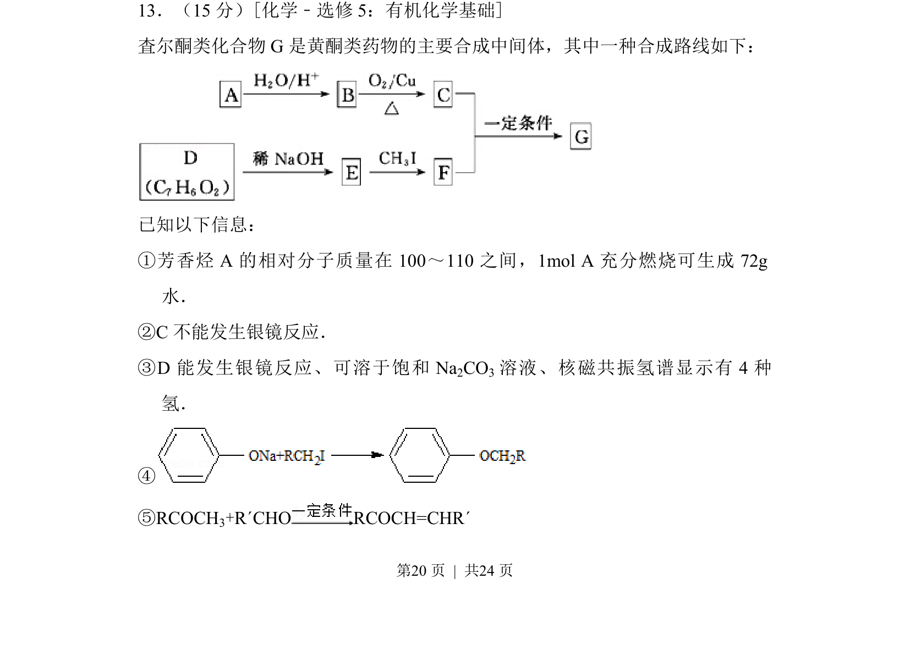
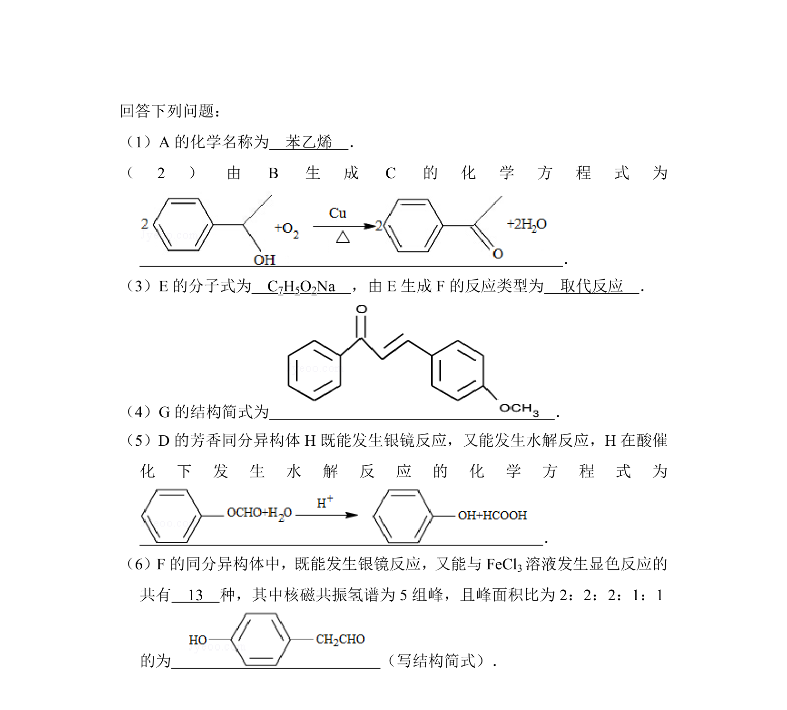
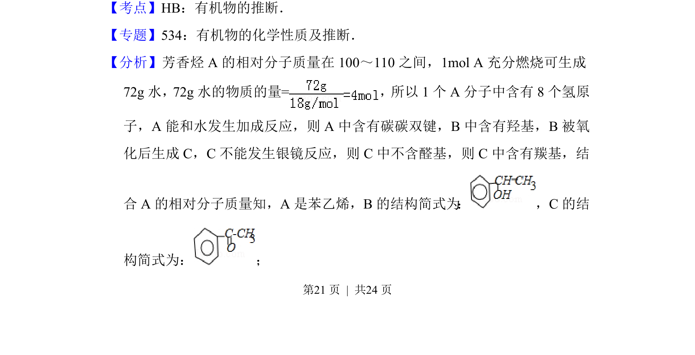
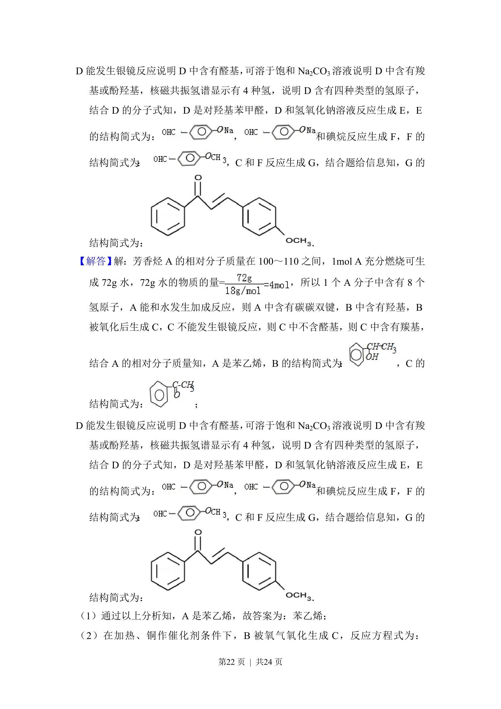
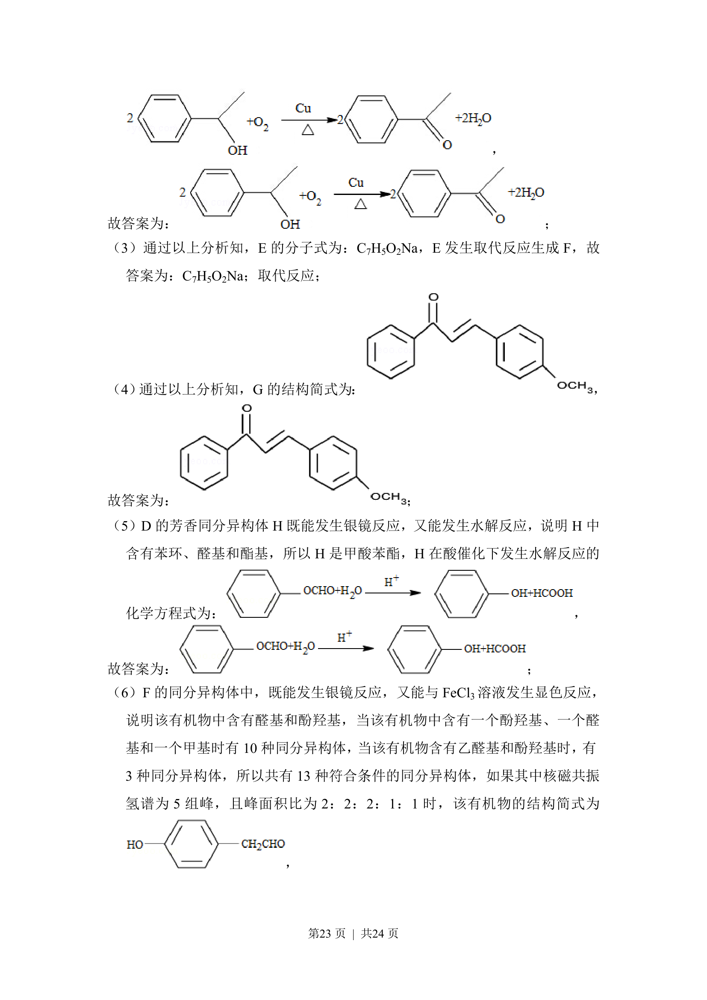
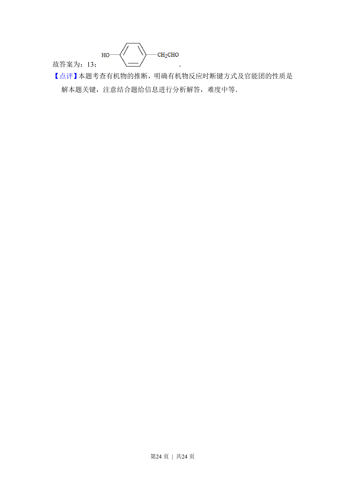

## 题面

## 摘要

本题为有机合成推断题，通过芳香烃燃烧数据、特征反应和波谱信息推断中间体结构并合成查尔酮类化合物。

## 关联考点

- [[545-有机推断|有机推断]]
- [[663-官能团性质|官能团性质]]
- [[646-反应类型|反应类型]]
- [[653-合成路线|合成路线]]

## 答案与解析

> 📄 原 PDF 第 20 页：`素材/真题/湖南/2008-2024·（湖南）化学高考真题/2013年高考化学试卷（新课标Ⅰ）（解析卷）.pdf`
