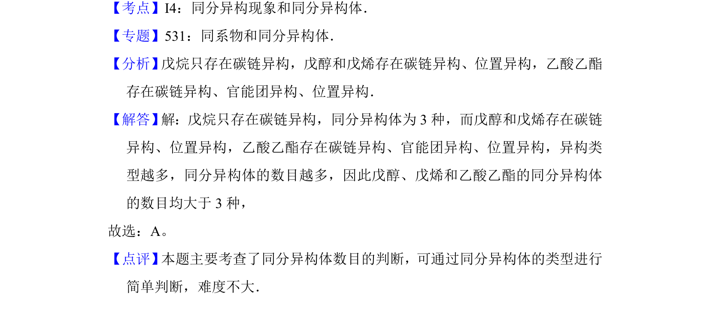

## 题面

## 摘要

比较戊烷、戊醇、戊烯、乙酸乙酯的同分异构体数目

## 关联考点

- [[446-同分异构体|同分异构体]]
- [[碳链异构]]
- [[位置异构]]
- [[官能团异构]]

## 答案与解析

> 📄 原 PDF 第 1 页：`素材/真题/湖南/2008-2024·（湖南）化学高考真题/2014年高考化学试卷（新课标Ⅰ）（解析卷）.pdf`

<!-- 题干文本-start -->
## 题干文本
1．（6分）下列化合物中同分异构体数目最少的是（　　）
A．戊烷B．戊醇C．戊烯D．乙酸乙酯
<!-- 题干文本-end -->

<!-- 解析文本-start -->
## 解析文本
【考点】I4：同分异构现象和同分异构体．菁优网版权所有
【专题】531：同系物和同分异构体．
【分析】 戊烷只存在碳链异构，戊醇和戊烯存在碳链异构、位置异构，乙酸乙酯
存在碳链异构、官能团异构、位置异构．
【解答】 解：戊烷只存在碳链异构，同分异构体为3种，而戊醇和戊烯存在碳链
异构、位置异构，乙酸乙酯存在碳链异构、官能团异构、位置异构，异构类
型越多，同分异构体的数目越多，因此戊醇、戊烯和乙酸乙酯的同分异构体
的数目均大于3种，
故选：A。
【点评】 本题主要考查了同分异构体数目的判断，可通过同分异构体的类型进行
简单判断，难度不大．
<!-- 解析文本-end -->
