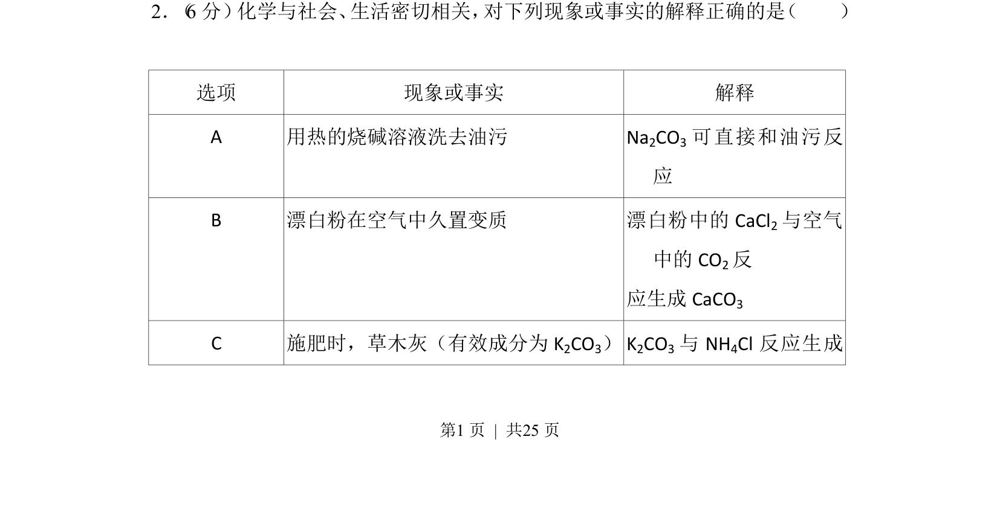
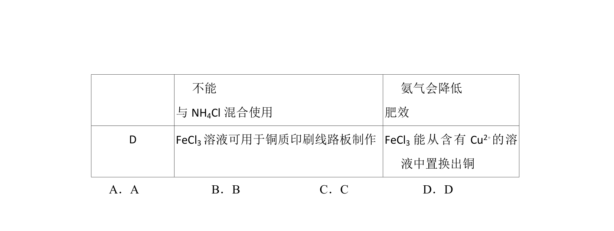
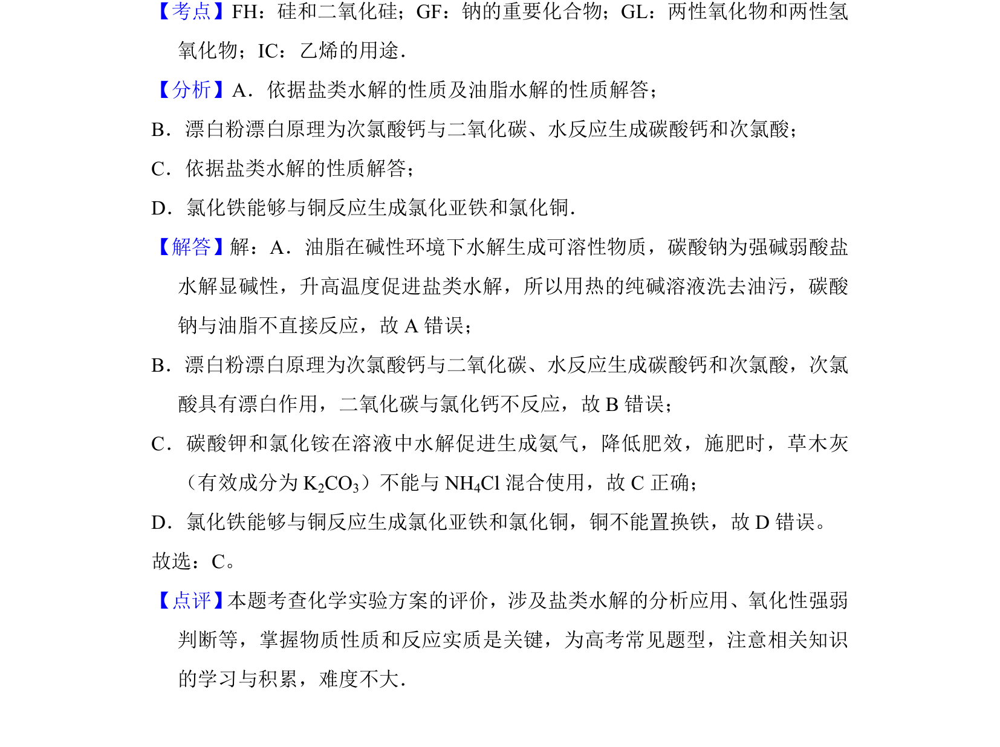

## 题面

## 摘要

用化学知识解释生活现象的正误判断，涉及纯碱去油污、漂白粉变质和草木灰混施等。

## 关联考点

- [[336-盐类水解|盐类水解]]
- [[204-漂白粉|漂白粉]]
- [[铵盐与碱反应]]

## 答案与解析

> 📄 原 PDF 第 1 页：`素材/真题/湖南/2008-2024·（湖南）化学高考真题/2014年高考化学试卷（新课标Ⅰ）（解析卷）.pdf`
