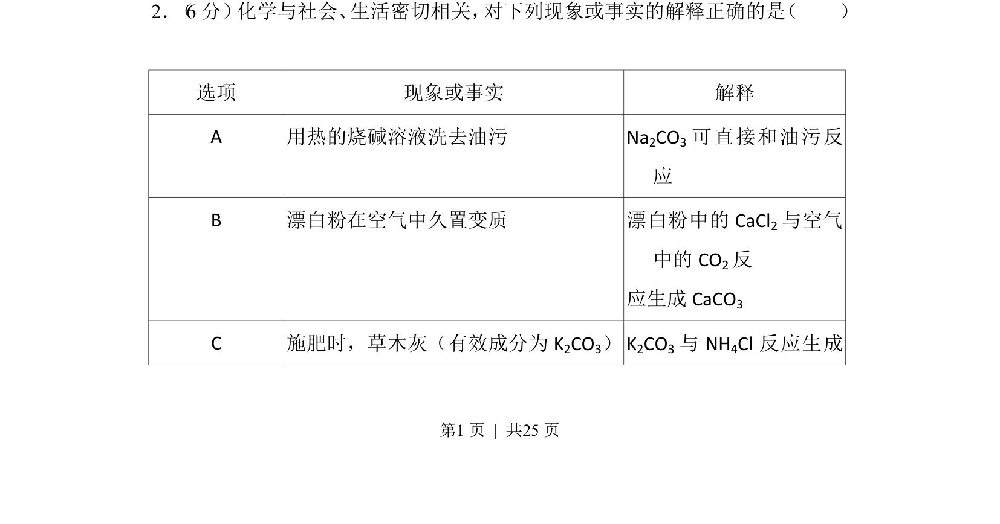
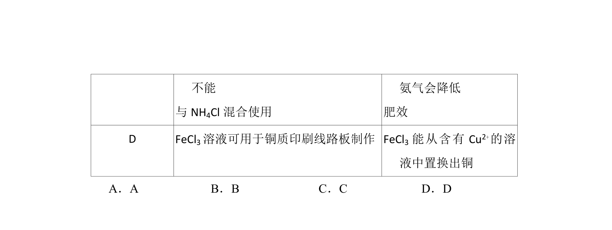
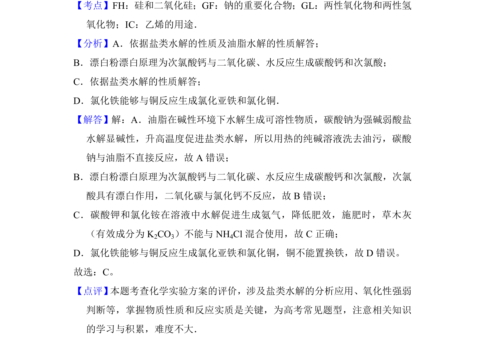

## 题面

## 摘要

用化学知识解释生活现象的正误判断，涉及纯碱去油污、漂白粉变质和草木灰混施等。

## 关联考点

- [[336-盐类水解|盐类水解]]
- [[204-漂白粉|漂白粉]]
- [[铵盐与碱反应]]

## 答案与解析

> 📄 原 PDF 第 1 页：`素材/真题/湖南/2008-2024·（湖南）化学高考真题/2014年高考化学试卷（新课标Ⅰ）（解析卷）.pdf`

<!-- 题干文本-start -->
## 题干文本
2． （6分） 化学与社会、 生活密切相关， 对下列现象或事实的解释正确的是 （　　） 
选项 现象或事实 解释
A 用热的烧碱溶液洗去油污 Na2CO3 可直接和油污反
应
B 漂白粉在空气中久置变质 漂白粉中的CaCl 2与空气
中的CO 2反
应生成CaCO 3
C 施肥时，草木灰（有效成分为K 2CO3） K2CO3与NH 4Cl反应生成
<!-- 题干文本-end -->

<!-- 解析文本-start -->
## 解析文本

<!-- 解析文本-end -->
