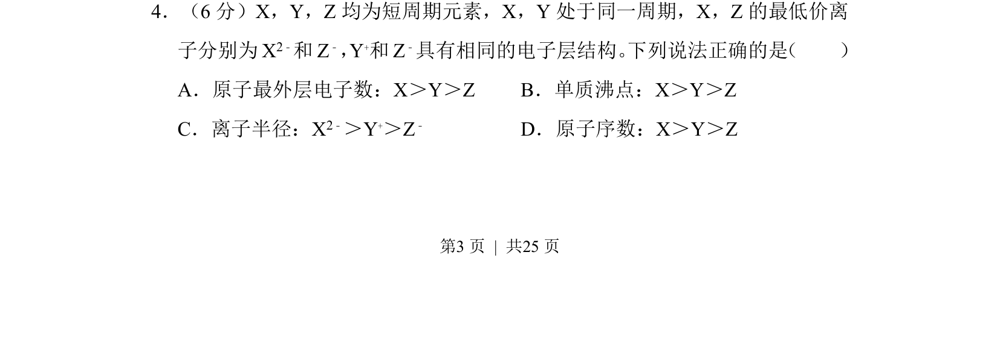
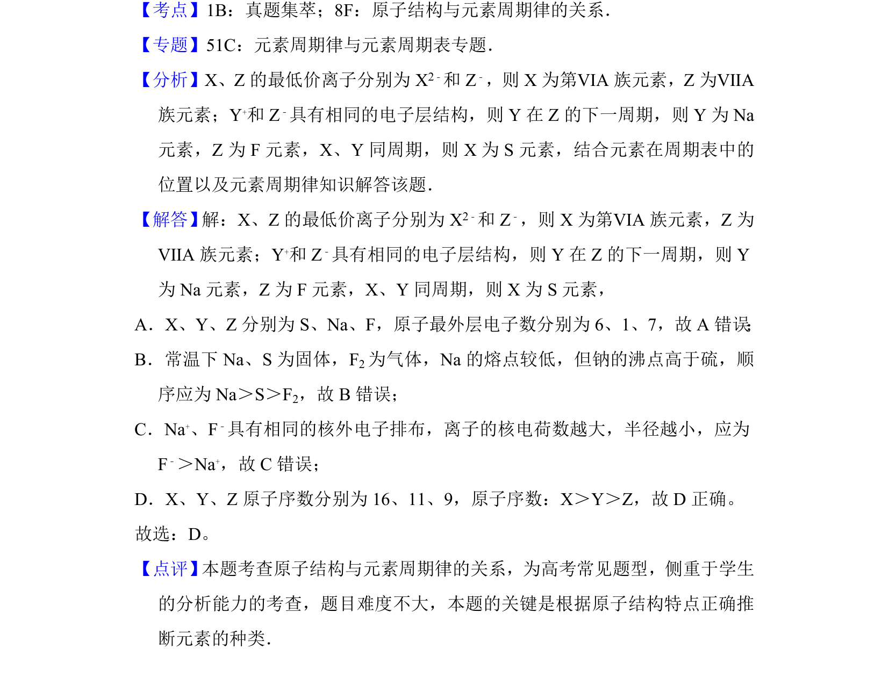

## 题面

## 摘要

短周期元素推断及周期性变化规律比较

## 关联考点

- [[252-元素周期律|元素周期律]]
- [[426-原子结构|原子结构]]
- [[离子半径比较]]

## 答案与解析

> 📄 原 PDF 第 3 页：`素材/真题/湖南/2008-2024·（湖南）化学高考真题/2014年高考化学试卷（新课标Ⅰ）（解析卷）.pdf`

<!-- 题干文本-start -->
## 题干文本
4．（6分）X，Y，Z均为短周期元素，X，Y处于同一周期，X，Z的最低价离
子分别为X 2﹣和Z ﹣，Y+和Z ﹣具有相同的电子层结构。 下列说法正确的是 （　　）
A．原子最外层电子数：X＞Y＞Z B．单质沸点：X＞Y＞Z
C．离子半径：X2﹣＞Y+＞Z﹣ D．原子序数：X＞Y＞Z
<!-- 题干文本-end -->

<!-- 解析文本-start -->
## 解析文本

<!-- 解析文本-end -->
