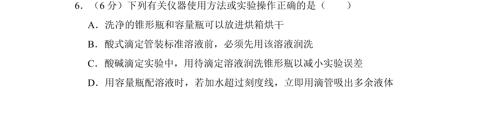
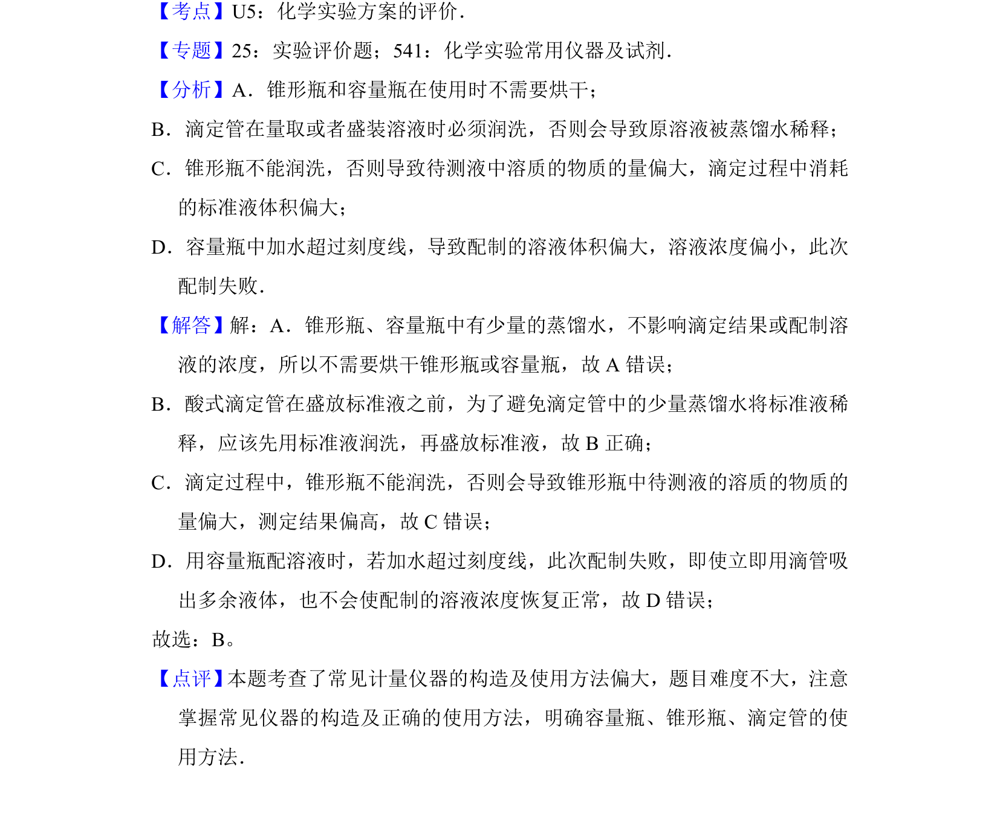

## 题面

## 摘要

考查化学实验基本操作，涉及仪器使用、滴定与溶液配制的正确方法。

## 关联考点

- [[613-化学实验方案评价|化学实验方案评价]]
- [[滴定管润洗]]
- [[容量瓶使用]]
- [[锥形瓶使用]]

## 答案与解析

> 📄 原 PDF 第 6 页：`素材/真题/湖南/2008-2024·（湖南）化学高考真题/2014年高考化学试卷（新课标Ⅰ）（解析卷）.pdf`
