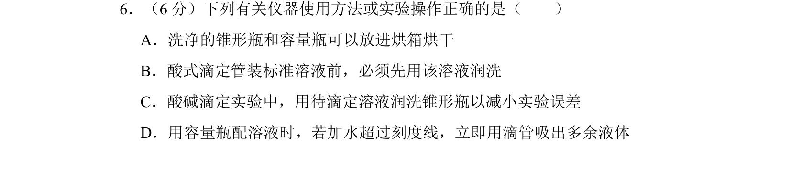
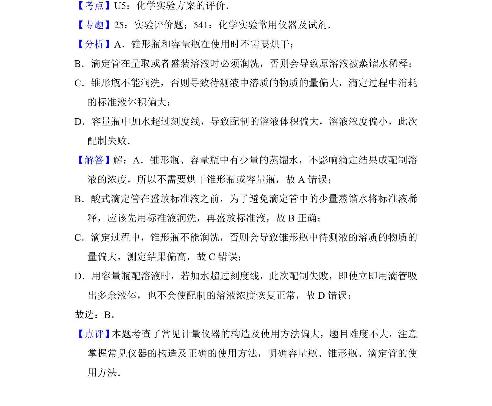

## 题面

## 摘要

考查化学实验基本操作，涉及仪器使用、滴定与溶液配制的正确方法。

## 关联考点

- [[613-化学实验方案评价|化学实验方案评价]]
- [[滴定管润洗]]
- [[容量瓶使用]]
- [[锥形瓶使用]]

## 答案与解析

> 📄 原 PDF 第 6 页：`素材/真题/湖南/2008-2024·（湖南）化学高考真题/2014年高考化学试卷（新课标Ⅰ）（解析卷）.pdf`

<!-- 题干文本-start -->
## 题干文本
6．（6分）下列有关仪器使用方法或实验操作正确的是（　　）
A．洗净的锥形瓶和容量瓶可以放进烘箱烘干
B．酸式滴定管装标准溶液前，必须先用该溶液润洗
C．酸碱滴定实验中，用待滴定溶液润洗锥形瓶以减小实验误差
D．用容量瓶配溶液时，若加水超过刻度线，立即用滴管吸出多余液体
<!-- 题干文本-end -->

<!-- 解析文本-start -->
## 解析文本
【考点】U5：化学实验方案的评价．菁优网版权所有
【专题】25：实验评价题；541：化学实验常用仪器及试剂．
【分析】A．锥形瓶和容量瓶在使用时不需要烘干；
B．滴定管在量取或者盛装溶液时必须润洗，否则会导致原溶液被蒸馏水稀释；
C．锥形瓶不能润洗，否则导致待测液中溶质的物质的量偏大，滴定过程中消耗
的标准液体积偏大；
D．容量瓶中加水超过刻度线，导致配制的溶液体积偏大，溶液浓度偏小，此次
配制失败．
【解答】解：A．锥形瓶、容量瓶中有少量的蒸馏水，不影响滴定结果或配制溶
液的浓度，所以不需要烘干锥形瓶或容量瓶，故A错误；
B．酸式滴定管在盛放标准液之前，为了避免滴定管中的少量蒸馏水将标准液稀
释，应该先用标准液润洗，再盛放标准液，故B正确；
C．滴定过程中，锥形瓶不能润洗，否则会导致锥形瓶中待测液的溶质的物质的
量偏大，测定结果偏高，故C错误；
D．用容量瓶配溶液时，若加水超过刻度线，此次配制失败，即使立即用滴管吸
出多余液体，也不会使配制的溶液浓度恢复正常，故D错误；
故选：B。
【点评】 本题考查了常见计量仪器的构造及使用方法偏大，题目难度不大，注意
掌握常见仪器的构造及正确的使用方法，明确容量瓶、锥形瓶、滴定管的使
用方法．
<!-- 解析文本-end -->
