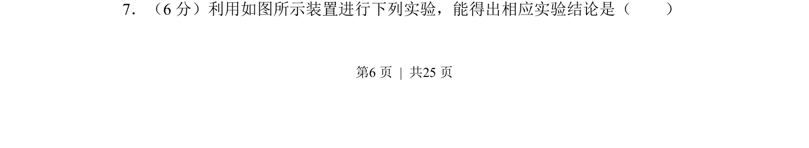
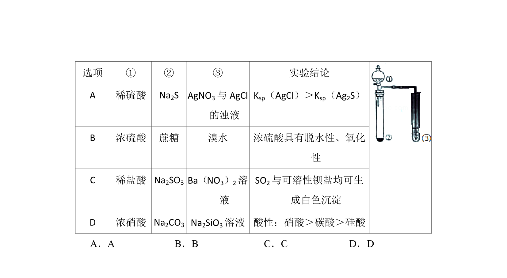
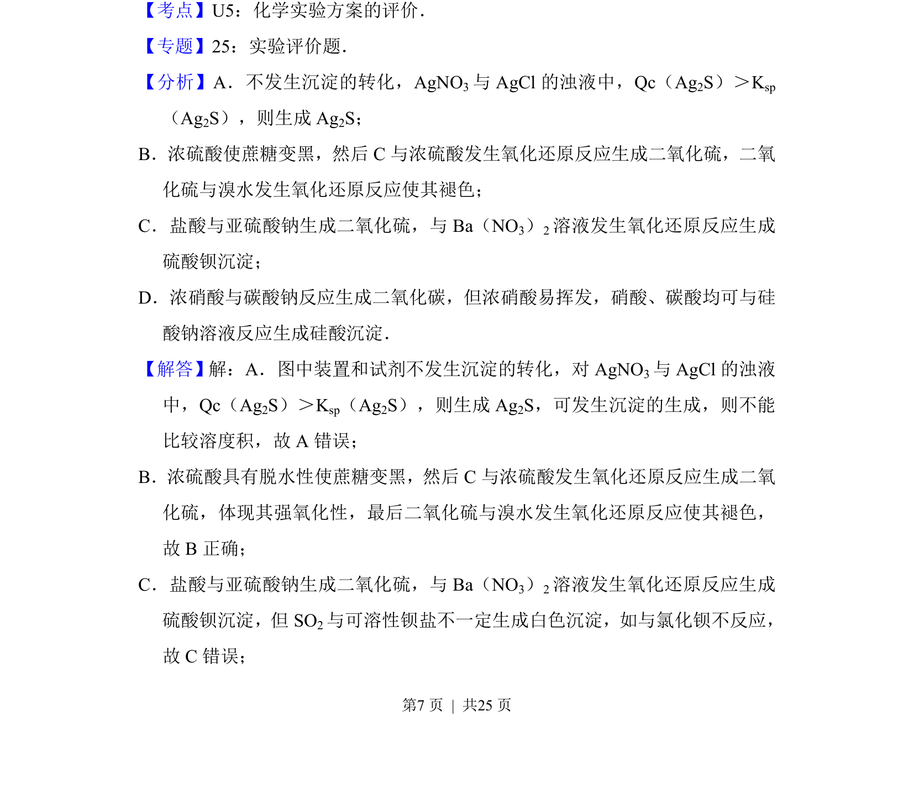
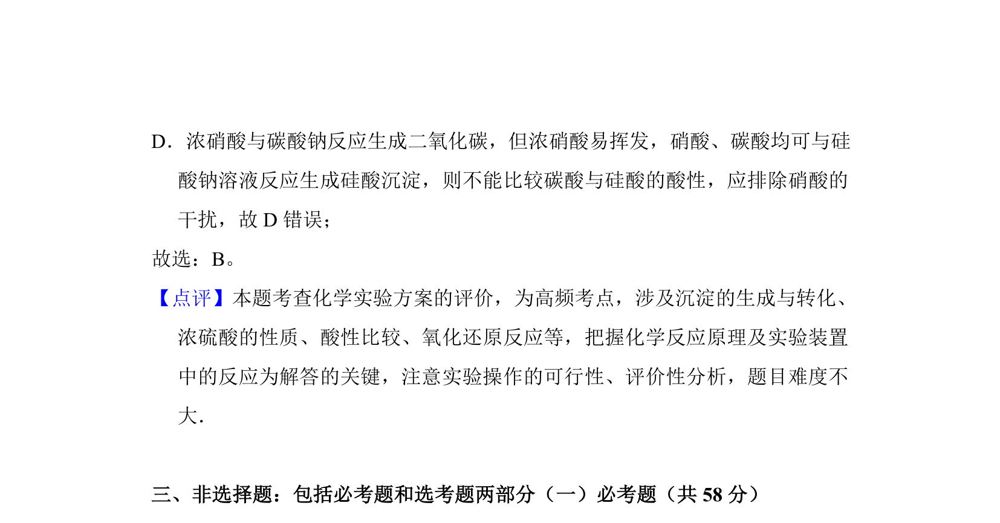

## 题面

## 摘要

考查利用实验装置进行物质制备与性质验证，分析实验设计能否得出预期结论

## 关联考点

- [[997-实验装置分析|实验装置分析]]
- [[气体制备与收集]]
- [[物质性质验证]]
- [[实验结论评价]]

## 答案与解析

> 📄 原 PDF 第 6 页：`素材/真题/湖南/2008-2024·（湖南）化学高考真题/2014年高考化学试卷（新课标Ⅰ）（解析卷）.pdf`
