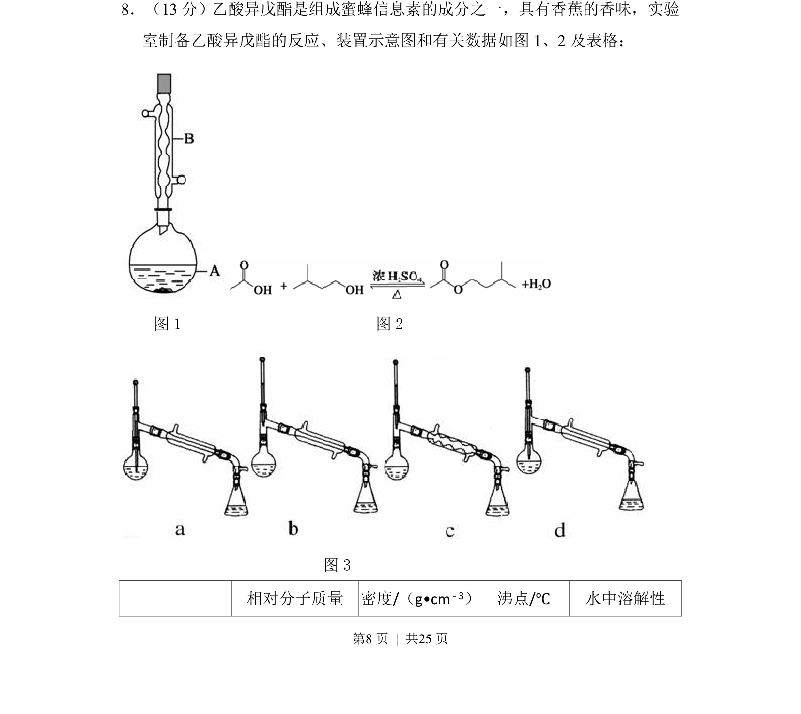
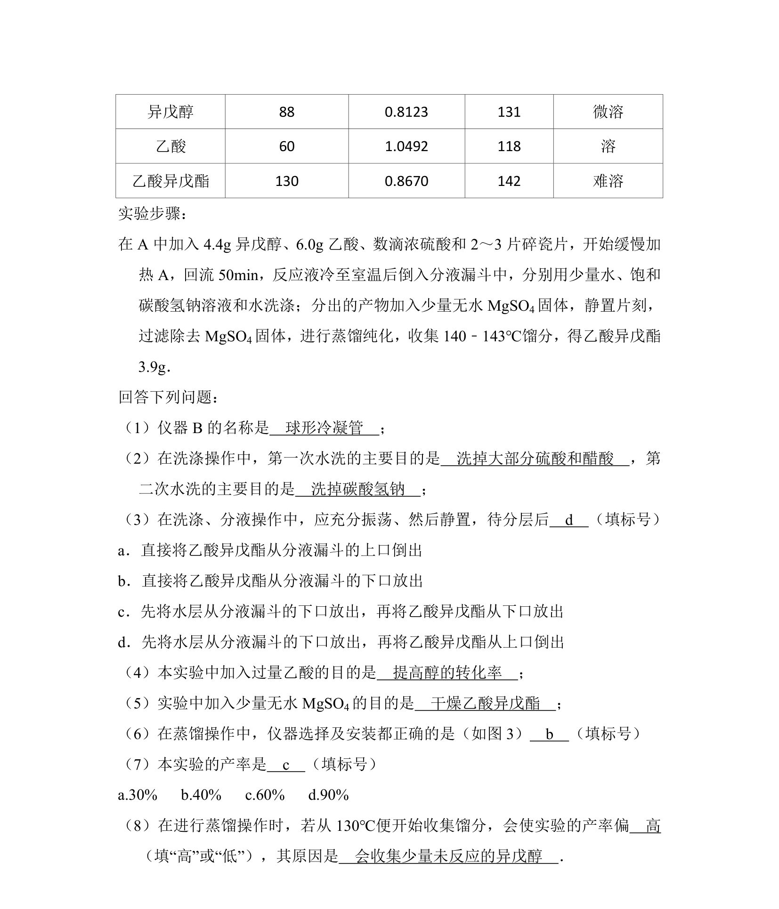
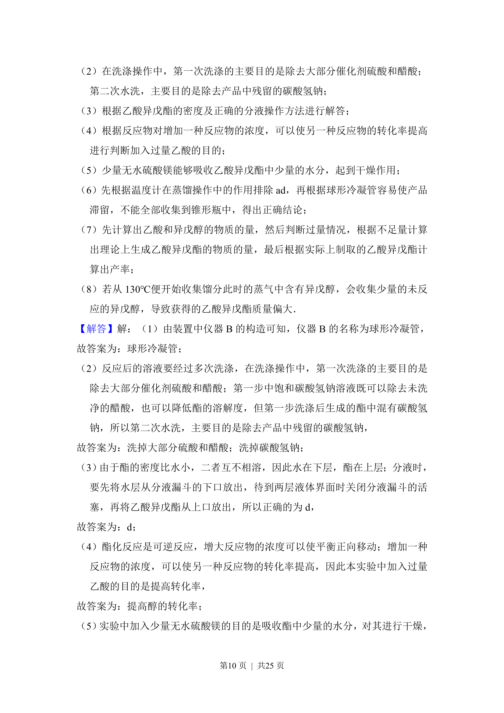
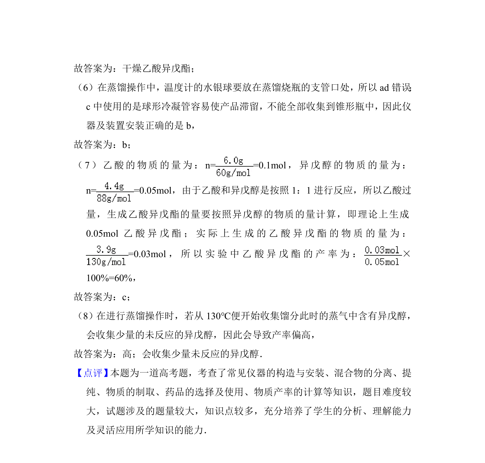

## 题面

## 摘要

实验室制备乙酸异戊酯的有机实验题，涉及酯化反应、装置选择、分离提纯及产率计算。

## 关联考点

- [[250-酯化反应|酯化反应]]
- [[996-实验装置|实验装置]]
- [[分液与蒸馏]]
- [[591-产率计算|产率计算]]

## 答案与解析

> 📄 原 PDF 第 8 页：`素材/真题/湖南/2008-2024·（湖南）化学高考真题/2014年高考化学试卷（新课标Ⅰ）（解析卷）.pdf`
