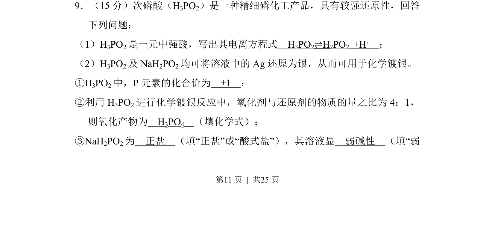
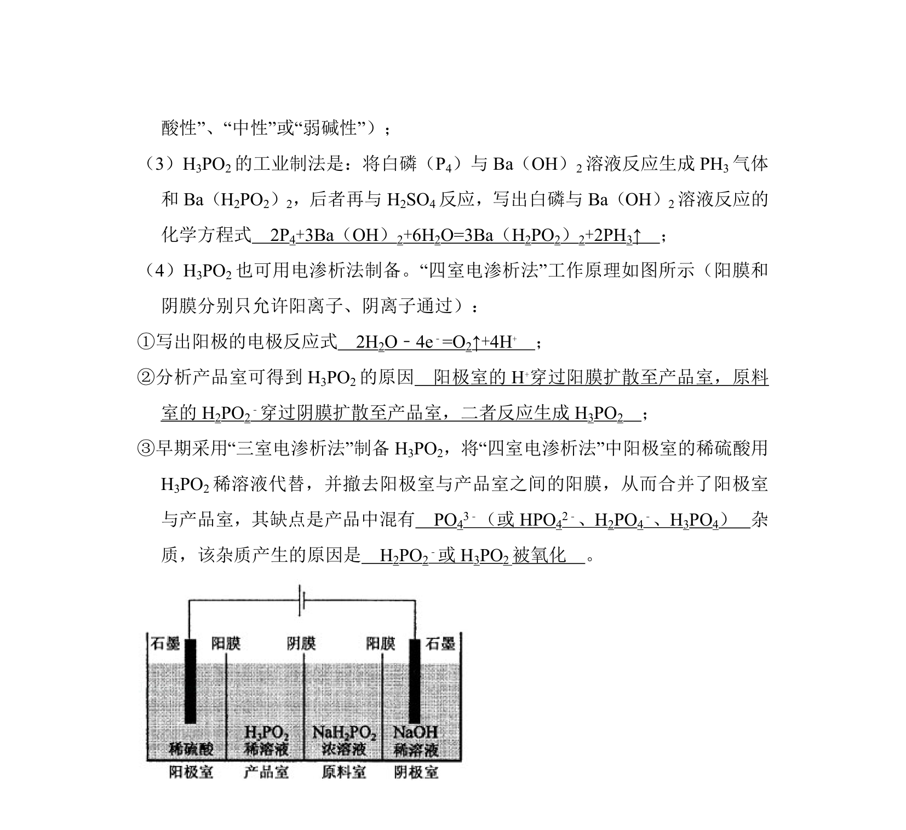
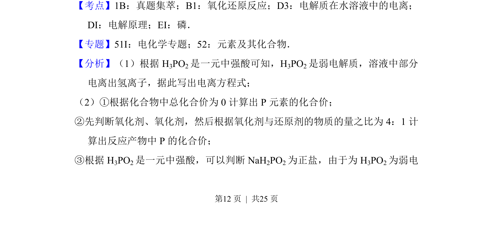
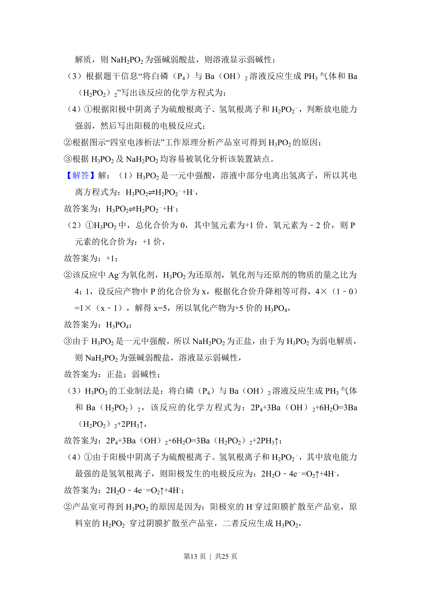
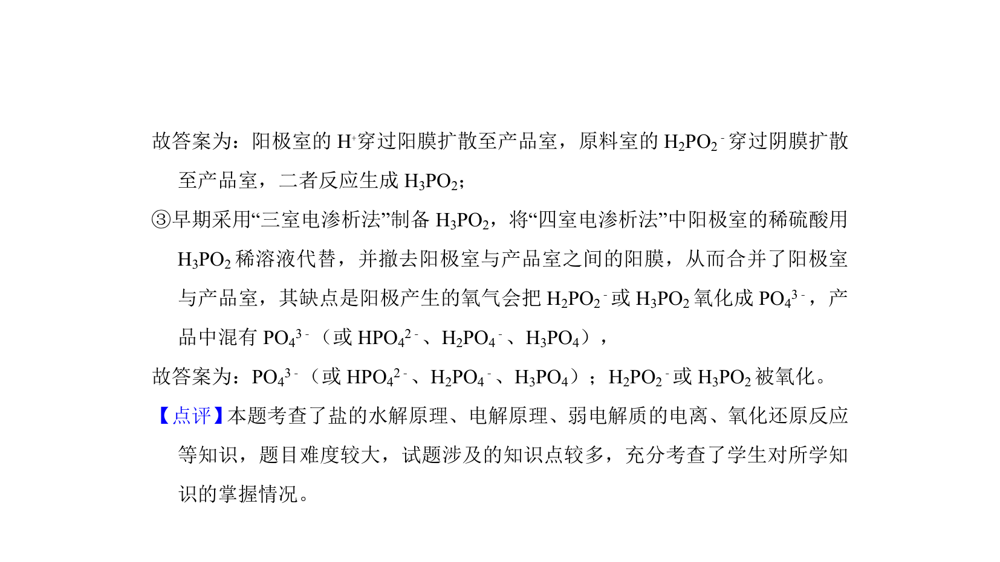

## 题面

## 摘要

以次磷酸为载体，考查弱酸电离、化合价判断、氧化还原反应及盐的分类与酸碱性。

## 关联考点

- [[322-弱电解质电离|弱电解质电离]]
- [[162-氧化还原反应|氧化还原反应]]
- [[028-化合价|化合价]]
- [[336-盐类水解|盐类水解]]

## 答案与解析

> 📄 原 PDF 第 11 页：`素材/真题/湖南/2008-2024·（湖南）化学高考真题/2014年高考化学试卷（新课标Ⅰ）（解析卷）.pdf`
