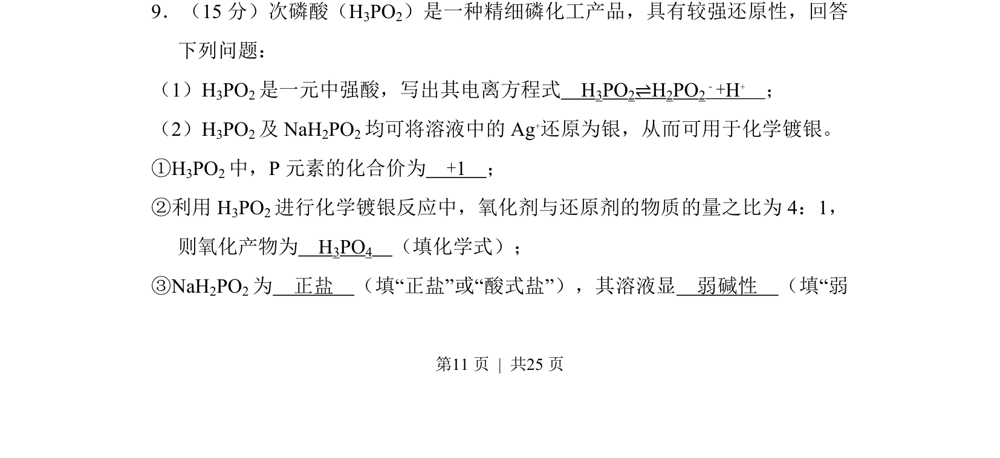
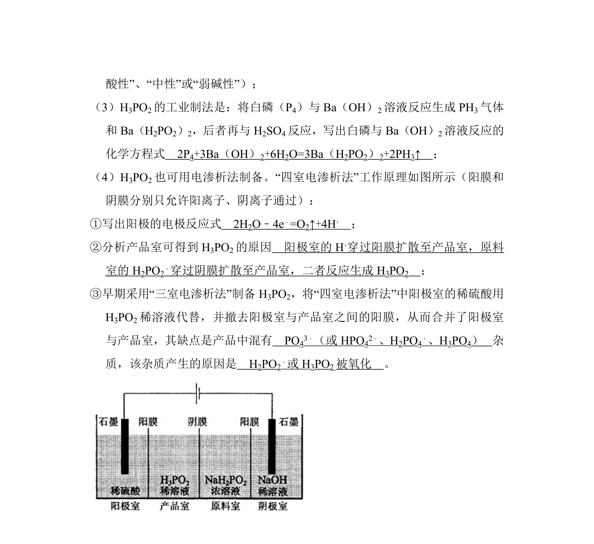
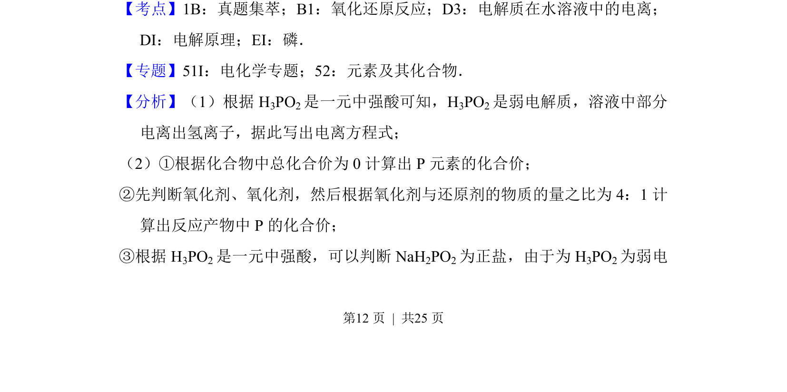
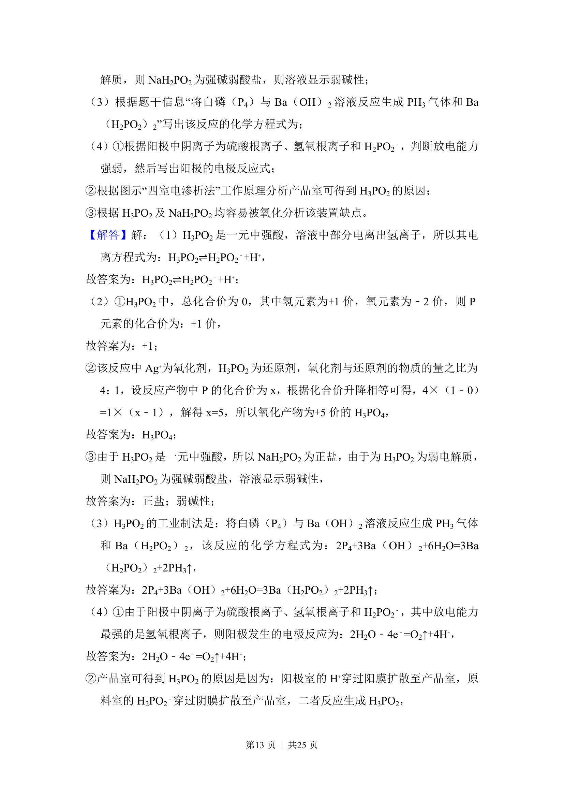
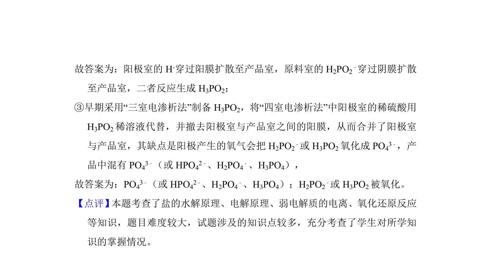

## 题面

## 摘要

以次磷酸为载体，考查弱酸电离、化合价判断、氧化还原反应及盐的分类与酸碱性。

## 关联考点

- [[322-弱电解质电离|弱电解质电离]]
- [[162-氧化还原反应|氧化还原反应]]
- [[028-化合价|化合价]]
- [[336-盐类水解|盐类水解]]

## 答案与解析

> 📄 原 PDF 第 11 页：`素材/真题/湖南/2008-2024·（湖南）化学高考真题/2014年高考化学试卷（新课标Ⅰ）（解析卷）.pdf`

<!-- 题干文本-start -->
## 题干文本
9．（15分）次磷酸（H 3PO2）是一种精细磷化工产品，具有较强还原性，回答
下列问题：
（1）H3PO2是一元中强酸，写出其电离方程式　H3PO2⇌H2PO2
﹣+H+　；
（2）H3PO2及NaH 2PO2均可将溶液中的Ag +还原为银，从而可用于化学镀银。
①H3PO2中，P元素的化合价为　+1　；
②利用H 3PO2进行化学镀银反应中，氧化剂与还原剂的物质的量之比为4：1，
则氧化产物为　H3PO4　（填化学式）；
③NaH2PO2为　正盐　（填“正盐”或“酸式盐”），其溶液显　弱碱性　（填“弱
<!-- 题干文本-end -->

<!-- 解析文本-start -->
## 解析文本

<!-- 解析文本-end -->
