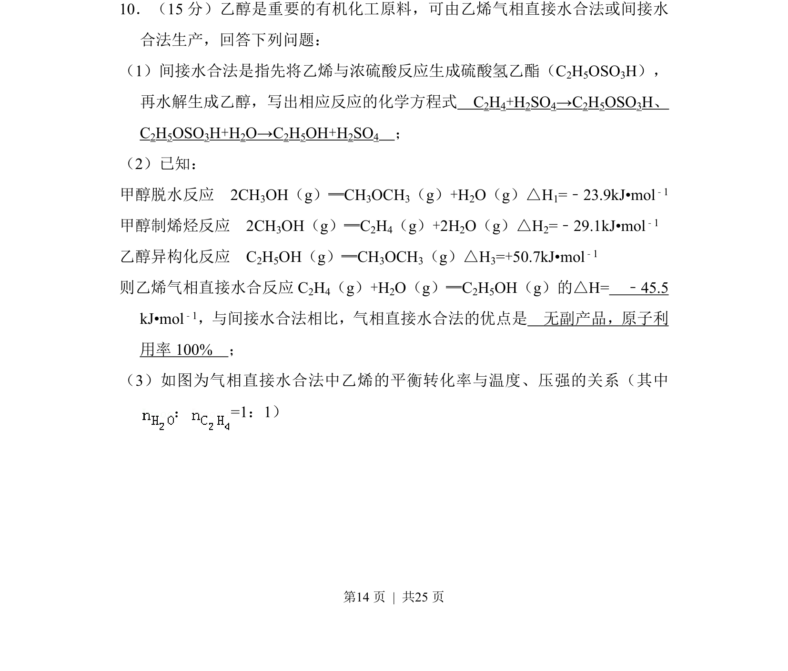
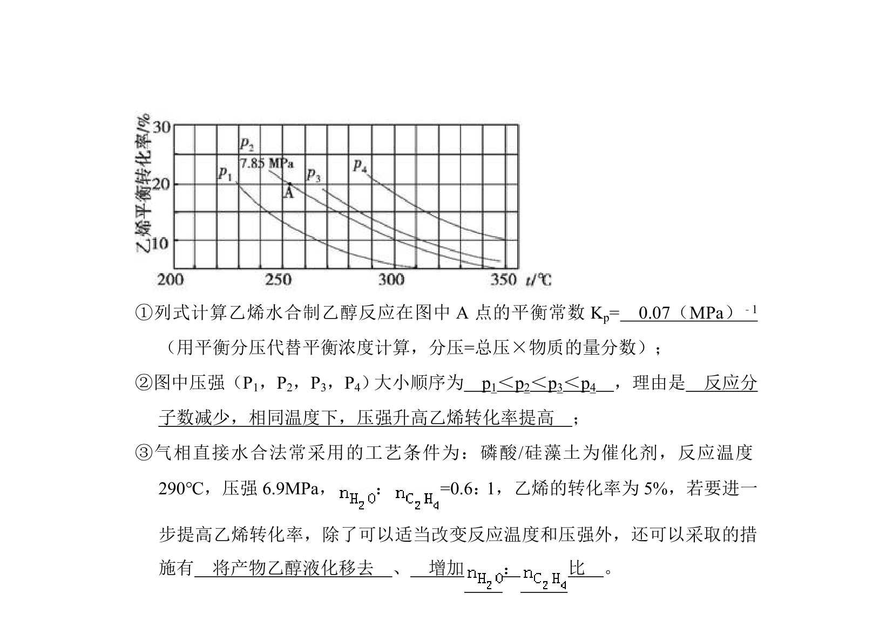
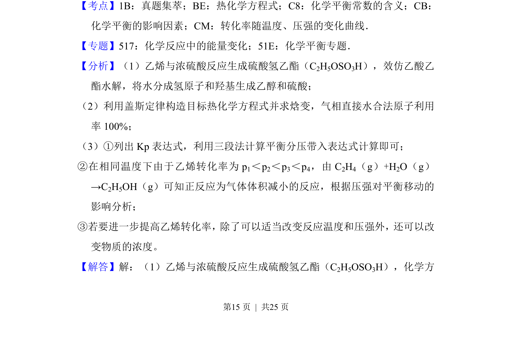
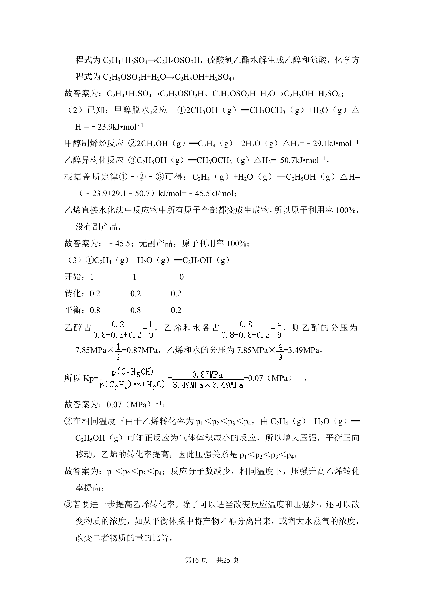
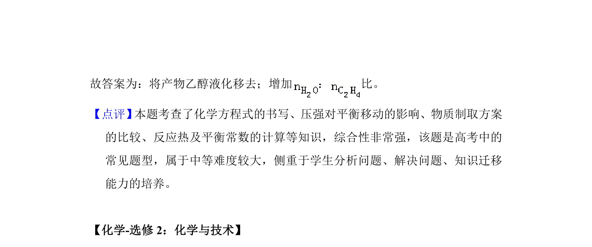

## 题面

## 摘要

乙醇制备方法、盖斯定律计算反应热及平衡图像分析

## 关联考点

- [[621-化学方程式书写|化学方程式书写]]
- [[311-盖斯定律|盖斯定律]]
- [[768-热化学方程式与反应热计算|反应热计算]]
- [[617-化学平衡图像|化学平衡图像]]

## 答案与解析

> 📄 原 PDF 第 14 页：`素材/真题/湖南/2008-2024·（湖南）化学高考真题/2014年高考化学试卷（新课标Ⅰ）（解析卷）.pdf`
