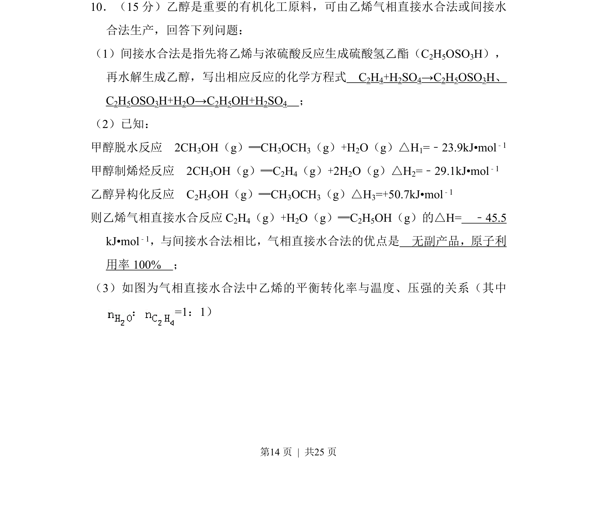
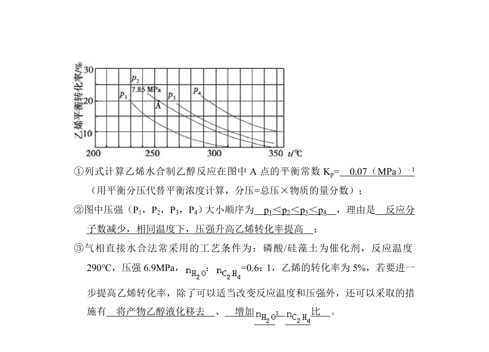
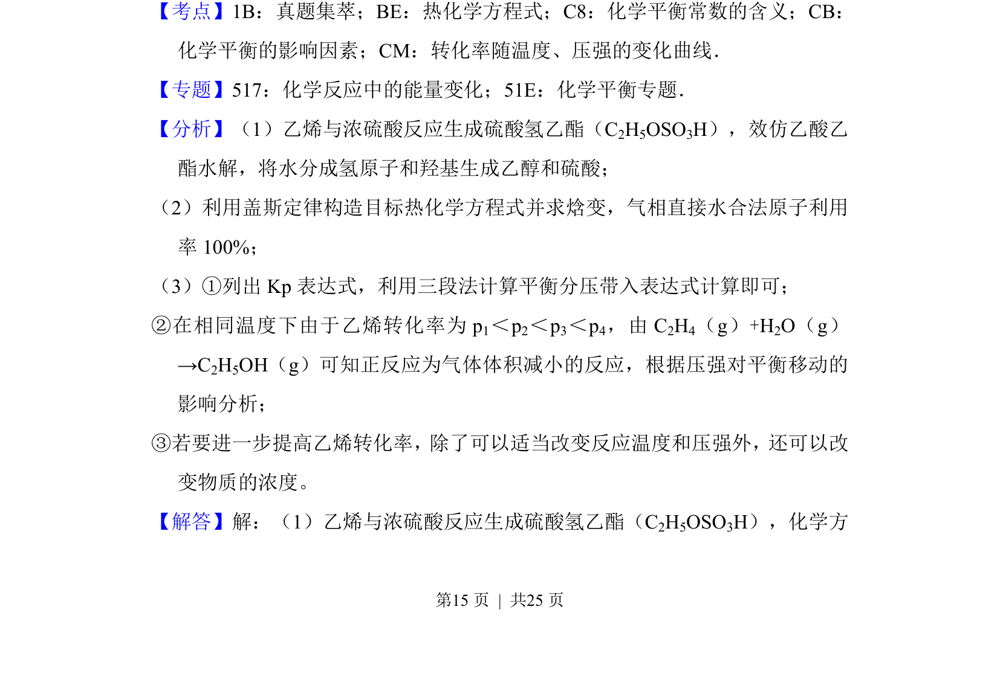
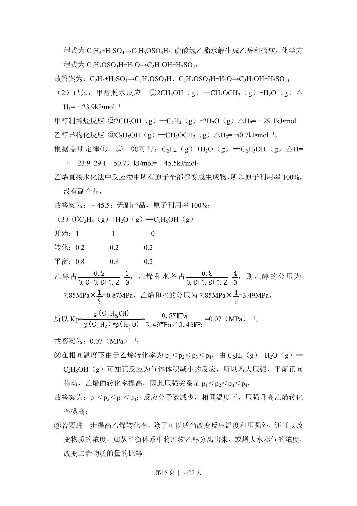
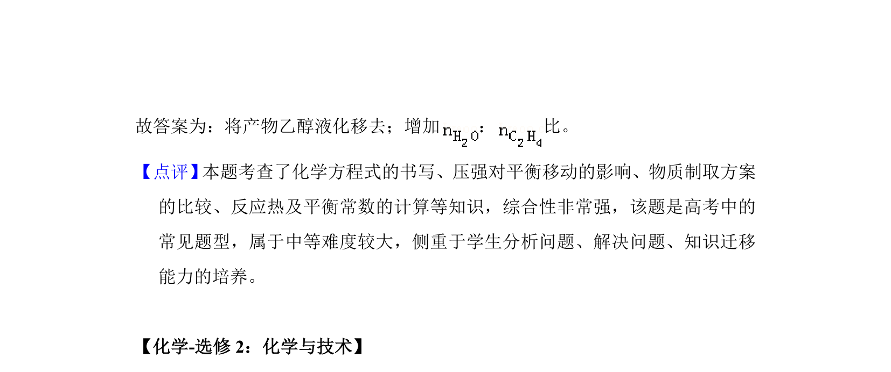

## 题面

## 摘要

乙醇制备方法、盖斯定律计算反应热及平衡图像分析

## 关联考点

- [[976-化学方程式的书写|化学方程式书写]]
- [[311-盖斯定律|盖斯定律]]
- [[768-热化学方程式与反应热计算|反应热计算]]
- [[617-化学平衡图像|化学平衡图像]]

## 答案与解析

> 📄 原 PDF 第 14 页：`素材/真题/湖南/2008-2024·（湖南）化学高考真题/2014年高考化学试卷（新课标Ⅰ）（解析卷）.pdf`

<!-- 题干文本-start -->
## 题干文本
10．（15分）乙醇是重要的有机化工原料，可由乙烯气相直接水合法或间接水
合法生产，回答下列问题：
（1）间接水合法是指先将乙烯与浓硫酸反应生成硫酸氢乙酯（C2H5OSO3H），
再水解生成乙醇，写出相应反应的化学方程式　C2H4+H2SO4→C2H5OSO3H、
C2H5OSO3H+H2O→C2H5OH+H2SO4　；
（2）已知：
甲醇脱水反应  2CH 3OH（g）═CH3OCH3（g）+H2O（g）△H1=﹣23.9kJ•mol﹣1
甲醇制烯烃反应  2CH 3OH（g）═C2H4（g）+2H2O（g）△H2=﹣29.1kJ•mol﹣1
乙醇异构化反应  C 2H5OH（g）═CH3OCH3（g）△H3=+50.7kJ•mol﹣1
则乙烯气相直接水合反应C 2H4（g）+H2O（g）═C2H5OH（g）的△H=　﹣45.5　
kJ•mol﹣1，与间接水合法相比，气相直接水合法的优点是　无副产品，原子利
用率100%　；
（3）如图为气相直接水合法中乙烯的平衡转化率与温度、压强的关系（其中
：=1：1）
<!-- 题干文本-end -->

<!-- 解析文本-start -->
## 解析文本

<!-- 解析文本-end -->
