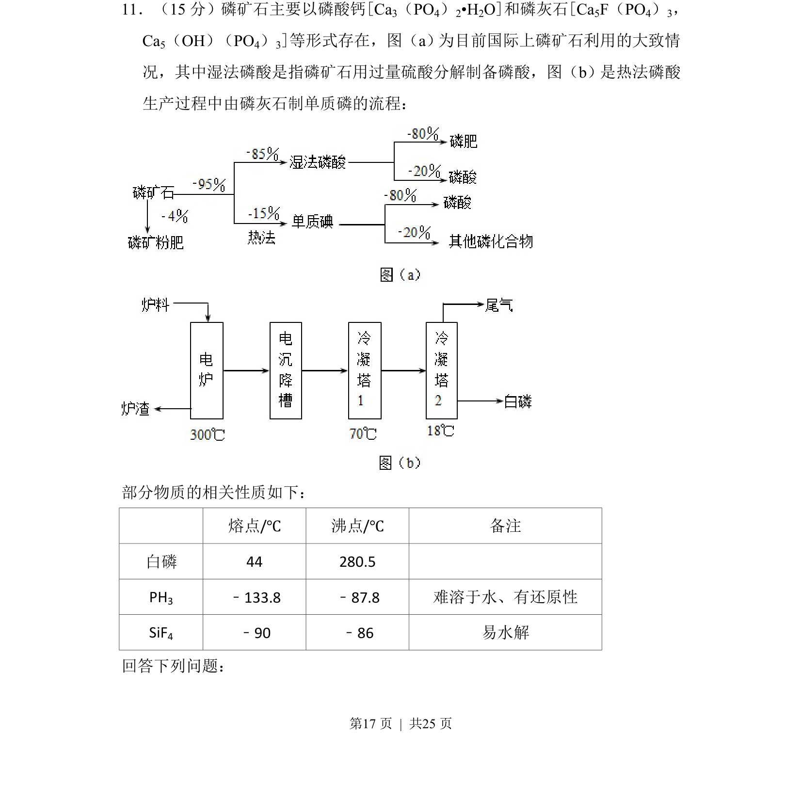
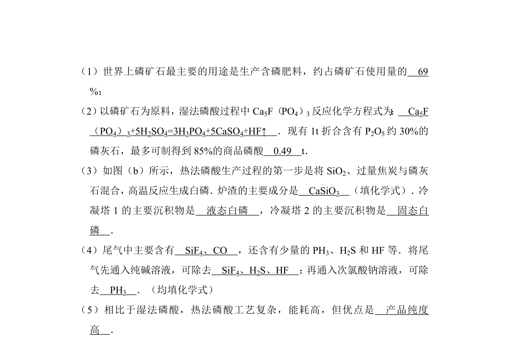
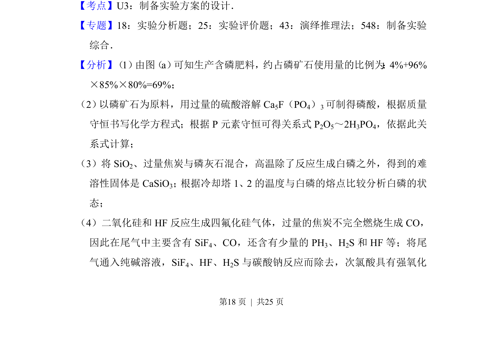
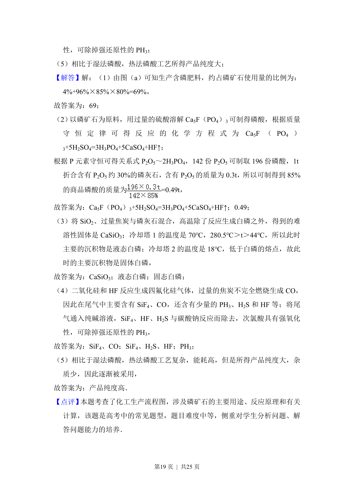

## 题面

## 摘要

考查磷矿石湿法与热法磷酸生产流程及物质性质的综合分析

## 关联考点

- [[工业流程]]
- [[磷及其化合物]]
- [[774-物质性质|物质性质]]
- [[化学反应原理]]

## 答案与解析

> 📄 原 PDF 第 17 页：`素材/真题/湖南/2008-2024·（湖南）化学高考真题/2014年高考化学试卷（新课标Ⅰ）（解析卷）.pdf`
