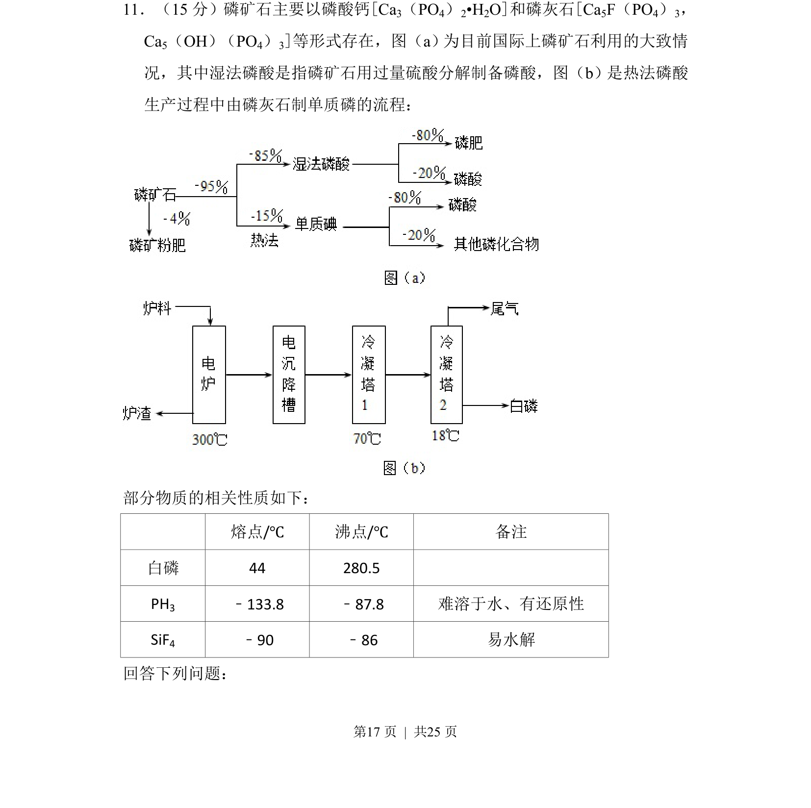
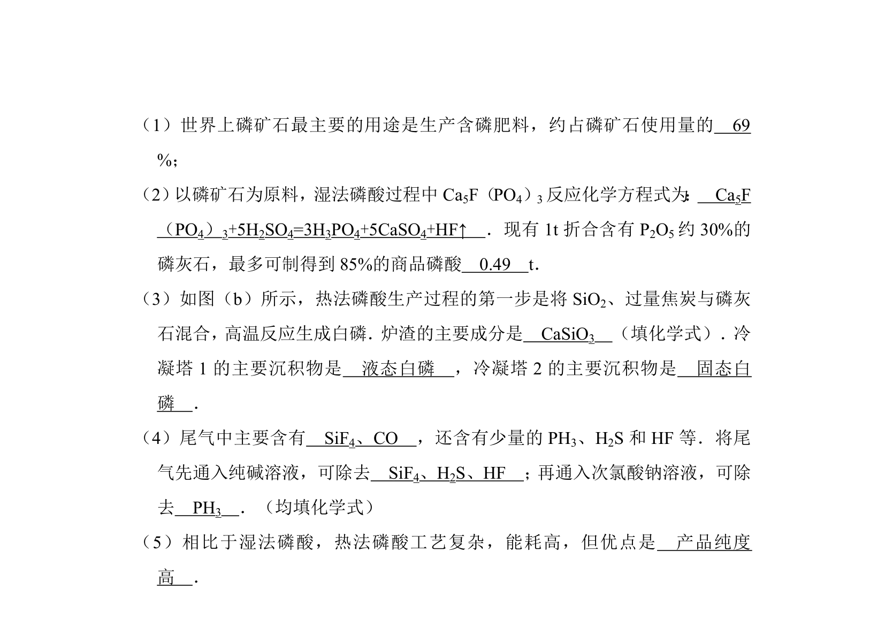
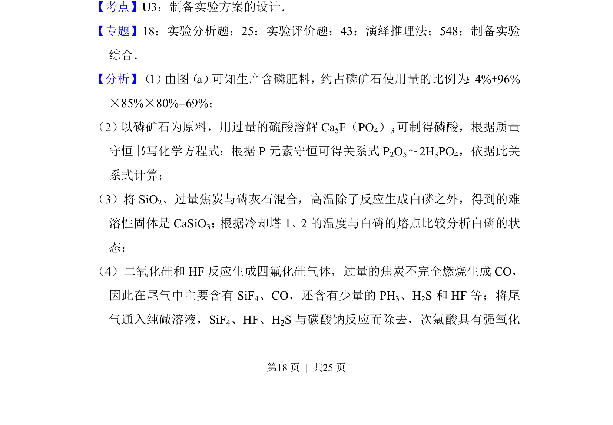
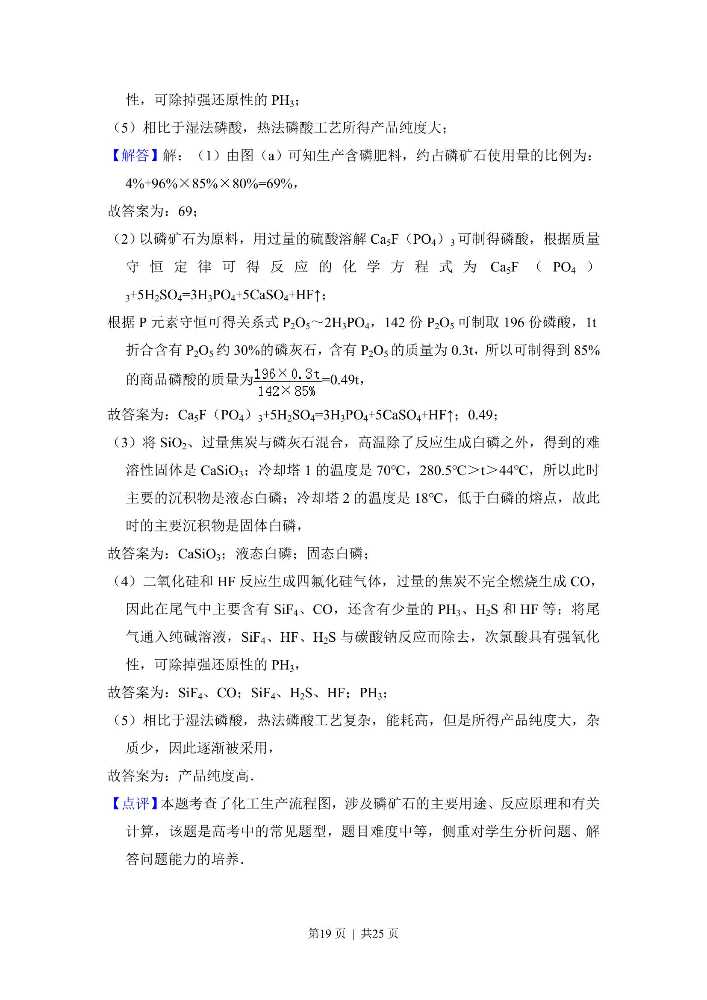

## 题面

## 摘要

考查磷矿石湿法与热法磷酸生产流程及物质性质的综合分析

## 关联考点

- [[998-工业流程|工业流程]]
- [[磷及其化合物]]
- [[774-物质性质|物质性质]]
- [[化学反应原理]]

## 答案与解析

> 📄 原 PDF 第 17 页：`素材/真题/湖南/2008-2024·（湖南）化学高考真题/2014年高考化学试卷（新课标Ⅰ）（解析卷）.pdf`

<!-- 题干文本-start -->
## 题干文本
11．（15分）磷矿石主要以磷酸钙[Ca 3（PO4）2•H2O]和磷灰石[Ca5F（PO4）3，
Ca5（OH）（PO4）3]等形式存在，图（a）为目前国际上磷矿石利用的大致情
况，其中湿法磷酸是指磷矿石用过量硫酸分解制备磷酸，图（b）是热法磷酸
生产过程中由磷灰石制单质磷的流程：
部分物质的相关性质如下：
熔点/℃ 沸点/℃ 备注
白磷 44 280.5
PH3 ﹣133.8 ﹣87.8 难溶于水、有还原性
SiF4 ﹣90 ﹣86 易水解
回答下列问题：
<!-- 题干文本-end -->

<!-- 解析文本-start -->
## 解析文本

<!-- 解析文本-end -->
