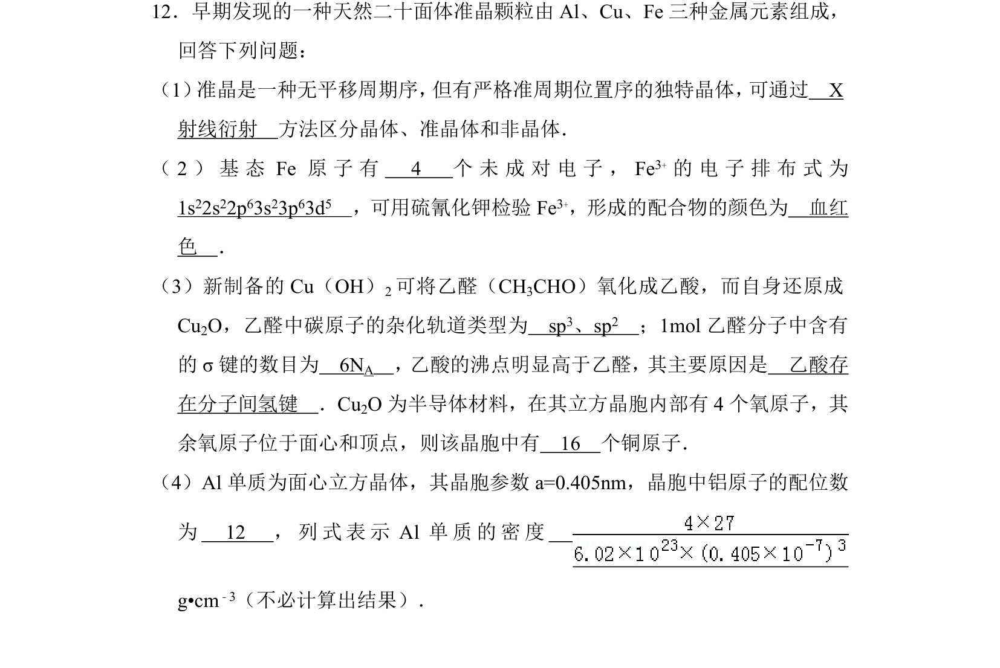
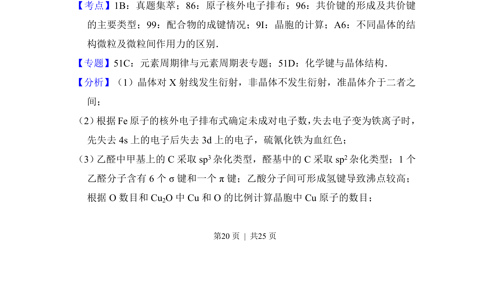
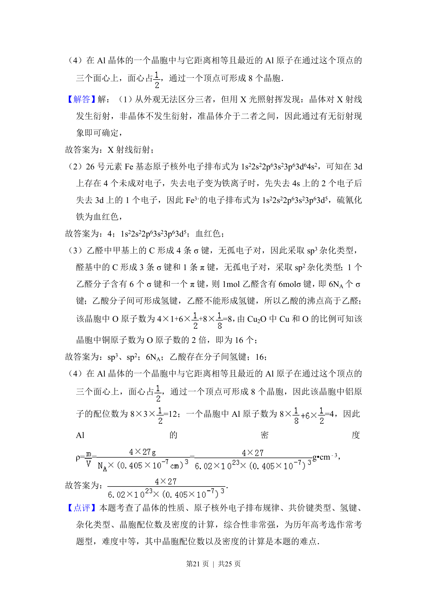

## 题面

## 摘要

综合考查晶体区分方法、原子电子排布及配合物检验、有机物杂化与氢键、晶胞计算及金属晶体密度。

## 关联考点

- [[636-原子核外电子排布|原子核外电子排布]]
- [[428-共价键类型|共价键类型]]
- [[441-配合物|配合物]]
- [[702-晶胞计算|晶胞计算]]

## 答案与解析

> 📄 原 PDF 第 20 页：`素材/真题/湖南/2008-2024·（湖南）化学高考真题/2014年高考化学试卷（新课标Ⅰ）（解析卷）.pdf`
