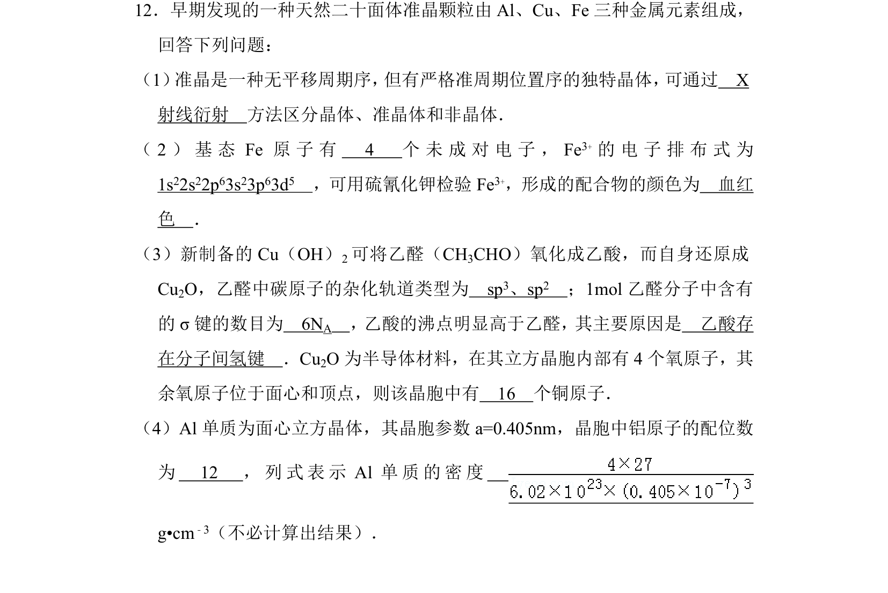
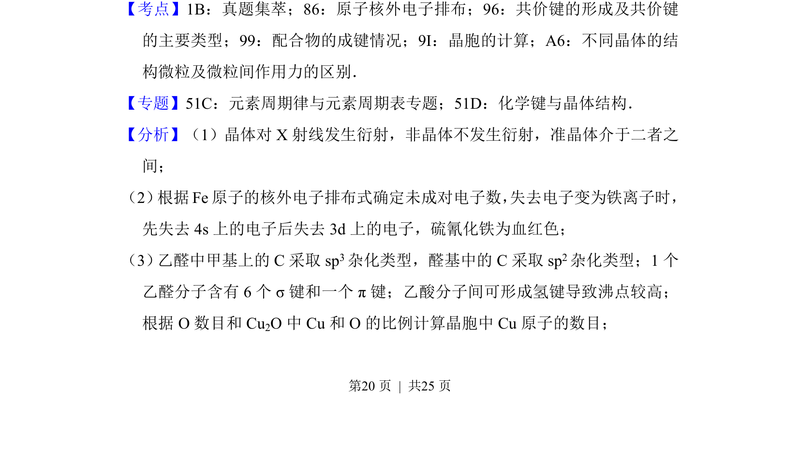
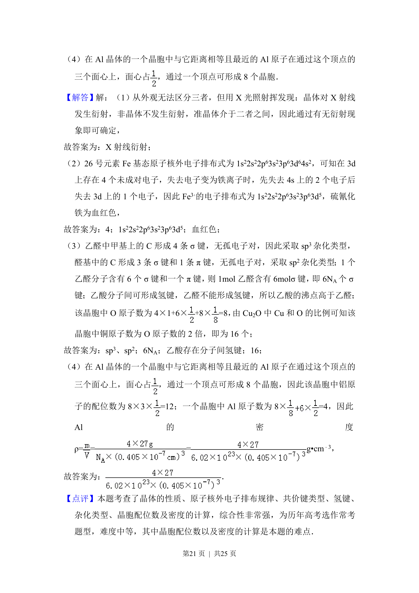

## 题面

## 摘要

综合考查晶体区分方法、原子电子排布及配合物检验、有机物杂化与氢键、晶胞计算及金属晶体密度。

## 关联考点

- [[636-原子核外电子排布|原子核外电子排布]]
- [[428-共价键类型|共价键类型]]
- [[441-配合物|配合物]]
- [[702-晶胞计算|晶胞计算]]

## 答案与解析

> 📄 原 PDF 第 20 页：`素材/真题/湖南/2008-2024·（湖南）化学高考真题/2014年高考化学试卷（新课标Ⅰ）（解析卷）.pdf`

<!-- 题干文本-start -->
## 题干文本
12．早期发现的一种天然二十面体准晶颗粒由Al、Cu、Fe三种金属元素组成，
回答下列问题：
（1） 准晶是一种无平移周期序， 但有严格准周期位置序的独特晶体， 可通过　X
射线衍射　方法区分晶体、准晶体和非晶体．
（2） 基 态Fe原 子 有 　4　 个 未 成 对 电 子 ，Fe3+ 的 电 子 排 布 式 为 　
1s22s22p63s23p63d5　，可用硫氰化钾检验Fe 3+，形成的配合物的颜色为　血红
色　．
（3）新制备的Cu（OH） 2可将乙醛（CH 3CHO）氧化成乙酸，而自身还原成
Cu2O，乙醛中碳原子的杂化轨道类型为　sp 3、sp2　；1mol乙醛分子中含有
的σ键的数目为　6N A　，乙酸的沸点明显高于乙醛，其主要原因是　乙酸存
在分子间氢键　．Cu2O为半导体材料，在其立方晶胞内部有4个氧原子，其
余氧原子位于面心和顶点，则该晶胞中有　16　个铜原子．
（4）Al单质为面心立方晶体，其晶胞参数a=0.405nm，晶胞中铝原子的配位数
为　12　，列式表示Al单质的密度　 　
g•cm﹣3（不必计算出结果）．
<!-- 题干文本-end -->

<!-- 解析文本-start -->
## 解析文本
【考点】1B：真题集萃；86：原子核外电子排布；96：共价键的形成及共价键
的主要类型；99：配合物的成键情况；9I：晶胞的计算；A6：不同晶体的结
构微粒及微粒间作用力的区别．菁优网版权所有
【专题】51C：元素周期律与元素周期表专题；51D：化学键与晶体结构．
【分析】（1）晶体对X射线发生衍射，非晶体不发生衍射，准晶体介于二者之
间；
（2） 根据Fe原子的核外电子排布式确定未成对电子数， 失去电子变为铁离子时，
先失去4s上的电子后失去3d上的电子，硫氰化铁为血红色；
（3） 乙醛中甲基上的C采取sp3杂化类型，醛基中的C采取sp 2杂化类型；1个
乙醛分子含有6个σ键和一个π键；乙酸分子间可形成氢键导致沸点较高；
根据O数目和Cu 2O中Cu和O的比例计算晶胞中Cu原子的数目；
<!-- 解析文本-end -->
