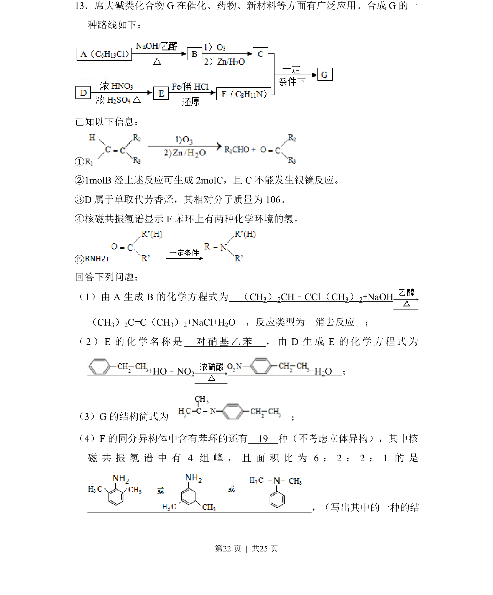
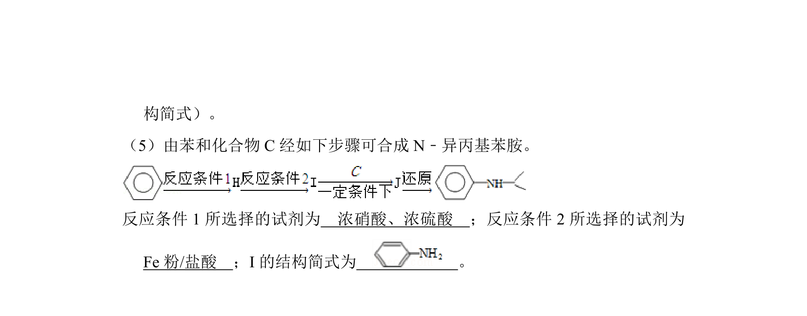
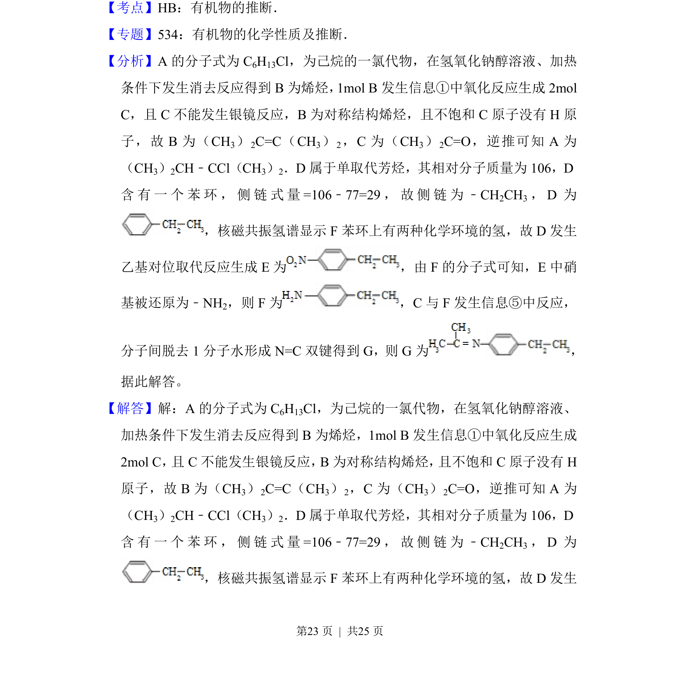
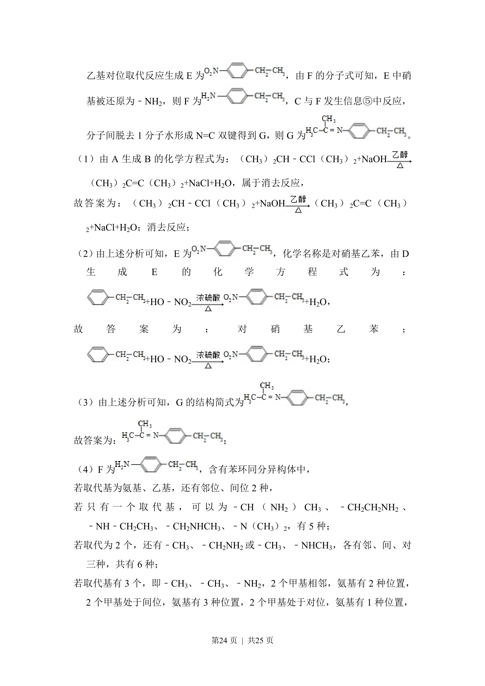
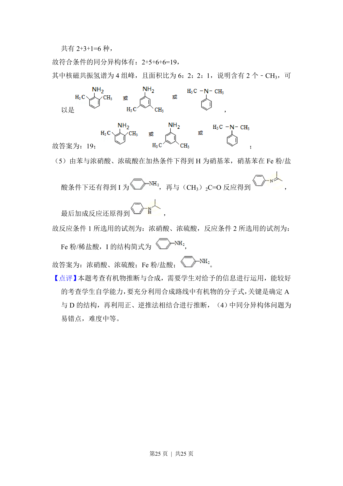

## 题面

## 摘要

有机合成路线中席夫碱G的制备，涉及卤代烃消去、硝化反应、结构推断及同分异构体书写。

## 关联考点

- [[756-消去反应|消去反应]]
- [[922-同分异构体书写|同分异构体书写]]
- [[723-核磁共振氢谱|核磁共振氢谱]]
- [[709-有机合成推断|有机合成推断]]

## 答案与解析

> 📄 原 PDF 第 22 页：`素材/真题/湖南/2008-2024·（湖南）化学高考真题/2014年高考化学试卷（新课标Ⅰ）（解析卷）.pdf`
