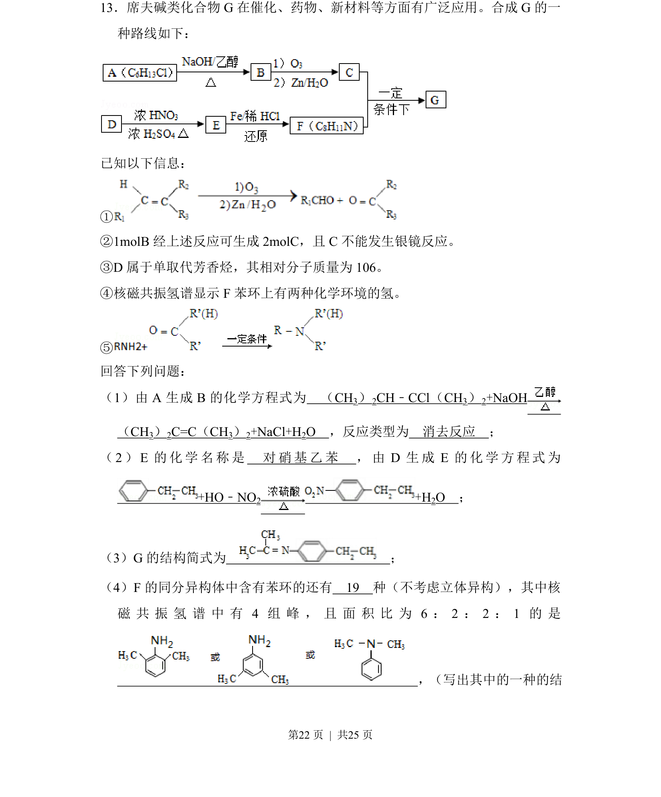
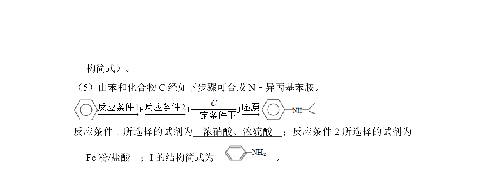
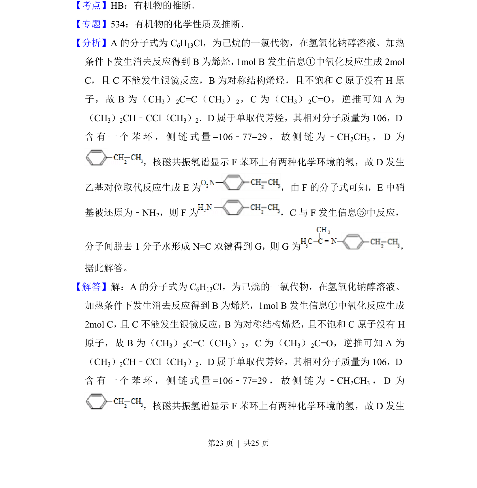
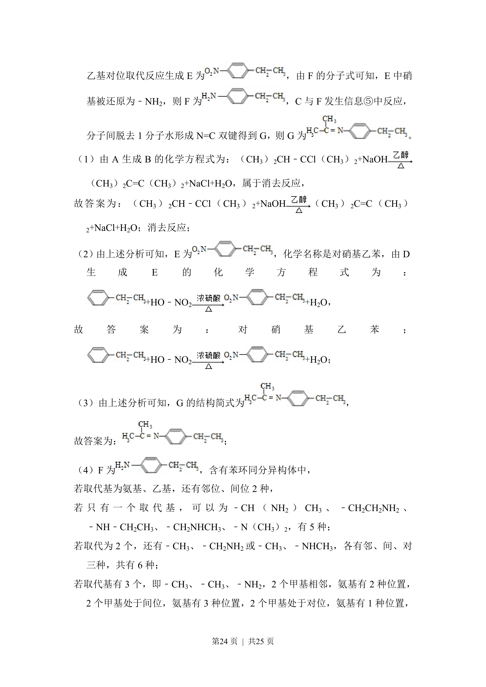
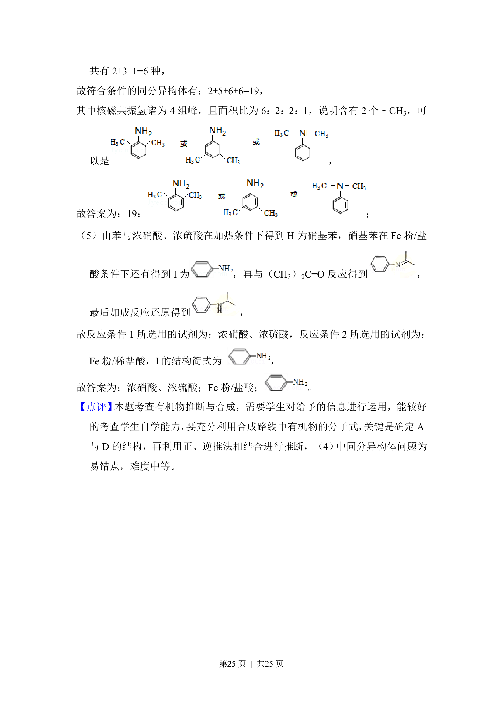

## 题面

## 摘要

有机合成路线中席夫碱G的制备，涉及卤代烃消去、硝化反应、结构推断及同分异构体书写。

## 关联考点

- [[756-消去反应|消去反应]]
- [[922-同分异构体书写|同分异构体书写]]
- [[723-核磁共振氢谱|核磁共振氢谱]]
- [[709-有机合成推断|有机合成推断]]

## 答案与解析

> 📄 原 PDF 第 22 页：`素材/真题/湖南/2008-2024·（湖南）化学高考真题/2014年高考化学试卷（新课标Ⅰ）（解析卷）.pdf`

<!-- 题干文本-start -->
## 题干文本
13．席夫碱类化合物G在催化、药物、新材料等方面有广泛应用。合成G的一
种路线如下：
已知以下信息：
①
②1molB经上述反应可生成2molC，且C不能发生银镜反应。
③D属于单取代芳香烃，其相对分子质量为106。
④核磁共振氢谱显示F苯环上有两种化学环境的氢。
⑤
回答下列问题：
（1）由A生成B的化学方程式为　（CH 3）2CH﹣CCl（CH 3）2+NaOH
（CH3）2C=C（CH3）2+NaCl+H2O　，反应类型为　消去反应　；
（2）E的化学名称是　对硝基乙苯　，由D生成E的化学方程式为　
+HO﹣NO2 +H2O　；
（3）G的结构简式为　 　；
（4）F的同分异构体中含有苯环的还有　19　种（不考虑立体异构），其中核
磁 共 振 氢 谱 中 有4组 峰 ， 且 面 积 比 为6：2：2：1的 是 　
　，（写出其中的一种的结
<!-- 题干文本-end -->

<!-- 解析文本-start -->
## 解析文本

<!-- 解析文本-end -->
