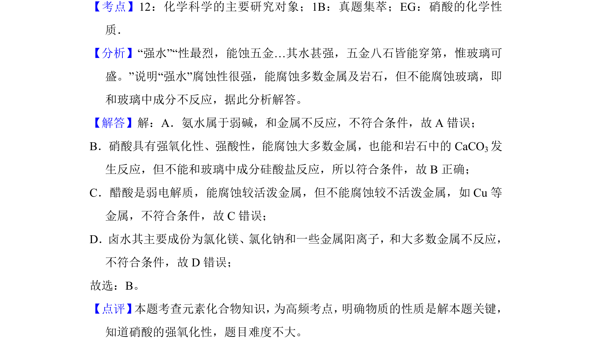

## 题面

## 摘要

通过古籍记载推断“强水”成分，考查硝酸的强氧化性和腐蚀性

## 关联考点

- [[982-硝酸的化学性质|硝酸的化学性质]]
- [[常见无机物的性质]]

## 答案与解析

> 📄 原 PDF 第 1 页：`素材/真题/湖南/2008-2024·（湖南）化学高考真题/2015年高考化学试卷（新课标Ⅰ）（解析卷）.pdf`

<!-- 题干文本-start -->
## 题干文本
1．（6分）我国清代《本草纲目拾遗》中记叙无机药物335种，其中“强水”条
目下写道：“性最烈，能蚀五金…其水甚强，五金八石皆能穿第，惟玻璃可
盛。”这里的“强水”是指（　　）
A．氨水B．硝酸C．醋D．卤水
<!-- 题干文本-end -->

<!-- 解析文本-start -->
## 解析文本
【考点】12：化学科学的主要研究对象；1B：真题集萃；EG：硝酸的化学性
质．菁优网版权所有
【分析】“强水”“性最烈，能蚀五金…其水甚强，五金八石皆能穿第，惟玻璃可
盛。”说明“强水”腐蚀性很强，能腐蚀多数金属及岩石，但不能腐蚀玻璃，即
和玻璃中成分不反应，据此分析解答。
【解答】解：A．氨水属于弱碱，和金属不反应，不符合条件，故A错误；
B．硝酸具有强氧化性、强酸性，能腐蚀大多数金属，也能和岩石中的CaCO3发
生反应，但不能和玻璃中成分硅酸盐反应，所以符合条件，故B正确；
C．醋酸是弱电解质，能腐蚀较活泼金属，但不能腐蚀较不活泼金属，如Cu等
金属，不符合条件，故C错误；
D．卤水其主要成份为氯化镁、氯化钠和一些金属阳离子，和大多数金属不反应，
不符合条件，故D错误；
故选：B。
【点评】 本题考查元素化合物知识， 为高频考点， 明确物质的性质是解本题关键，
知道硝酸的强氧化性，题目难度不大。
<!-- 解析文本-end -->
