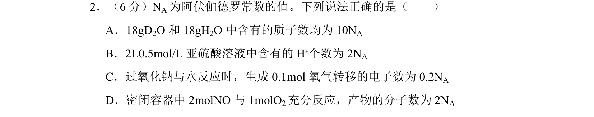
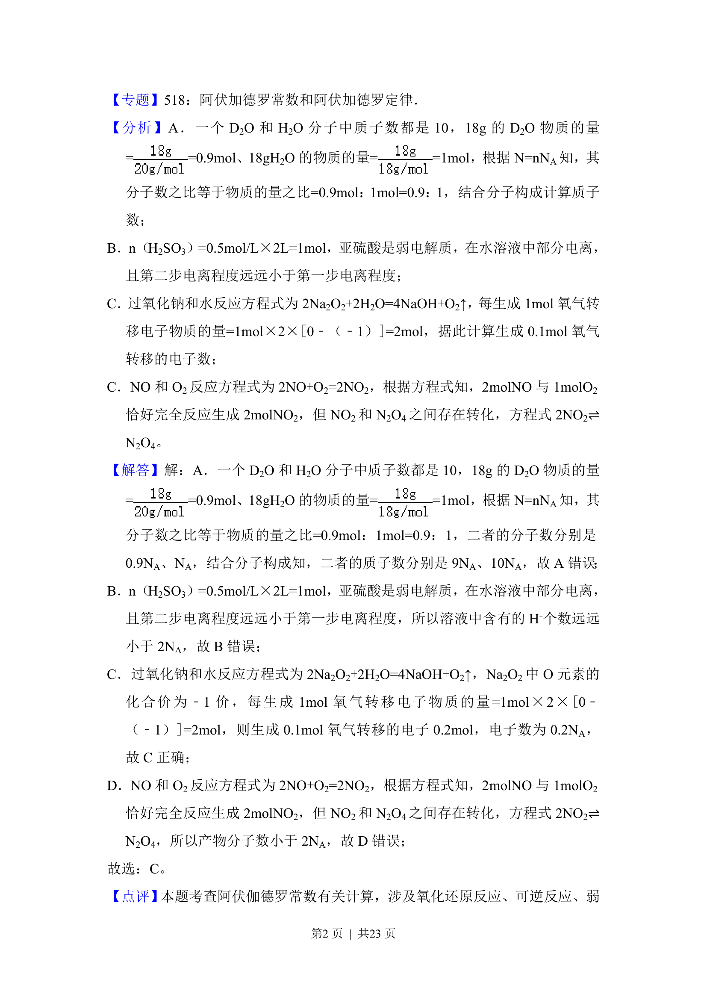
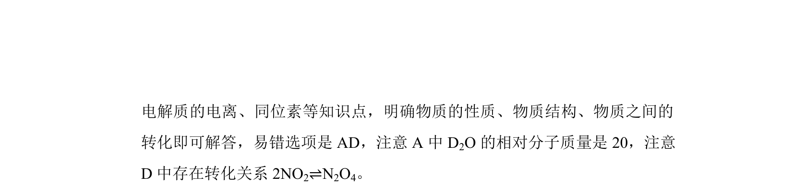

## 题面

## 摘要

考查阿伏加德罗常数应用，涉及质子数计算、弱电解质电离、氧化还原电子转移与可逆反应判断。

## 关联考点

- [[450-阿伏伽德罗常数|阿伏加德罗常数]]
- [[570-质子数|质子数]]
- [[322-弱电解质电离|弱电解质电离]]
- [[氧化还原电子转移]]

## 答案与解析

> 📄 原 PDF 第 1 页：`素材/真题/湖南/2008-2024·（湖南）化学高考真题/2015年高考化学试卷（新课标Ⅰ）（解析卷）.pdf`
