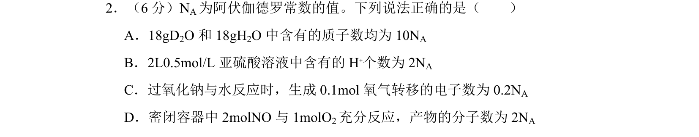
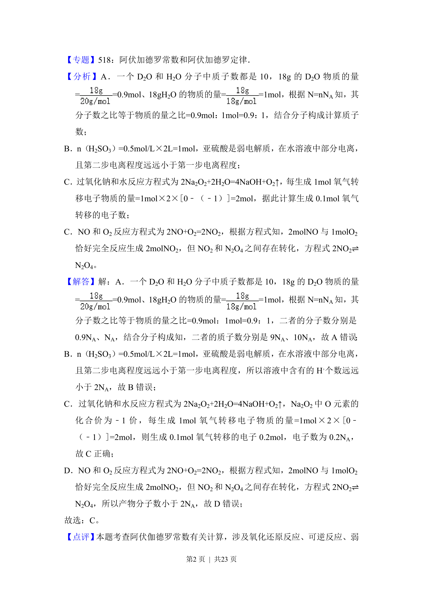
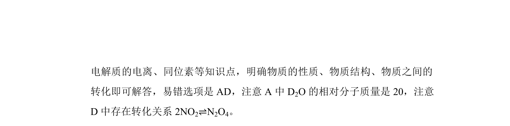

## 题面

## 摘要

考查阿伏加德罗常数应用，涉及质子数计算、弱电解质电离、氧化还原电子转移与可逆反应判断。

## 关联考点

- [[450-阿伏伽德罗常数|阿伏加德罗常数]]
- [[570-质子数|质子数]]
- [[322-弱电解质电离|弱电解质电离]]
- [[氧化还原电子转移]]

## 答案与解析

> 📄 原 PDF 第 1 页：`素材/真题/湖南/2008-2024·（湖南）化学高考真题/2015年高考化学试卷（新课标Ⅰ）（解析卷）.pdf`

<!-- 题干文本-start -->
## 题干文本
2．（6分）N A为阿伏伽德罗常数的值。下列说法正确的是（　　）
A．18gD2O和18gH 2O中含有的质子数均为10N A
B．2L0.5mol/L亚硫酸溶液中含有的H +个数为2N A
C．过氧化钠与水反应时，生成0.1mol氧气转移的电子数为0.2N A
D．密闭容器中2molNO与1molO 2充分反应，产物的分子数为2N A
<!-- 题干文本-end -->

<!-- 解析文本-start -->
## 解析文本
【考点】1B：真题集萃；4F：阿伏加德罗常数．菁优网版权所有
<!-- 解析文本-end -->
