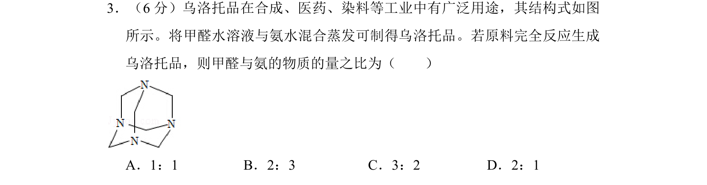
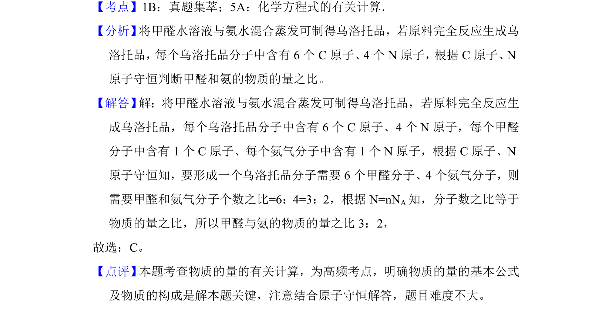

## 题面

## 摘要

根据乌洛托品分子结构，利用原子守恒计算甲醛与氨的物质的量之比。

## 关联考点

- [[880-原子守恒|原子守恒]]
- [[689-微粒数计算|物质的量计算]]
- [[有机物结构]]

## 答案与解析

> 📄 原 PDF 第 3 页：`素材/真题/湖南/2008-2024·（湖南）化学高考真题/2015年高考化学试卷（新课标Ⅰ）（解析卷）.pdf`
