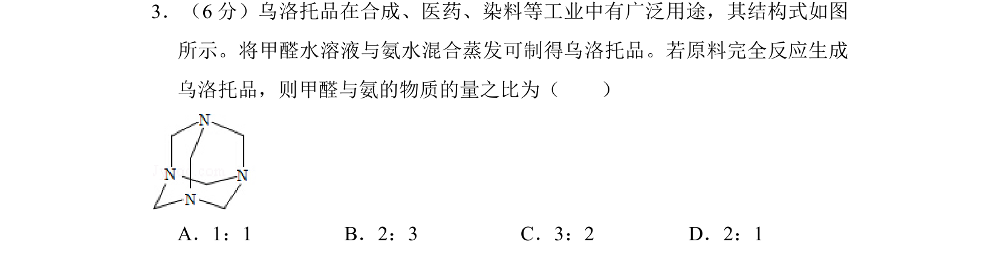
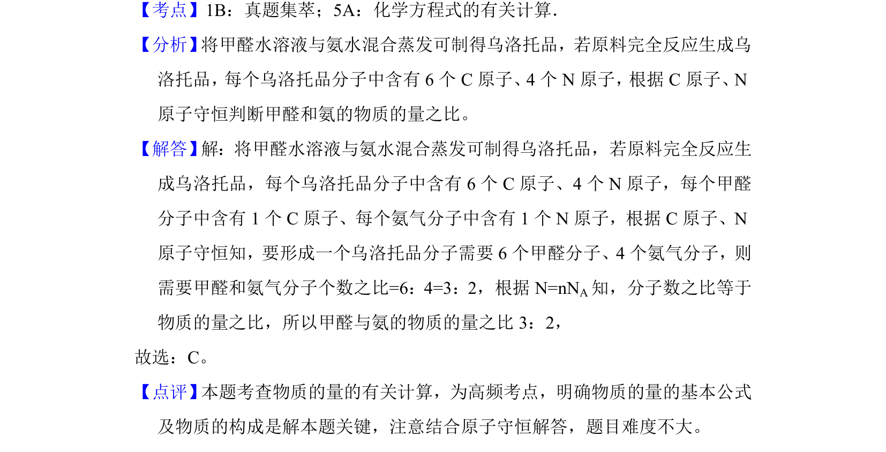

## 题面

## 摘要

根据乌洛托品分子结构，利用原子守恒计算甲醛与氨的物质的量之比。

## 关联考点

- [[880-原子守恒|原子守恒]]
- [[689-微粒数计算|物质的量计算]]
- [[有机物结构]]

## 答案与解析

> 📄 原 PDF 第 3 页：`素材/真题/湖南/2008-2024·（湖南）化学高考真题/2015年高考化学试卷（新课标Ⅰ）（解析卷）.pdf`

<!-- 题干文本-start -->
## 题干文本
3．（6分）乌洛托品在合成、医药、染料等工业中有广泛用途，其结构式如图
所示。将甲醛水溶液与氨水混合蒸发可制得乌洛托品。若原料完全反应生成
乌洛托品，则甲醛与氨的物质的量之比为（　　）
A．1：1 B．2：3 C．3：2 D．2：1
<!-- 题干文本-end -->

<!-- 解析文本-start -->
## 解析文本
【考点】1B：真题集萃；5A：化学方程式的有关计算．菁优网版权所有
【分析】 将甲醛水溶液与氨水混合蒸发可制得乌洛托品，若原料完全反应生成乌
洛托品， 每个乌洛托品分子中含有6个C原子、4个N原子， 根据C原子、N
原子守恒判断甲醛和氨的物质的量之比。
【解答】 解：将甲醛水溶液与氨水混合蒸发可制得乌洛托品，若原料完全反应生
成乌洛托品，每个乌洛托品分子中含有6个C原子、4个N原子，每个甲醛
分子中含有1个C原子、每个氨气分子中含有1个N原子，根据C原子、N
原子守恒知，要形成一个乌洛托品分子需要6个甲醛分子、4个氨气分子，则
需要甲醛和氨气分子个数之比=6：4=3：2，根据N=nNA知，分子数之比等于
物质的量之比，所以甲醛与氨的物质的量之比3：2，
故选：C。
【点评】 本题考查物质的量的有关计算，为高频考点，明确物质的量的基本公式
及物质的构成是解本题关键，注意结合原子守恒解答，题目难度不大。
<!-- 解析文本-end -->
