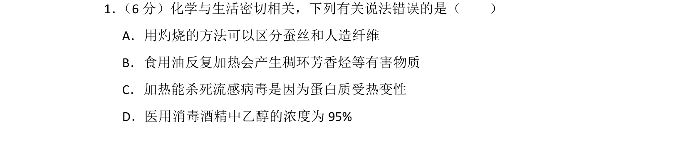
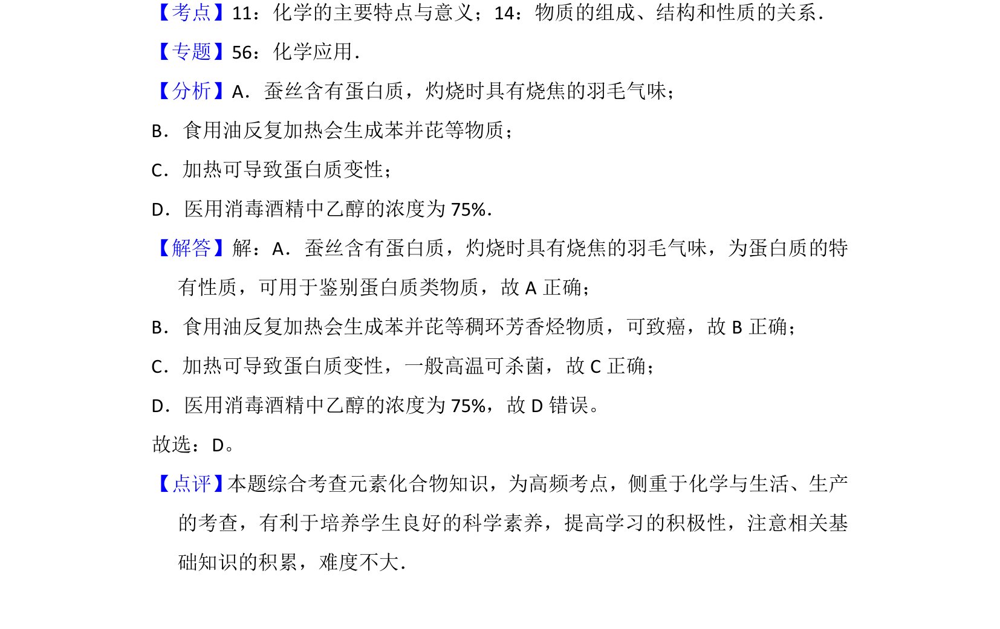

## 题面

## 摘要

考查蛋白质灼烧鉴别、医用酒精浓度等化学与生活的常识应用。

## 关联考点

- [[蛋白质变性]]
- [[785-物质鉴别|物质鉴别]]
- [[492-芳香烃|芳香烃]]
- [[乙醇浓度]]

## 答案与解析

> 📄 原 PDF 第 1 页：`素材/真题/湖南/2008-2024·（湖南）化学高考真题/2016年高考化学试卷（新课标Ⅰ）（解析卷）.pdf`
