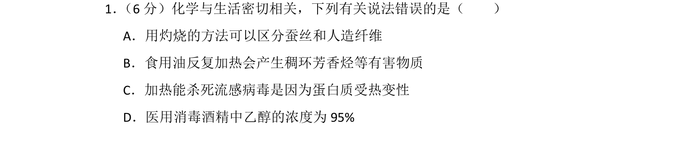
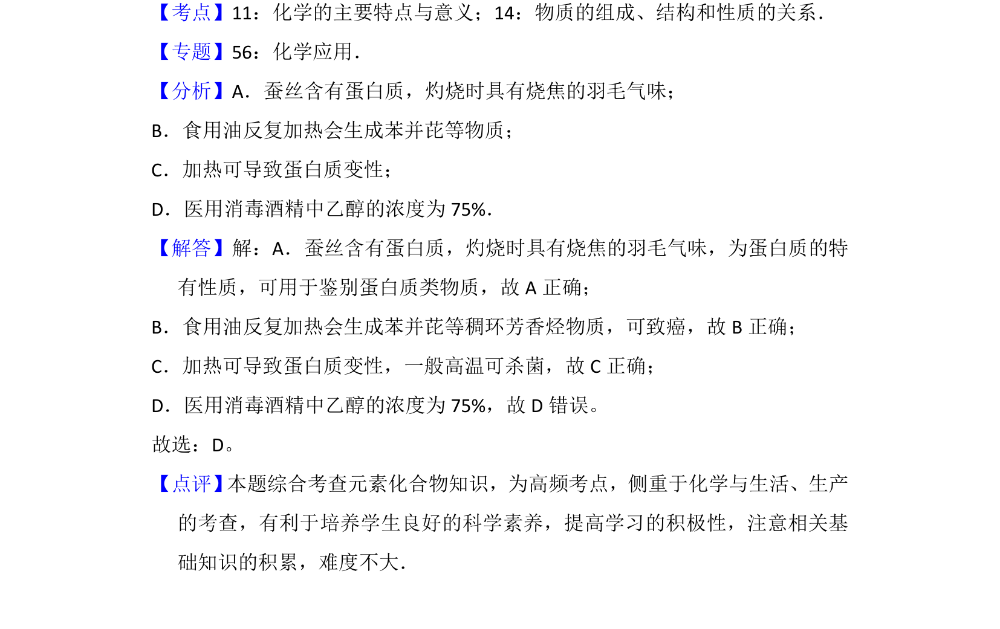

## 题面

## 摘要

考查蛋白质灼烧鉴别、医用酒精浓度等化学与生活的常识应用。

## 关联考点

- [[蛋白质变性]]
- [[785-物质鉴别|物质鉴别]]
- [[492-芳香烃|芳香烃]]
- [[乙醇浓度]]

## 答案与解析

> 📄 原 PDF 第 1 页：`素材/真题/湖南/2008-2024·（湖南）化学高考真题/2016年高考化学试卷（新课标Ⅰ）（解析卷）.pdf`

<!-- 题干文本-start -->
## 题干文本
1． （6分）化学与生活密切相关，下列有关说法错误的是（　　）
A．用灼烧的方法可以区分蚕丝和人造纤维
B．食用油反复加热会产生稠环芳香烃等有害物质
C．加热能杀死流感病毒是因为蛋白质受热变性
D．医用消毒酒精中乙醇的浓度为95%
<!-- 题干文本-end -->

<!-- 解析文本-start -->
## 解析文本
【考点】11：化学的主要特点与意义；14：物质的组成、结构和性质的关系．菁优网版权所有
【专题】56：化学应用．
【分析】A．蚕丝含有蛋白质，灼烧时具有烧焦的羽毛气味；
B．食用油反复加热会生成苯并芘等物质；
C．加热可导致蛋白质变性；
D．医用消毒酒精中乙醇的浓度为75%．
【解答】解：A．蚕丝含有蛋白质，灼烧时具有烧焦的羽毛气味，为蛋白质的特
有性质，可用于鉴别蛋白质类物质，故A正确；
B．食用油反复加热会生成苯并芘等稠环芳香烃物质，可致癌，故B正确；
C．加热可导致蛋白质变性，一般高温可杀菌，故C正确；
D．医用消毒酒精中乙醇的浓度为75%，故D错误。
故选：D。
【点评】 本题综合考查元素化合物知识，为高频考点，侧重于化学与生活、生产
的考查，有利于培养学生良好的科学素养，提高学习的积极性，注意相关基
础知识的积累，难度不大．
<!-- 解析文本-end -->
