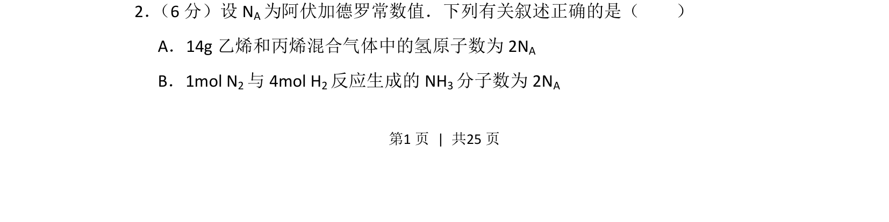
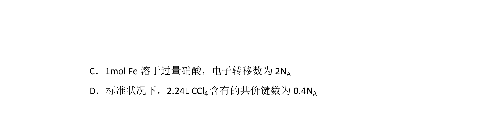
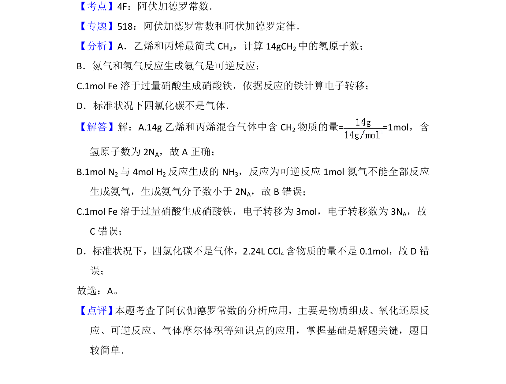

## 题面

## 摘要

考查阿伏加德罗常数在混合气体及可逆反应中的应用

## 关联考点

- [[450-阿伏伽德罗常数|阿伏加德罗常数]]
- [[有机物最简式]]
- [[289-可逆反应|可逆反应]]
- [[原子数计算]]

## 答案与解析

> 📄 原 PDF 第 1 页：`素材/真题/湖南/2008-2024·（湖南）化学高考真题/2016年高考化学试卷（新课标Ⅰ）（解析卷）.pdf`
