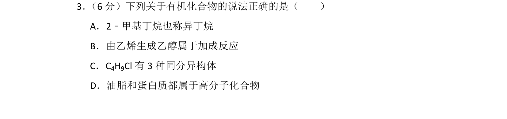
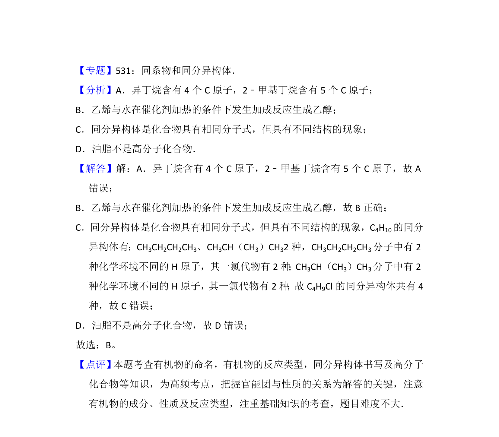

## 题面

## 摘要

考查有机物的命名、反应类型、同分异构体及高分子化合物等基础有机化学知识

## 关联考点

- [[有机物的命名]]
- [[233-乙烯加成反应|加成反应]]
- [[446-同分异构体|同分异构体]]
- [[505-高分子化合物|高分子化合物]]

## 答案与解析

> 📄 原 PDF 第 2 页：`素材/真题/湖南/2008-2024·（湖南）化学高考真题/2016年高考化学试卷（新课标Ⅰ）（解析卷）.pdf`
