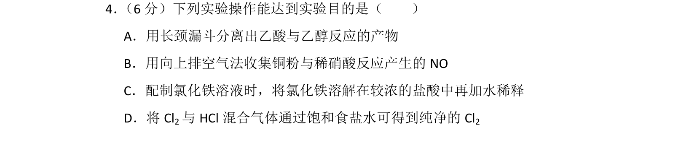
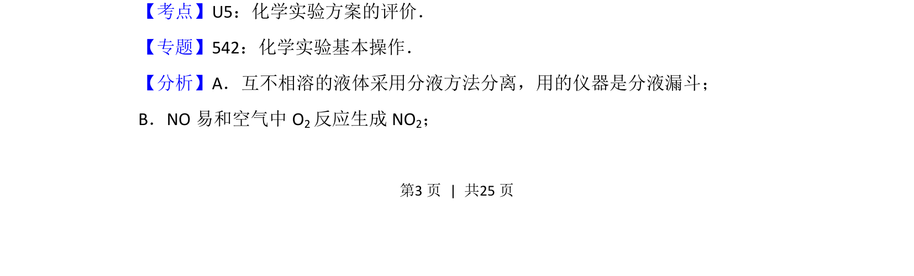
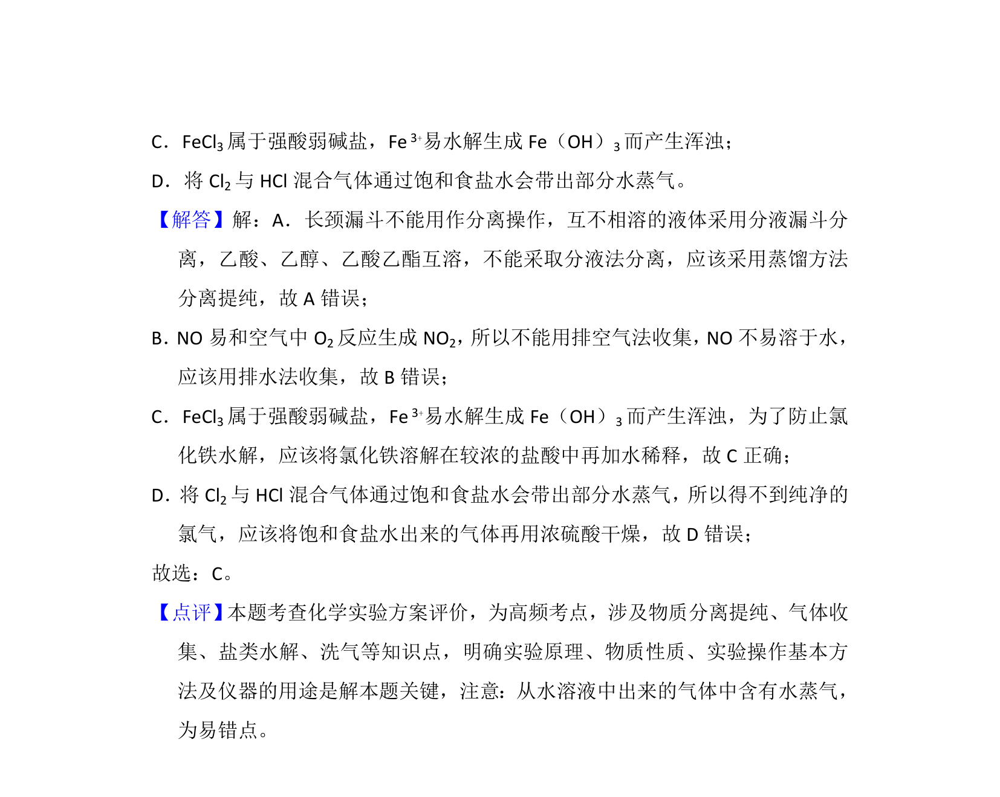

## 题面

## 摘要

考查化学实验基本操作能否达到实验目的，涉及分液、气体收集、溶液配制与除杂等判断。

## 关联考点

- [[613-化学实验方案评价|化学实验方案评价]]
- [[943-物质的分离与提纯|物质的分离与提纯]]
- [[气体的收集与净化]]
- [[盐类水解应用]]

## 答案与解析

> 📄 原 PDF 第 3 页：`素材/真题/湖南/2008-2024·（湖南）化学高考真题/2016年高考化学试卷（新课标Ⅰ）（解析卷）.pdf`
