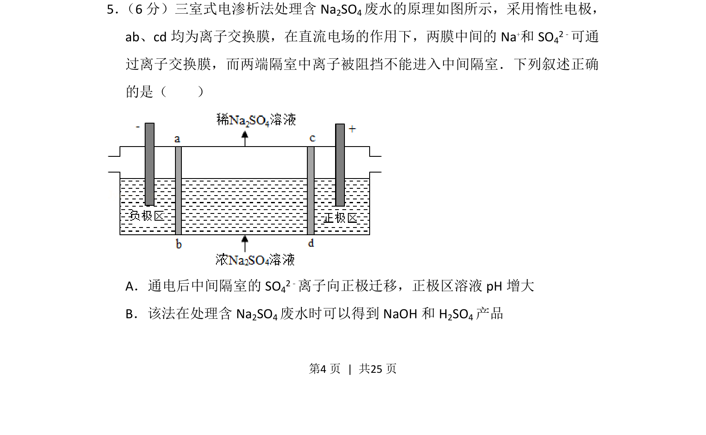
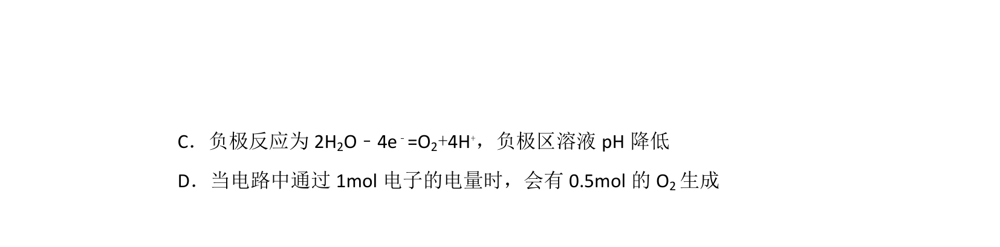
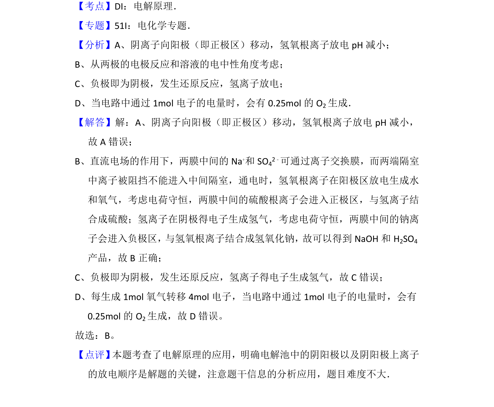

## 题面

## 摘要

电渗析法处理含Na2SO4废水，考查离子在电场中的迁移方向、离子交换膜作用及产物分析。

## 关联考点

- [[368-电解池|电解池]]
- [[804-离子交换膜|离子交换膜]]
- [[793-电极反应|电极反应]]
- [[溶液pH变化]]

## 答案与解析

> 📄 原 PDF 第 4 页：`素材/真题/湖南/2008-2024·（湖南）化学高考真题/2016年高考化学试卷（新课标Ⅰ）（解析卷）.pdf`
