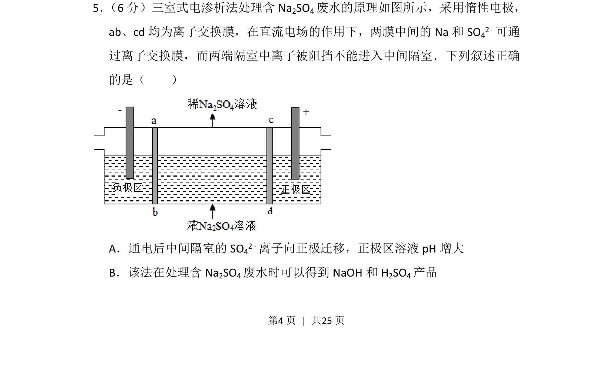
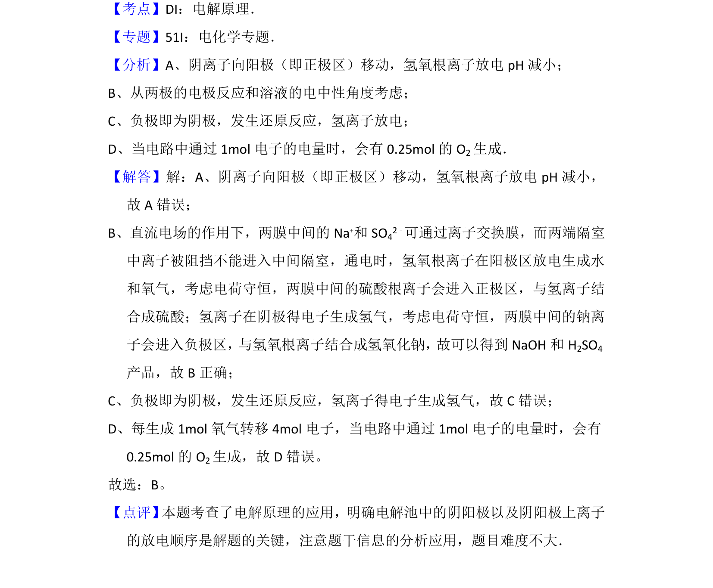

## 题面

## 摘要

电渗析法处理含Na2SO4废水，考查离子在电场中的迁移方向、离子交换膜作用及产物分析。

## 关联考点

- [[368-电解池|电解池]]
- [[804-离子交换膜|离子交换膜]]
- [[793-电极反应|电极反应]]
- [[溶液pH变化]]

## 答案与解析

> 📄 原 PDF 第 4 页：`素材/真题/湖南/2008-2024·（湖南）化学高考真题/2016年高考化学试卷（新课标Ⅰ）（解析卷）.pdf`

<!-- 题干文本-start -->
## 题干文本
5． （6分）三室式电渗析法处理含Na2SO4废水的原理如图所示，采用惰性电极，
ab、cd均为离子交换膜，在直流电场的作用下，两膜中间的Na +和SO 42﹣可通
过离子交换膜，而两端隔室中离子被阻挡不能进入中间隔室．下列叙述正确
的是（　　）
A．通电后中间隔室的SO 42﹣离子向正极迁移，正极区溶液pH增大
B．该法在处理含Na 2SO4废水时可以得到NaOH和H 2SO4产品
<!-- 题干文本-end -->

<!-- 解析文本-start -->
## 解析文本

<!-- 解析文本-end -->
