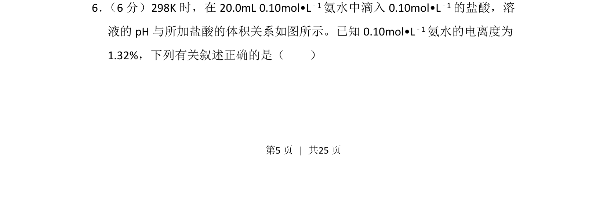
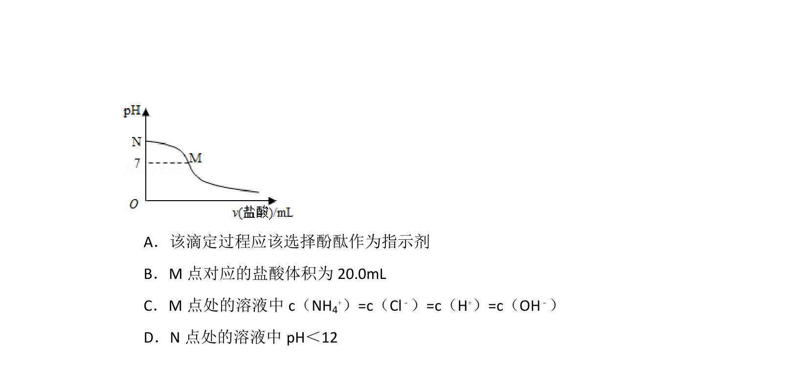
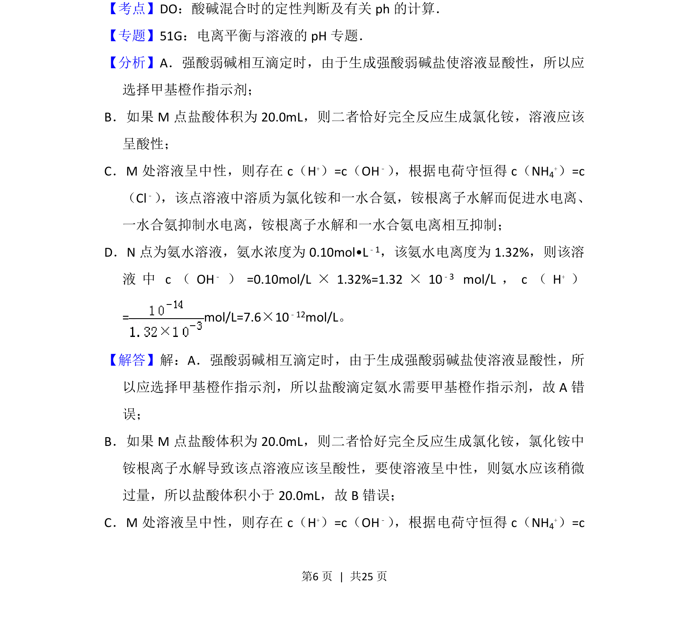
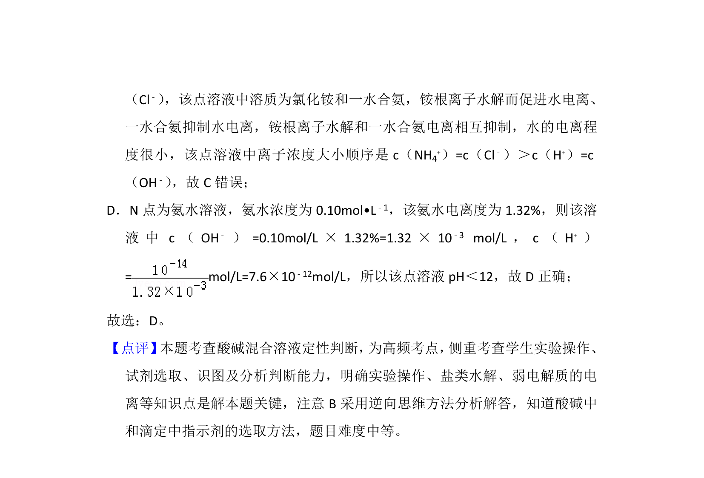

## 题面

## 摘要

氨水与盐酸的酸碱中和滴定曲线分析，结合电离度判断相关粒子浓度与pH变化。

## 关联考点

- [[弱碱电离平衡]]
- [[340-酸碱中和滴定|酸碱中和滴定]]
- [[电离度计算]]
- [[pH变化]]

## 答案与解析

> 📄 原 PDF 第 5 页：`素材/真题/湖南/2008-2024·（湖南）化学高考真题/2016年高考化学试卷（新课标Ⅰ）（解析卷）.pdf`
