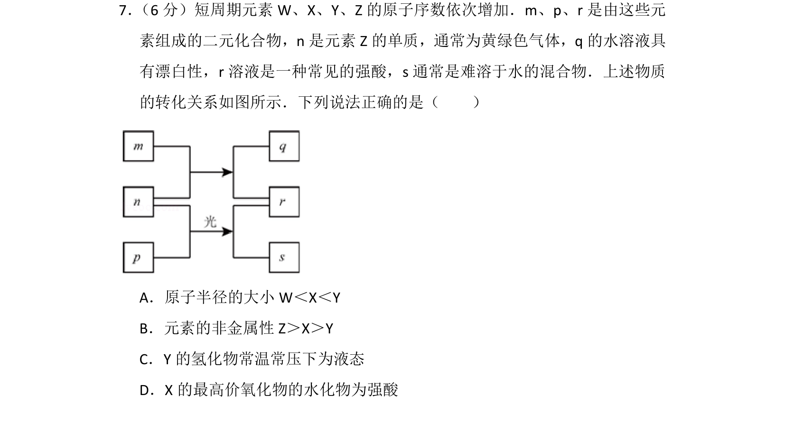
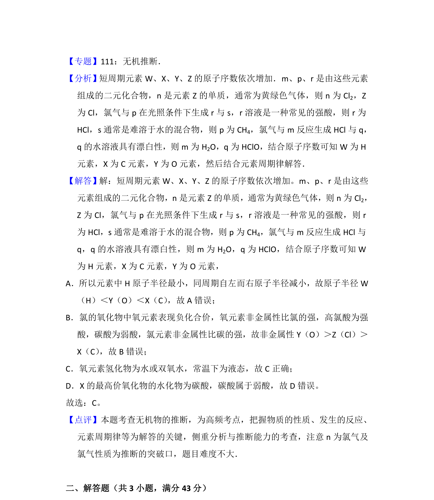

## 题面

## 摘要

根据短周期元素和转化关系推断元素，考查元素周期律与化合物性质。

## 关联考点

- [[597-元素推断|元素推断]]
- [[252-元素周期律|元素周期律]]
- [[635-原子半径比较|原子半径比较]]
- [[1004-非金属性比较|非金属性比较]]

## 答案与解析

> 📄 原 PDF 第 7 页：`素材/真题/湖南/2008-2024·（湖南）化学高考真题/2016年高考化学试卷（新课标Ⅰ）（解析卷）.pdf`
