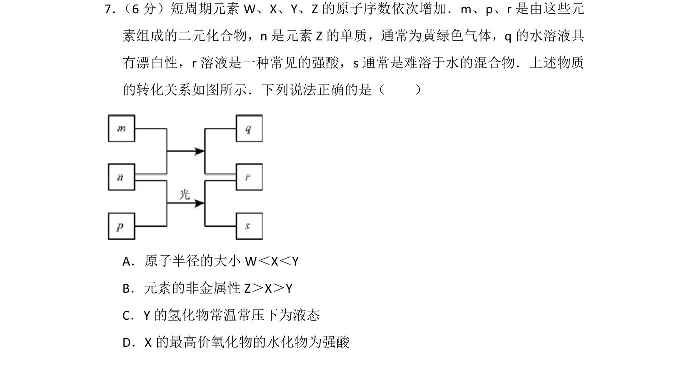
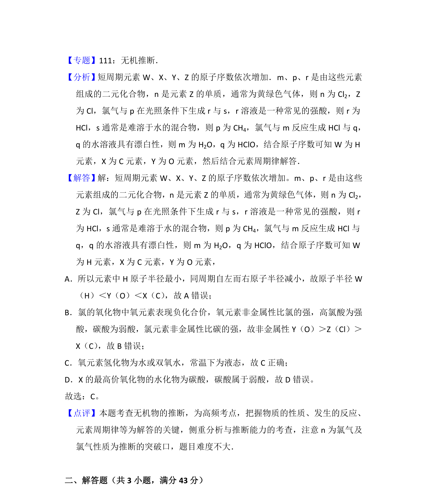

## 题面

## 摘要

根据短周期元素和转化关系推断元素，考查元素周期律与化合物性质。

## 关联考点

- [[597-元素推断|元素推断]]
- [[252-元素周期律|元素周期律]]
- [[635-原子半径比较|原子半径比较]]
- [[1004-非金属性比较|非金属性比较]]

## 答案与解析

> 📄 原 PDF 第 7 页：`素材/真题/湖南/2008-2024·（湖南）化学高考真题/2016年高考化学试卷（新课标Ⅰ）（解析卷）.pdf`

<!-- 题干文本-start -->
## 题干文本
7． （6分）短周期元素W、X、Y、Z的原子序数依次增加．m、p、r是由这些元
素组成的二元化合物，n是元素Z的单质，通常为黄绿色气体，q的水溶液具
有漂白性，r溶液是一种常见的强酸，s通常是难溶于水的混合物．上述物质
的转化关系如图所示．下列说法正确的是（　　）
A．原子半径的大小W＜X＜Y
B．元素的非金属性Z＞X＞Y
C．Y的氢化物常温常压下为液态
D．X的最高价氧化物的水化物为强酸
<!-- 题干文本-end -->

<!-- 解析文本-start -->
## 解析文本
【考点】GS：无机物的推断．菁优网版权所有
<!-- 解析文本-end -->
