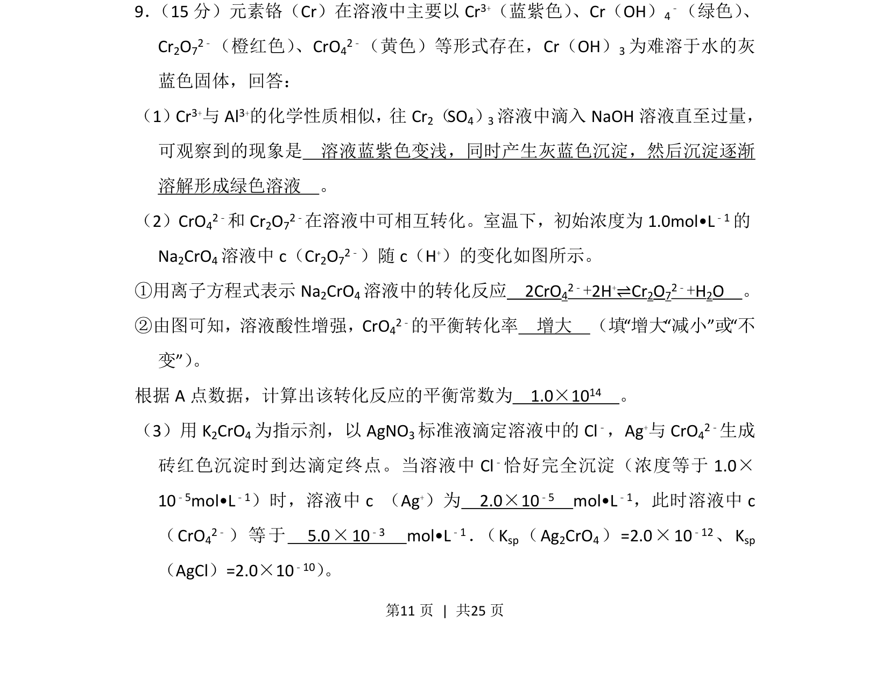
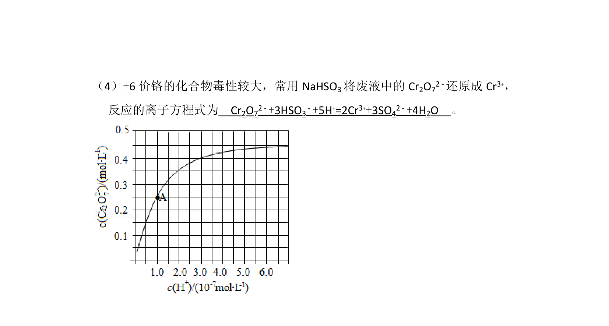
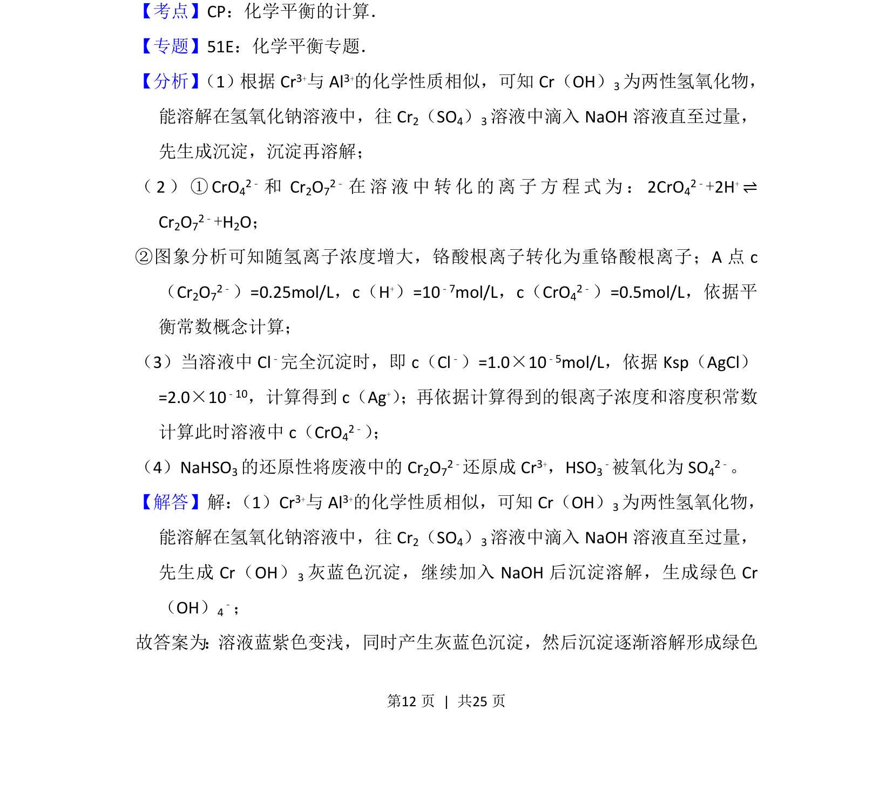
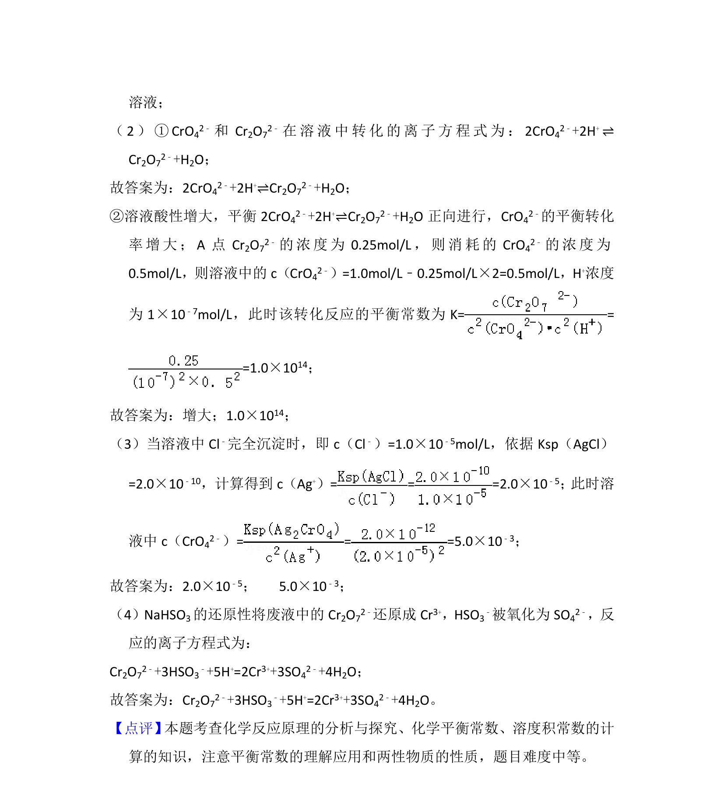

## 题面

## 摘要

以铬元素不同形态为背景，考查配合物转化、化学平衡及沉淀滴定相关计算。

## 关联考点

- [[配合物转化]]
- [[284-化学平衡|化学平衡]]
- [[342-化学平衡常数|平衡常数]]
- [[沉淀滴定]]
- [[762-溶度积|溶度积]]

## 答案与解析

> 📄 原 PDF 第 11 页：`素材/真题/湖南/2008-2024·（湖南）化学高考真题/2016年高考化学试卷（新课标Ⅰ）（解析卷）.pdf`
