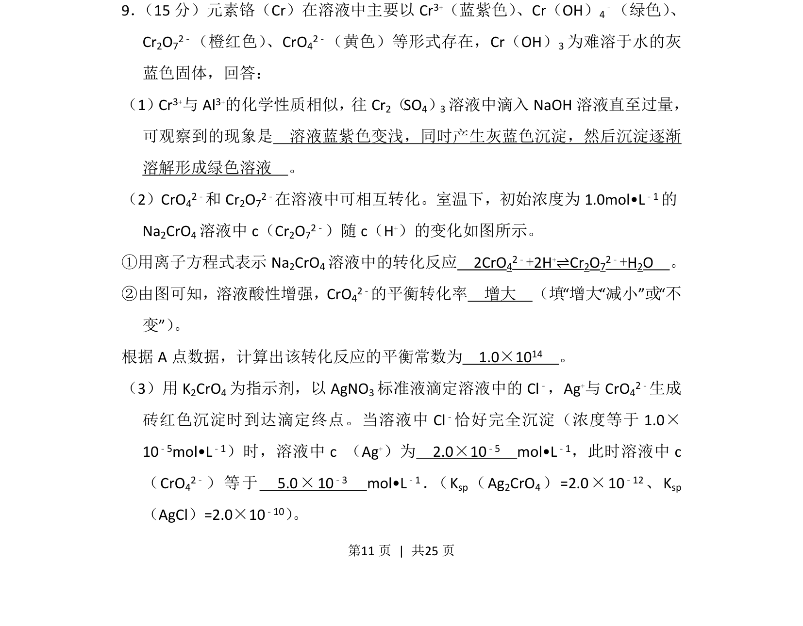
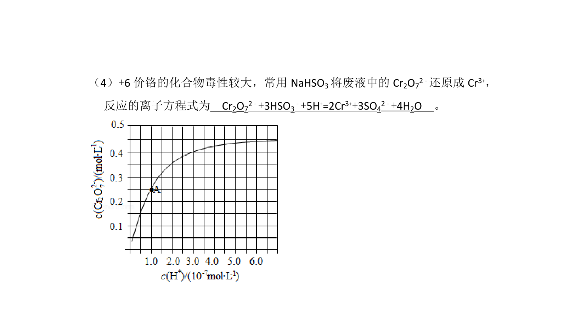
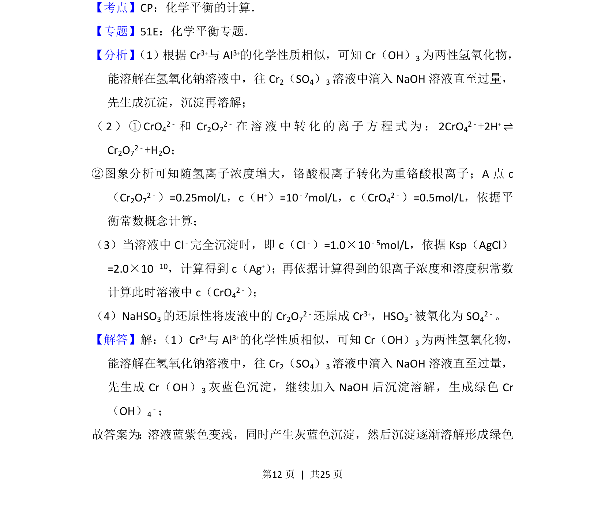
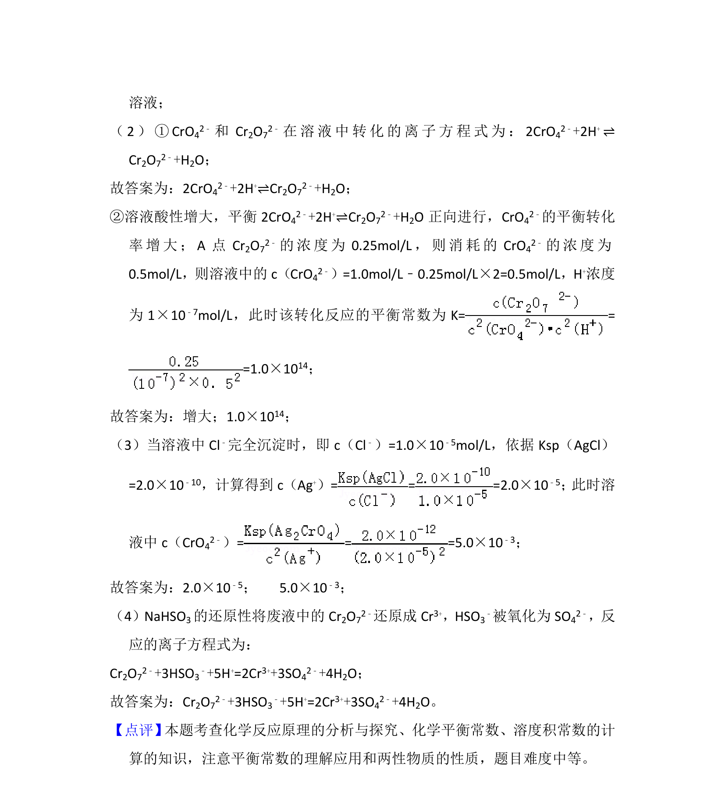

## 题面

## 摘要

以铬元素不同形态为背景，考查配合物转化、化学平衡及沉淀滴定相关计算。

## 关联考点

- [[配合物转化]]
- [[284-化学平衡|化学平衡]]
- [[342-化学平衡常数|平衡常数]]
- [[沉淀滴定]]
- [[762-溶度积|溶度积]]

## 答案与解析

> 📄 原 PDF 第 11 页：`素材/真题/湖南/2008-2024·（湖南）化学高考真题/2016年高考化学试卷（新课标Ⅰ）（解析卷）.pdf`

<!-- 题干文本-start -->
## 题干文本
9． （15分）元素铬（Cr）在溶液中主要以Cr3+（蓝紫色） 、Cr（OH）4
﹣（绿色） 、
Cr2O72﹣（橙红色） 、CrO42﹣（黄色）等形式存在，Cr（OH） 3为难溶于水的灰
蓝色固体，回答：
（1）Cr3+与Al 3+的化学性质相似，往Cr2（SO4）3溶液中滴入NaOH溶液直至过量，
可观察到的现象是　溶液蓝紫色变浅，同时产生灰蓝色沉淀，然后沉淀逐渐
溶解形成绿色溶液　。
（2）CrO42﹣和Cr 2O72﹣在溶液中可相互转化。室温下，初始浓度为1.0mol•L ﹣1的
Na2CrO4溶液中c（Cr 2O72﹣）随c（H +）的变化如图所示。
①用离子方程式表示Na 2CrO4溶液中的转化反应　2CrO42﹣+2H+⇌Cr2O72﹣+H2O　。
②由图可知，溶液酸性增强，CrO42﹣的平衡转化率　增大　（填“增大“减小”或“不
变”） 。
根据A点数据，计算出该转化反应的平衡常数为　1.0×10 14　。
（3）用K 2CrO4为指示剂，以AgNO 3标准液滴定溶液中的Cl ﹣，Ag+与CrO 42﹣生成
砖红色沉淀时到达滴定终点。当溶液中Cl ﹣恰好完全沉淀（浓度等于1.0×
10﹣5mol•L﹣1）时，溶液中c （Ag +）为　2.0×10﹣5　mol•L﹣1，此时溶液中c
（CrO 42﹣）等于　5.0×10 ﹣3　mol•L﹣1． （Ksp（Ag 2CrO4）=2.0×10 ﹣12、K sp
（AgCl）=2.0×10﹣10） 。
<!-- 题干文本-end -->

<!-- 解析文本-start -->
## 解析文本

<!-- 解析文本-end -->
