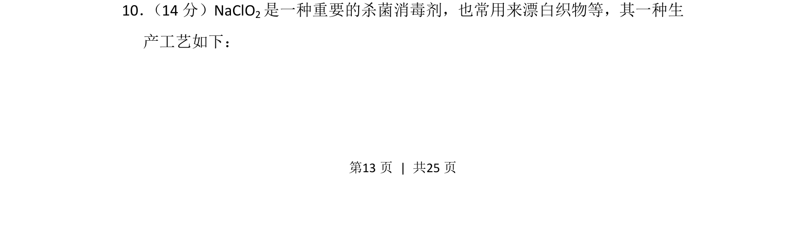
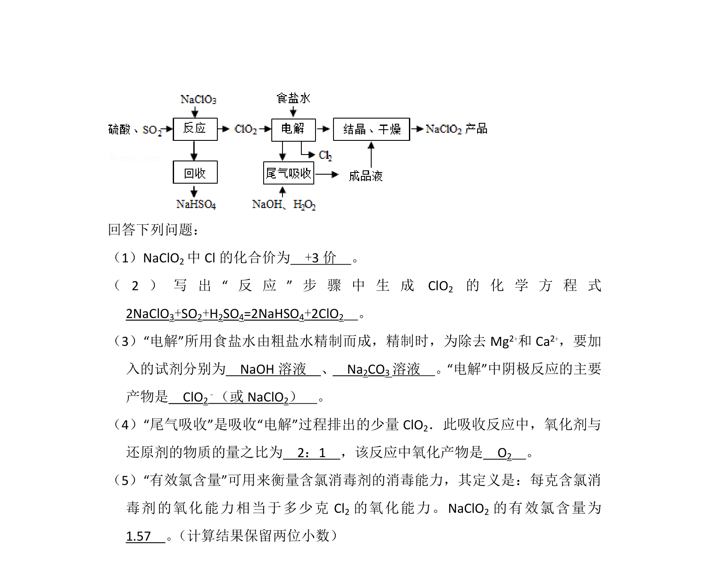
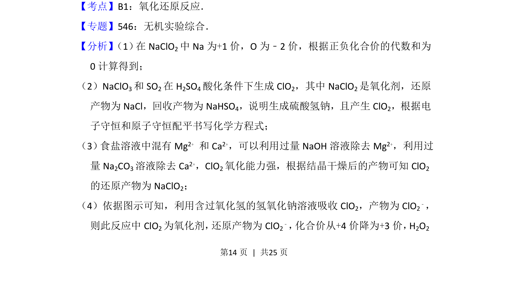
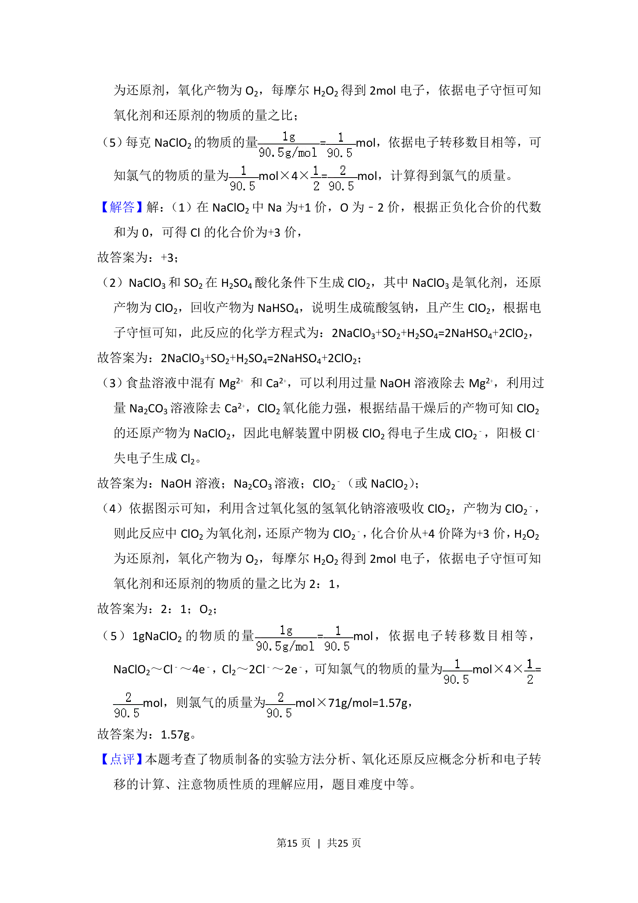
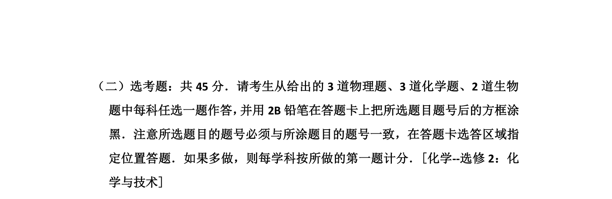

## 题面

## 摘要

该题考查 NaClO₂ 的生产工艺及其杀菌消毒、漂白应用。

## 关联考点

- [[氯的含氧酸盐]]
- [[679-工艺流程|工艺流程]]
- [[162-氧化还原反应|氧化还原反应]]
- [[物质性质与应用]]

## 答案与解析

> 📄 原 PDF 第 13 页：`素材/真题/湖南/2008-2024·（湖南）化学高考真题/2016年高考化学试卷（新课标Ⅰ）（解析卷）.pdf`
