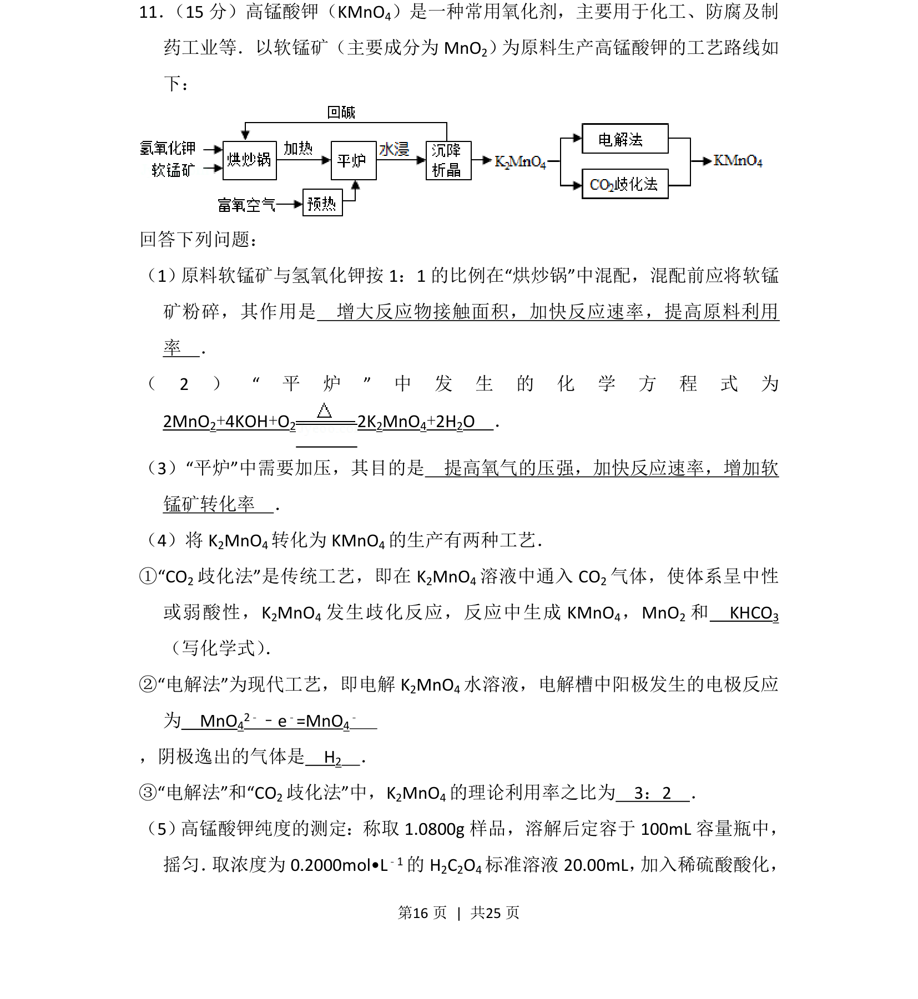
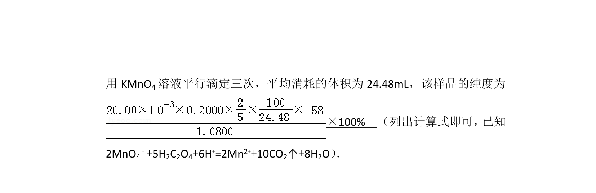
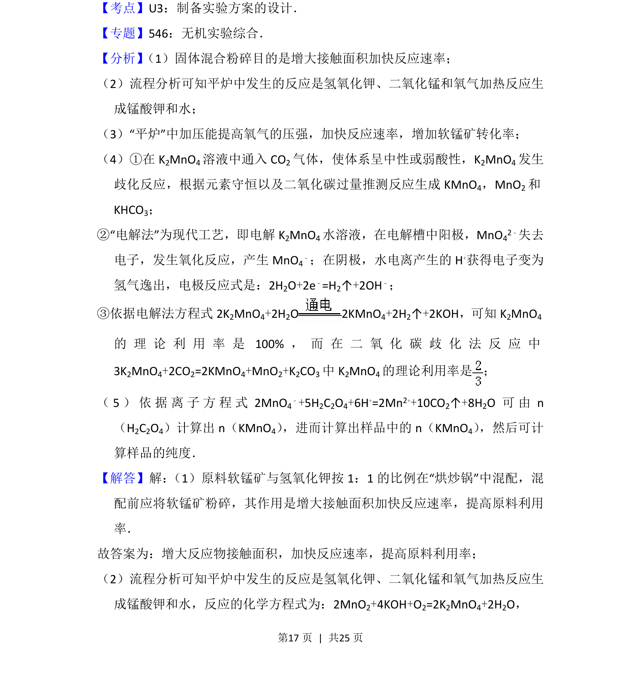
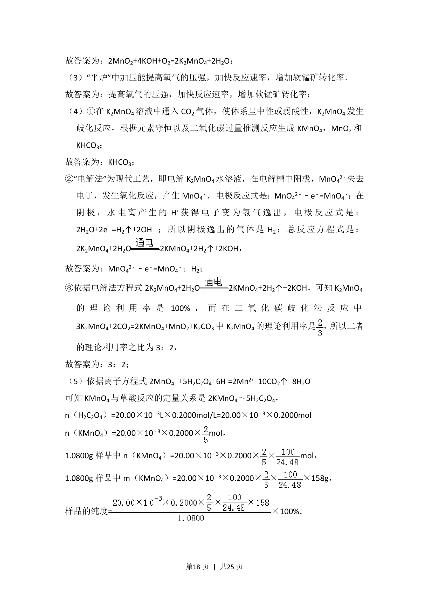
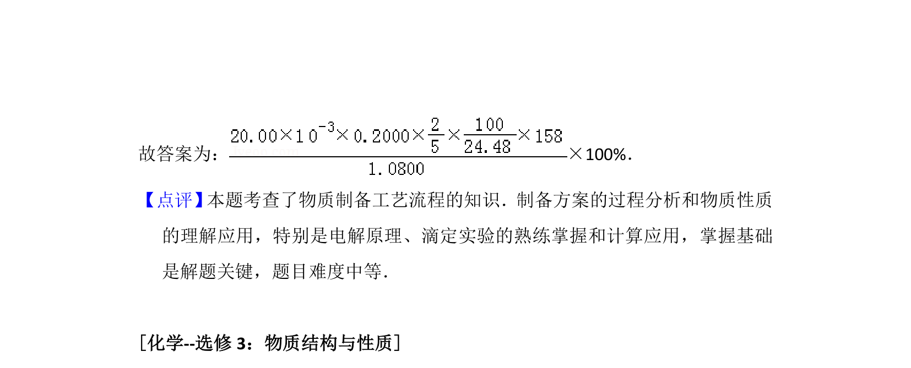

## 题面

## 摘要

以软锰矿为原料制备高锰酸钾的工艺流程，涉及反应速率调控、歧化法与电解法原理及纯度滴定分析。

## 关联考点

- [[534-反应速率影响因素|反应速率影响因素]]
- [[162-氧化还原反应|氧化还原反应]]
- [[电化学（电极反应）]]
- [[626-化学计算|化学计算]]

## 答案与解析

> 📄 原 PDF 第 16 页：`素材/真题/湖南/2008-2024·（湖南）化学高考真题/2016年高考化学试卷（新课标Ⅰ）（解析卷）.pdf`
