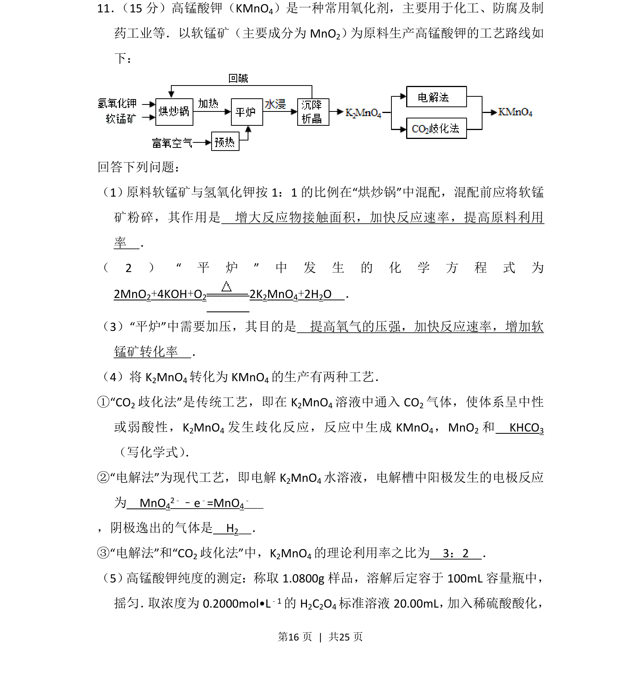
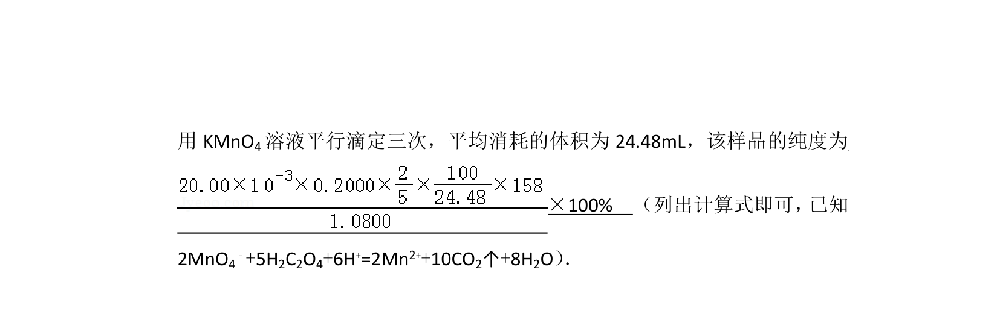
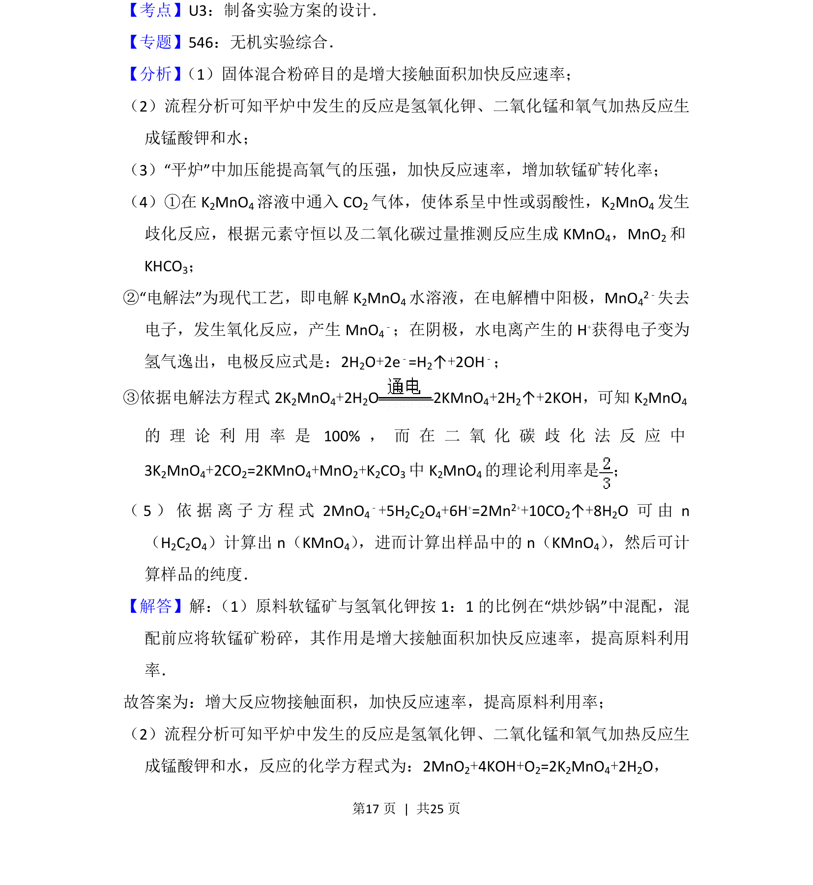
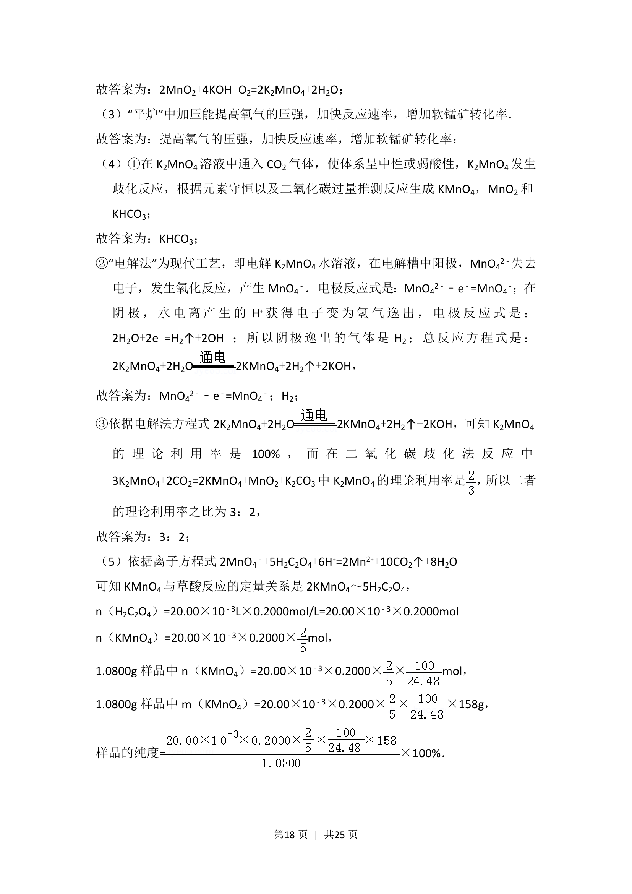
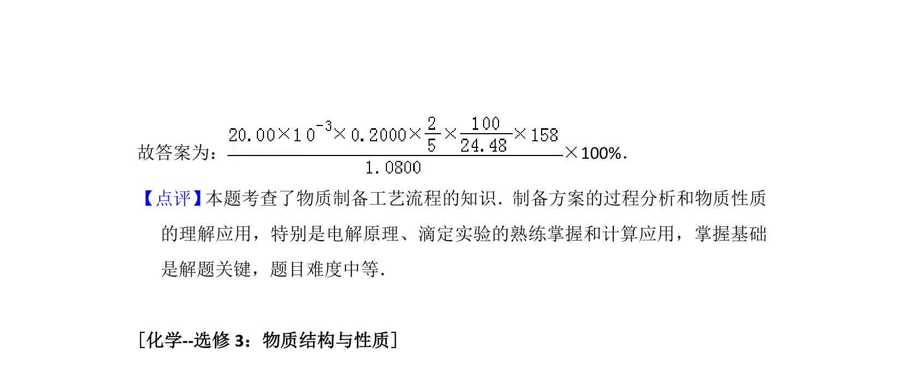

## 题面

## 摘要

以软锰矿为原料制备高锰酸钾的工艺流程，涉及反应速率调控、歧化法与电解法原理及纯度滴定分析。

## 关联考点

- [[534-反应速率影响因素|反应速率影响因素]]
- [[162-氧化还原反应|氧化还原反应]]
- [[电化学（电极反应）]]
- [[626-化学计算|化学计算]]

## 答案与解析

> 📄 原 PDF 第 16 页：`素材/真题/湖南/2008-2024·（湖南）化学高考真题/2016年高考化学试卷（新课标Ⅰ）（解析卷）.pdf`

<!-- 题干文本-start -->
## 题干文本
11． （15分）高锰酸钾（KMnO4）是一种常用氧化剂，主要用于化工、防腐及制
药工业等．以软锰矿（主要成分为MnO 2） 为原料生产高锰酸钾的工艺路线如
下：
回答下列问题：
（1） 原料软锰矿与氢氧化钾按1：1的比例在“烘炒锅”中混配，混配前应将软锰
矿粉碎，其作用是　增大反应物接触面积，加快反应速率，提高原料利用
率　．
（2）“平 炉”中 发 生 的 化 学 方 程 式 为 　
2MnO2+4KOH+O2 2K2MnO4+2H2O　．
（3）“平炉”中需要加压，其目的是　提高氧气的压强，加快反应速率，增加软
锰矿转化率　．
（4）将K 2MnO4转化为KMnO 4的生产有两种工艺．
①“CO2歧化法”是传统工艺，即在K 2MnO4溶液中通入CO 2气体，使体系呈中性
或弱酸性，K 2MnO4发生歧化反应，反应中生成KMnO 4，MnO2和　KHCO 3　
（写化学式） ．
②“电解法”为现代工艺，即电解K 2MnO4水溶液，电解槽中阳极发生的电极反应
为　MnO42﹣﹣e﹣=MnO4
﹣　
，阴极逸出的气体是　H2　．
③“电解法”和“CO2歧化法”中，K2MnO4的理论利用率之比为　3：2　．
（5） 高锰酸钾纯度的测定：称取1.0800g样品，溶解后定容于100mL容量瓶中，
摇匀． 取浓度为0.2000mol•L﹣1的H 2C2O4标准溶液20.00mL， 加入稀硫酸酸化，
<!-- 题干文本-end -->

<!-- 解析文本-start -->
## 解析文本

<!-- 解析文本-end -->
