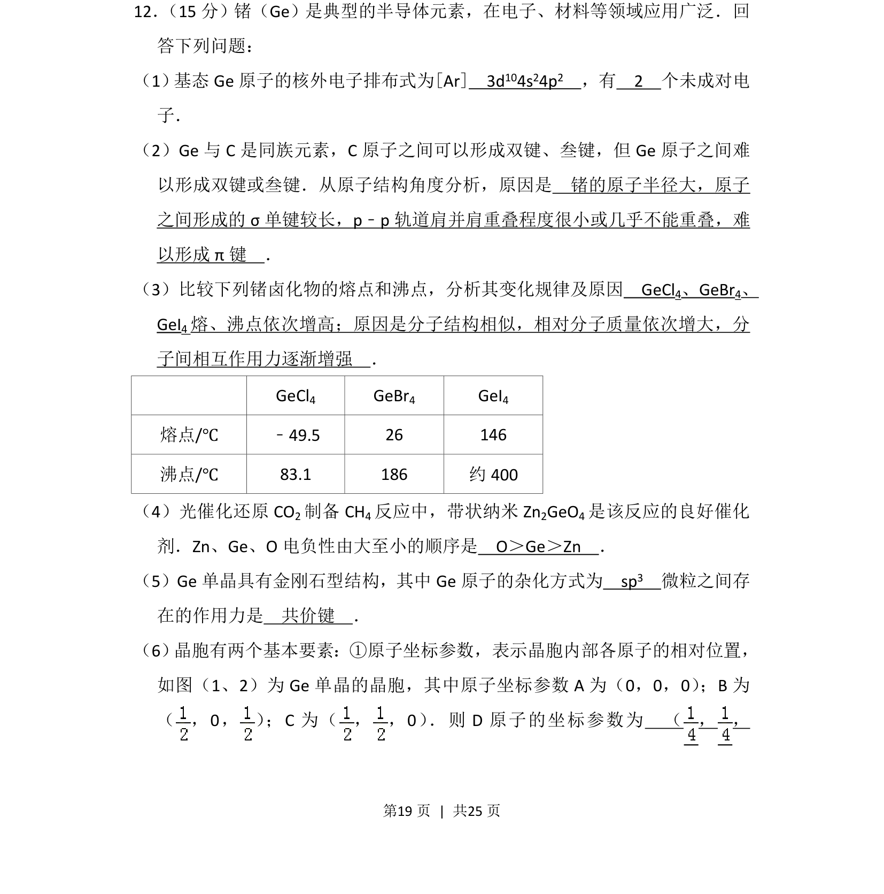
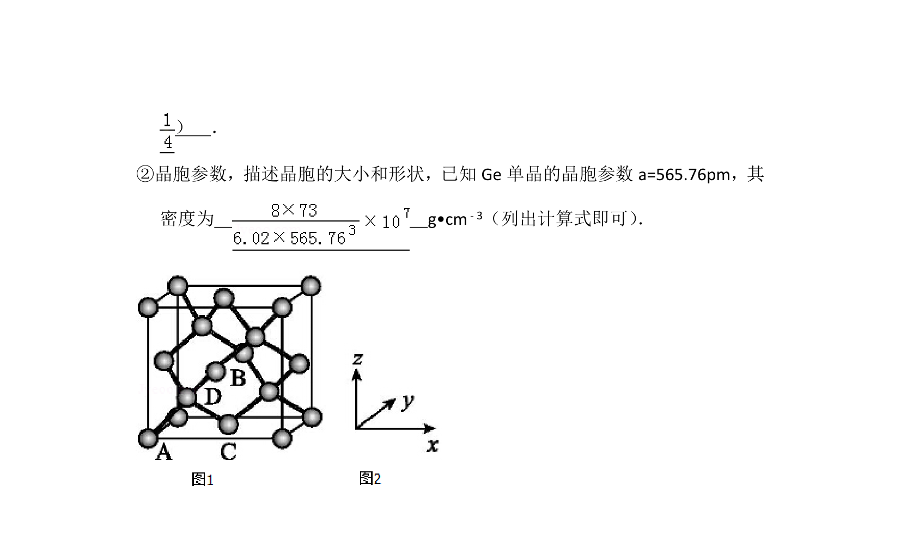
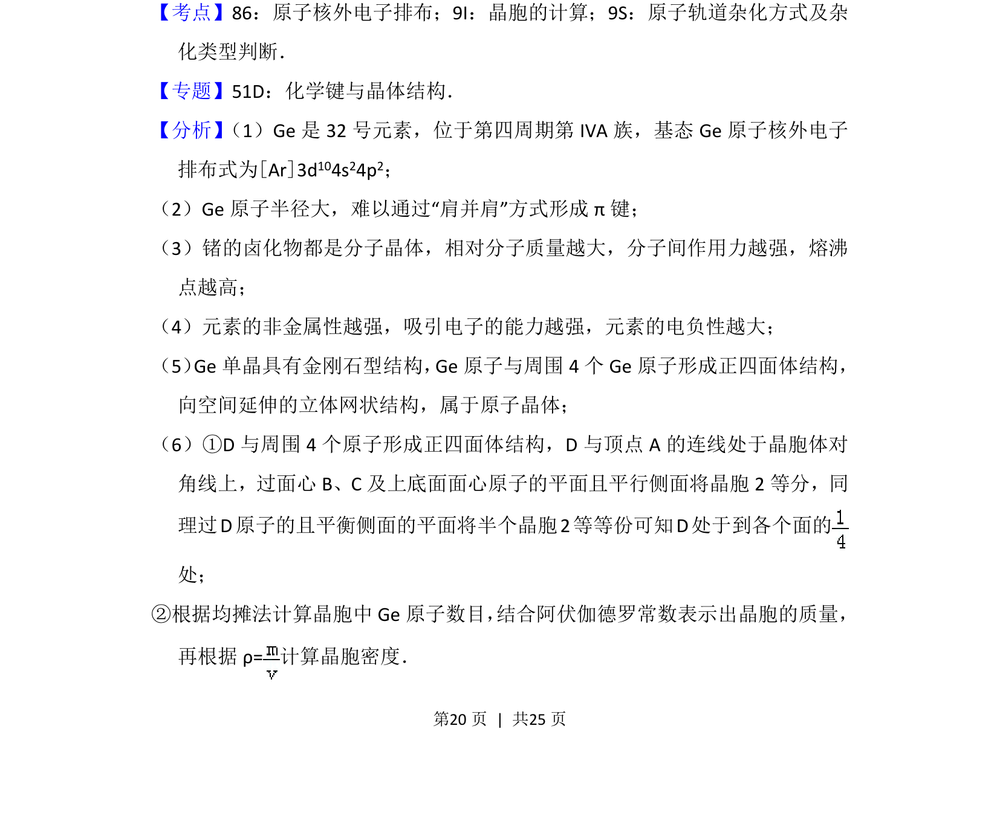
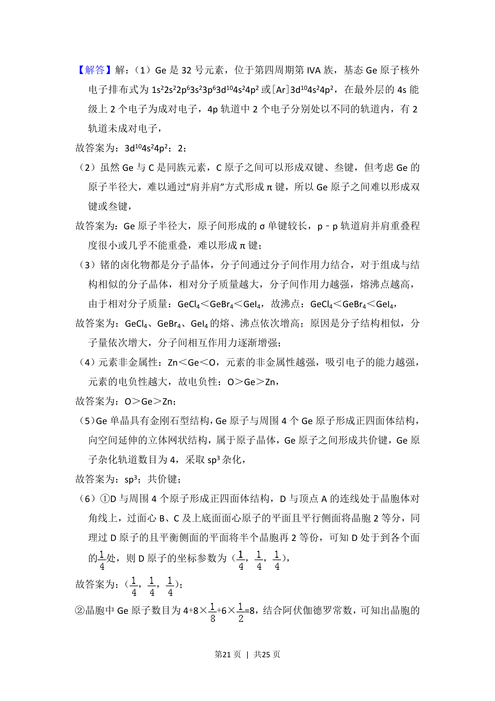
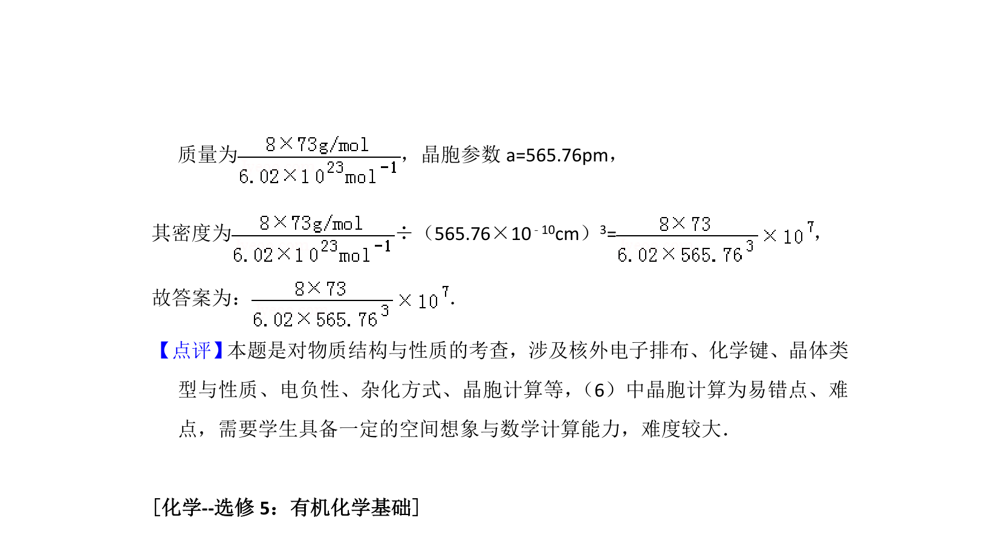

## 题面

## 摘要

本题以锗元素为载体，综合考查原子结构、分子性质、晶体结构及电负性等知识。

## 关联考点

- [[核外电子排布式]]
- [[原子结构与化学键]]
- [[分子间作用力与熔沸点]]
- [[391-电负性|电负性]]
- [[719-杂化方式|杂化方式]]
- [[晶胞原子坐标参数]]

## 答案与解析

> 📄 原 PDF 第 19 页：`素材/真题/湖南/2008-2024·（湖南）化学高考真题/2016年高考化学试卷（新课标Ⅰ）（解析卷）.pdf`
