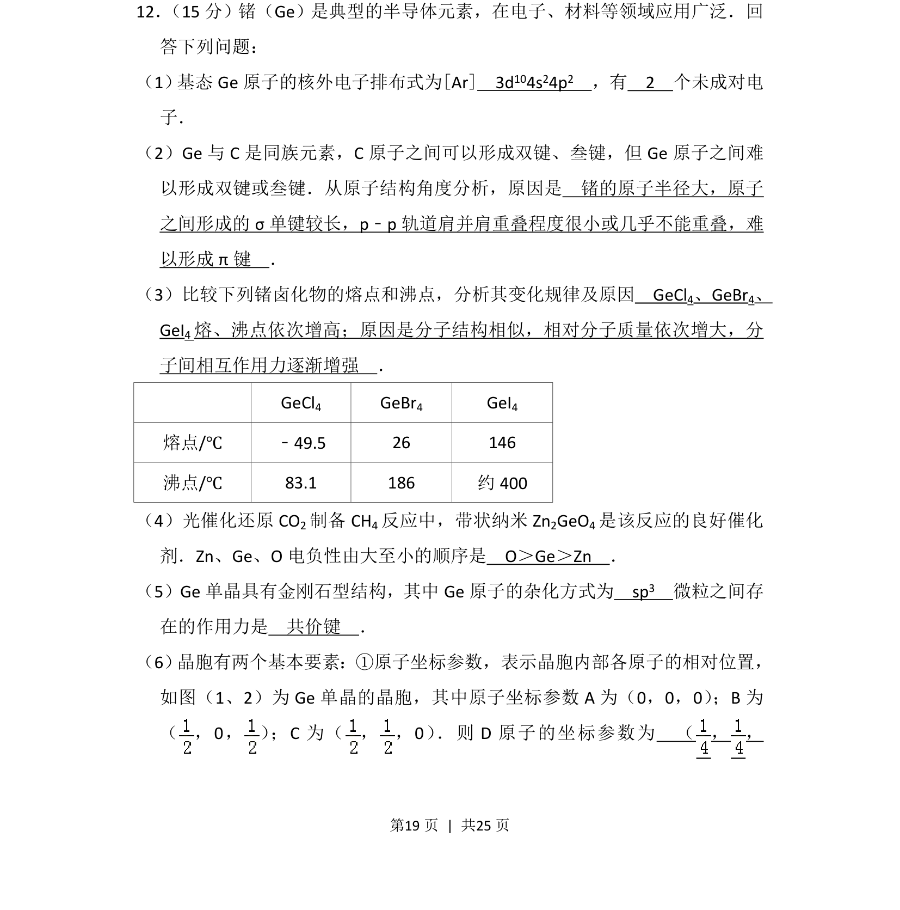
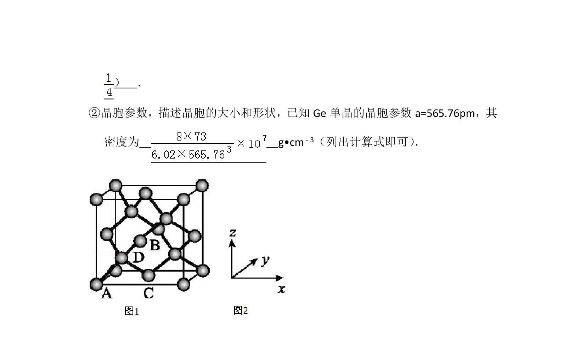
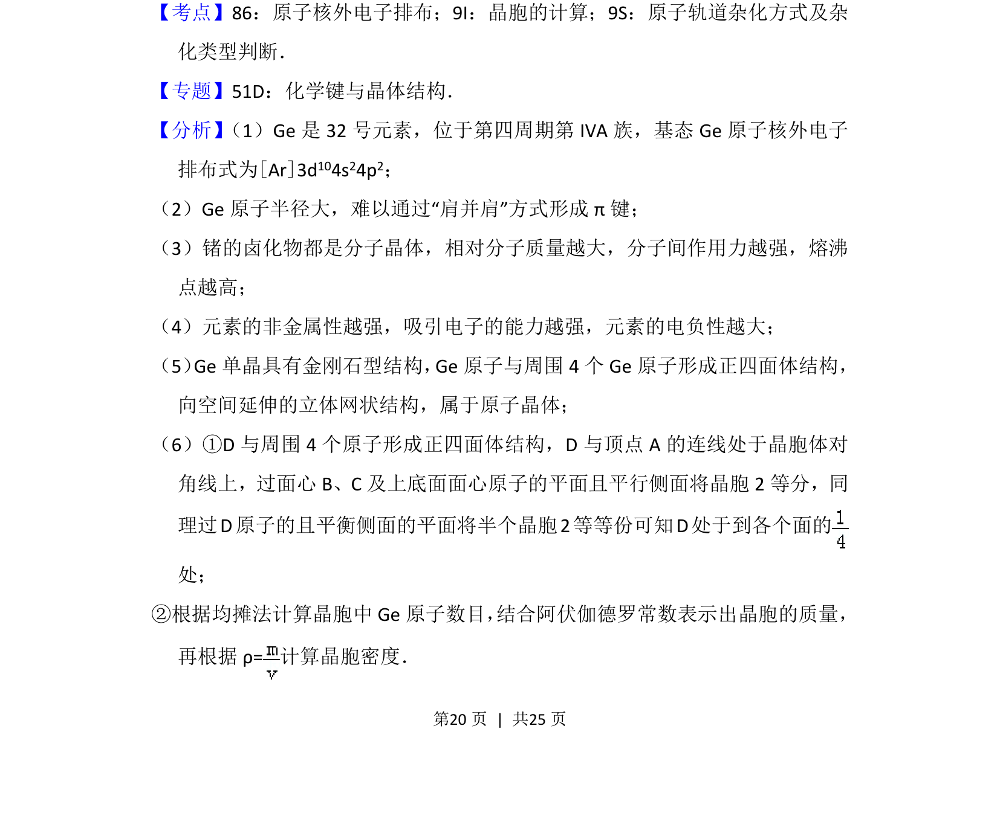
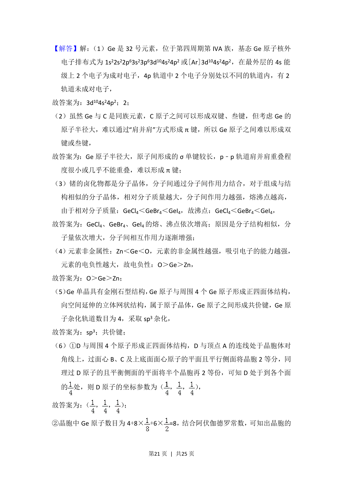
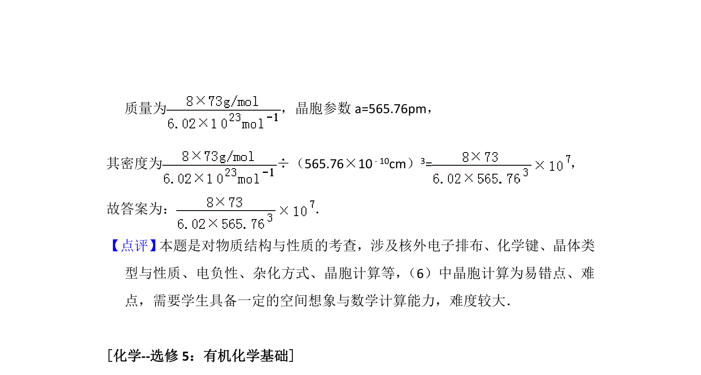

## 题面

## 摘要

本题以锗元素为载体，综合考查原子结构、分子性质、晶体结构及电负性等知识。

## 关联考点

- [[核外电子排布式]]
- [[原子结构与化学键]]
- [[分子间作用力与熔沸点]]
- [[391-电负性|电负性]]
- [[719-杂化方式|杂化方式]]
- [[晶胞原子坐标参数]]

## 答案与解析

> 📄 原 PDF 第 19 页：`素材/真题/湖南/2008-2024·（湖南）化学高考真题/2016年高考化学试卷（新课标Ⅰ）（解析卷）.pdf`

<!-- 题干文本-start -->
## 题干文本
12． （15分）锗（Ge）是典型的半导体元素，在电子、材料等领域应用广泛．回
答下列问题：
（1） 基态Ge原子的核外电子排布式为[Ar]　3d104s24p2　，有　2　个未成对电
子．
（2）Ge与C是同族元素，C原子之间可以形成双键、叁键，但Ge原子之间难
以形成双键或叁键．从原子结构角度分析，原因是　锗的原子半径大，原子
之间形成的σ单键较长，p﹣p轨道肩并肩重叠程度很小或几乎不能重叠，难
以形成π键　．
（3）比较下列锗卤化物的熔点和沸点，分析其变化规律及原因　GeCl4、GeBr4、
GeI4熔、沸点依次增高；原因是分子结构相似，相对分子质量依次增大，分
子间相互作用力逐渐增强　．
GeCl4 GeBr4 GeI4
熔点/℃ ﹣49.5 26 146
沸点/℃ 83.1 186 约400
（4）光催化还原CO 2制备CH 4反应中，带状纳米Zn 2GeO4是该反应的良好催化
剂．Zn、Ge、O电负性由大至小的顺序是　O＞Ge＞Zn　．
（5）Ge单晶具有金刚石型结构，其中Ge原子的杂化方式为　sp 3　微粒之间存
在的作用力是　共价键　．
（6） 晶胞有两个基本要素：①原子坐标参数，表示晶胞内部各原子的相对位置，
如图（1、2）为Ge单晶的晶胞，其中原子坐标参数A为（0，0，0） ；B为
（ ，0， ） ；C为（ ， ，0） ．则D原子的坐标参数为　（ ， ，
<!-- 题干文本-end -->

<!-- 解析文本-start -->
## 解析文本

<!-- 解析文本-end -->
