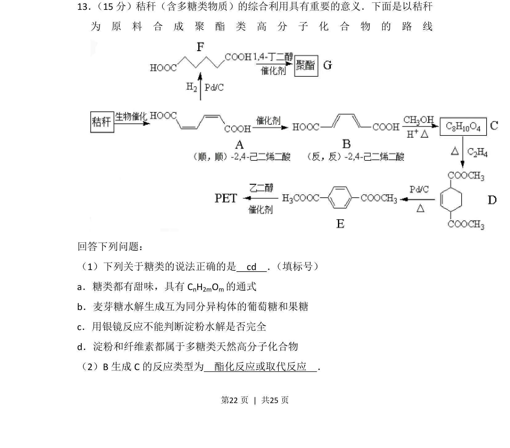
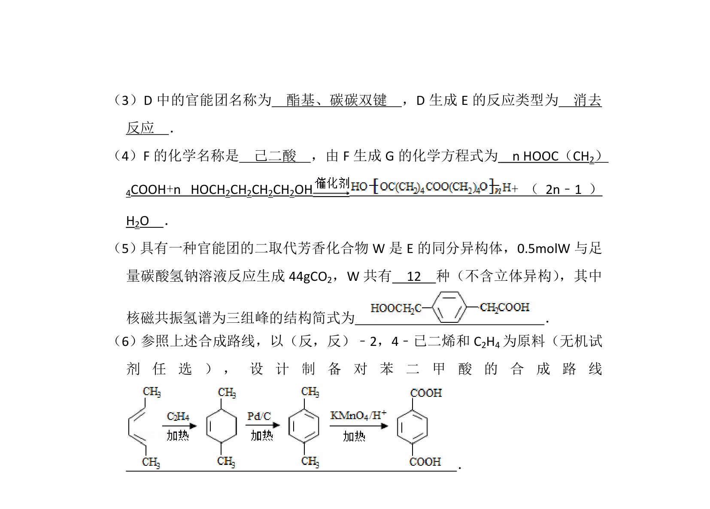
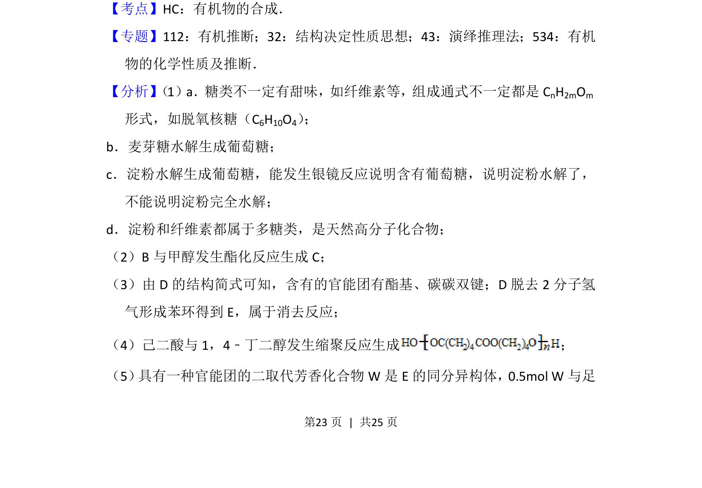
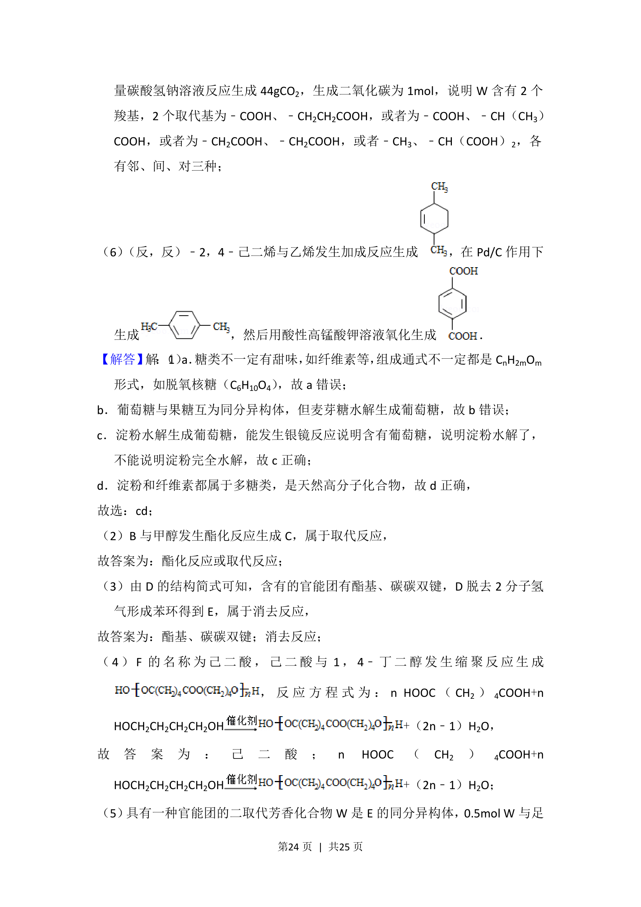
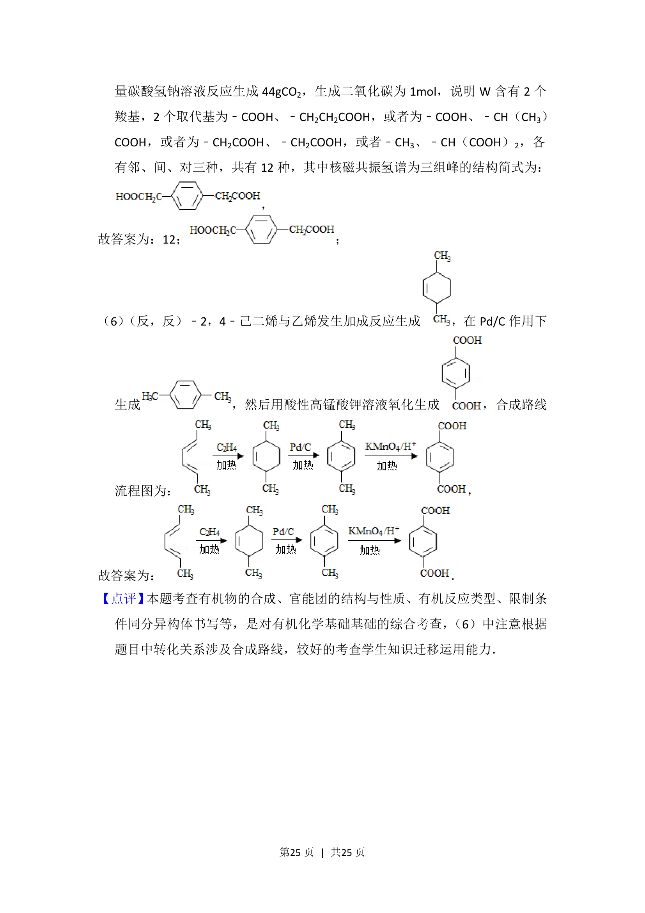

## 题面

## 摘要

一道以秸秆为原料合成聚酯的有机综合题，考查糖类基础知识与反应类型判断。

## 关联考点

- [[糖类的组成与性质]]
- [[508-多糖|多糖]]
- [[742-水解反应|水解反应]]
- [[250-酯化反应|酯化反应]]

## 答案与解析

> 📄 原 PDF 第 22 页：`素材/真题/湖南/2008-2024·（湖南）化学高考真题/2016年高考化学试卷（新课标Ⅰ）（解析卷）.pdf`
