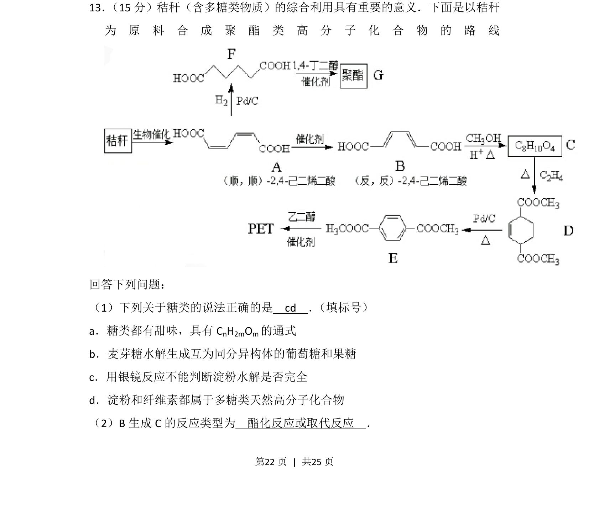
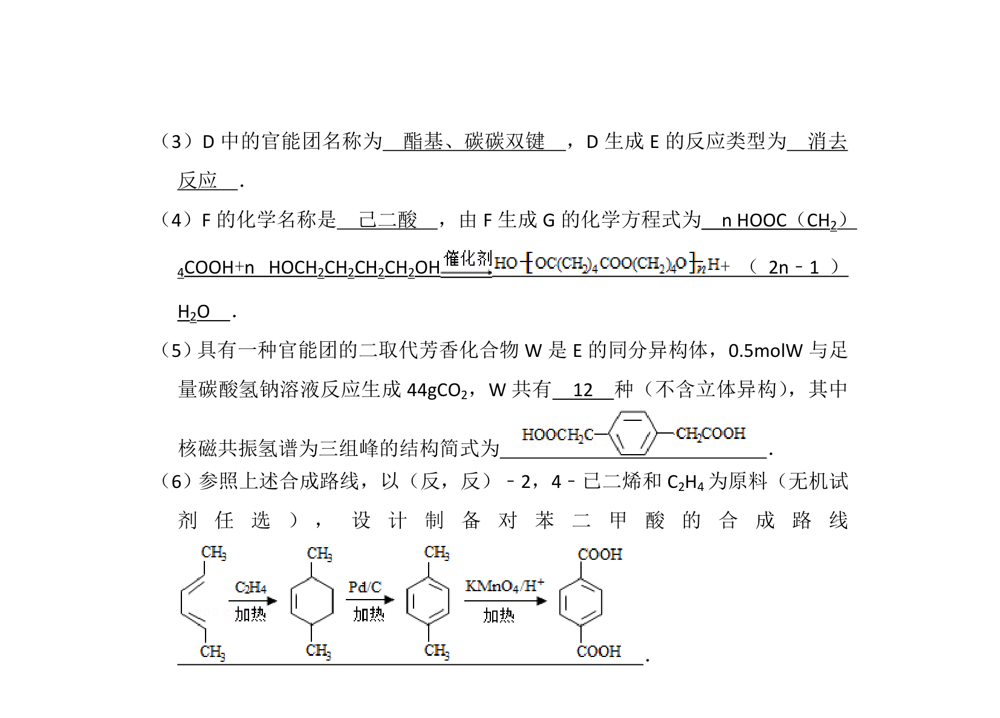
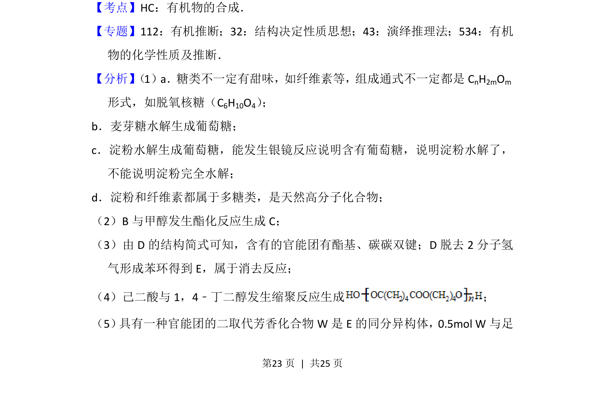
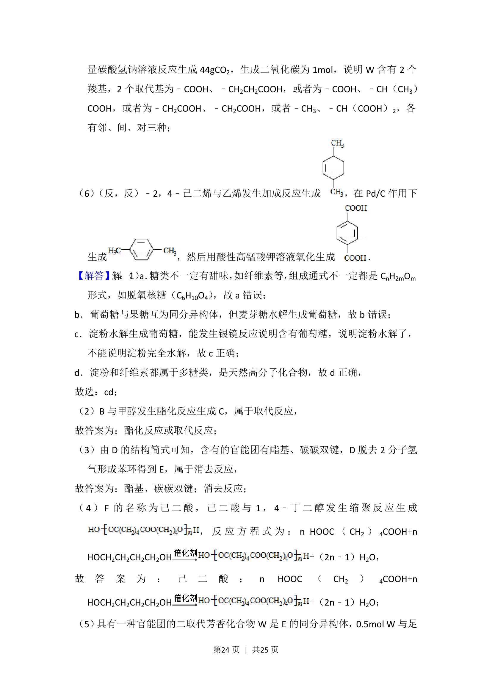
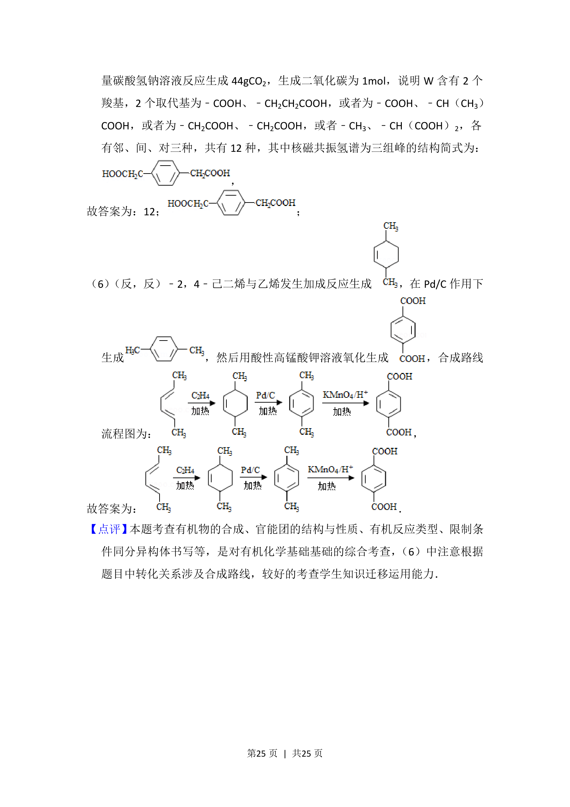

## 题面

## 摘要

一道以秸秆为原料合成聚酯的有机综合题，考查糖类基础知识与反应类型判断。

## 关联考点

- [[糖类的组成与性质]]
- [[508-多糖|多糖]]
- [[742-水解反应|水解反应]]
- [[250-酯化反应|酯化反应]]

## 答案与解析

> 📄 原 PDF 第 22 页：`素材/真题/湖南/2008-2024·（湖南）化学高考真题/2016年高考化学试卷（新课标Ⅰ）（解析卷）.pdf`

<!-- 题干文本-start -->
## 题干文本
13． （15分）秸秆（含多糖类物质）的综合利用具有重要的意义．下面是以秸秆
为 原 料 合 成 聚 酯 类 高 分 子 化 合 物 的 路 线
回答下列问题：
（1）下列关于糖类的说法正确的是　cd　． （填标号）
a．糖类都有甜味，具有C nH2mOm的通式
b．麦芽糖水解生成互为同分异构体的葡萄糖和果糖
c．用银镜反应不能判断淀粉水解是否完全
d．淀粉和纤维素都属于多糖类天然高分子化合物
（2）B生成C的反应类型为　酯化反应或取代反应　．
<!-- 题干文本-end -->

<!-- 解析文本-start -->
## 解析文本

<!-- 解析文本-end -->
