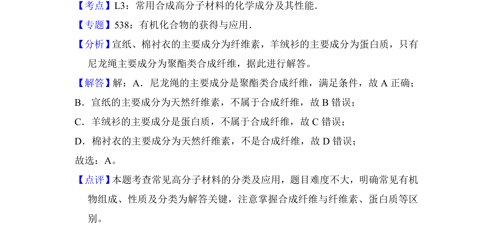

## 题面

## 摘要

该题考查常见生活用品的材料分类，区分合成纤维与天然高分子。

## 关联考点

- [[合成高分子材料]]
- [[514-纤维素|纤维素]]
- [[134-蛋白质|蛋白质]]

## 答案与解析

> 📄 原 PDF 第 1 页：`素材/真题/湖南/2008-2024·（湖南）化学高考真题/2017年高考化学试卷（新课标Ⅰ）（解析卷）.pdf`

<!-- 题干文本-start -->
## 题干文本
1．（6分）下列生活用品中主要由合成纤维制造的是（　　）
A．尼龙绳B．宣纸C．羊绒衫D．棉衬衣
<!-- 题干文本-end -->

<!-- 解析文本-start -->
## 解析文本
【考点】L3：常用合成高分子材料的化学成分及其性能．菁优网版权所有
【专题】538：有机化合物的获得与应用．
【分析】 宣纸、棉衬衣的主要成分为纤维素，羊绒衫的主要成分为蛋白质，只有
尼龙绳主要成分为聚酯类合成纤维，据此进行解答。
【解答】解：A．尼龙绳的主要成分是聚酯类合成纤维，满足条件，故A正确；
B．宣纸的主要成分为天然纤维素，不属于合成纤维，故B错误；
C．羊绒衫的主要成分是蛋白质，不属于合成纤维，故C错误；
D．棉衬衣的主要成分为天然纤维素，不是合成纤维，故D错误；
故选：A。
【点评】 本题考查常见高分子材料的分类及应用，题目难度不大，明确常见有机
物组成、性质及分类为解答关键，注意掌握合成纤维与纤维素、蛋白质等区
别。
<!-- 解析文本-end -->
