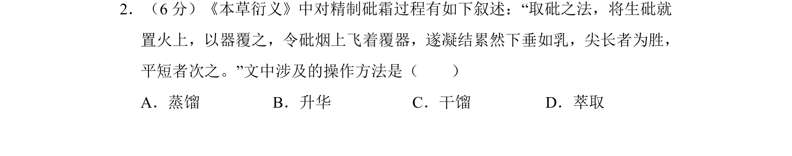
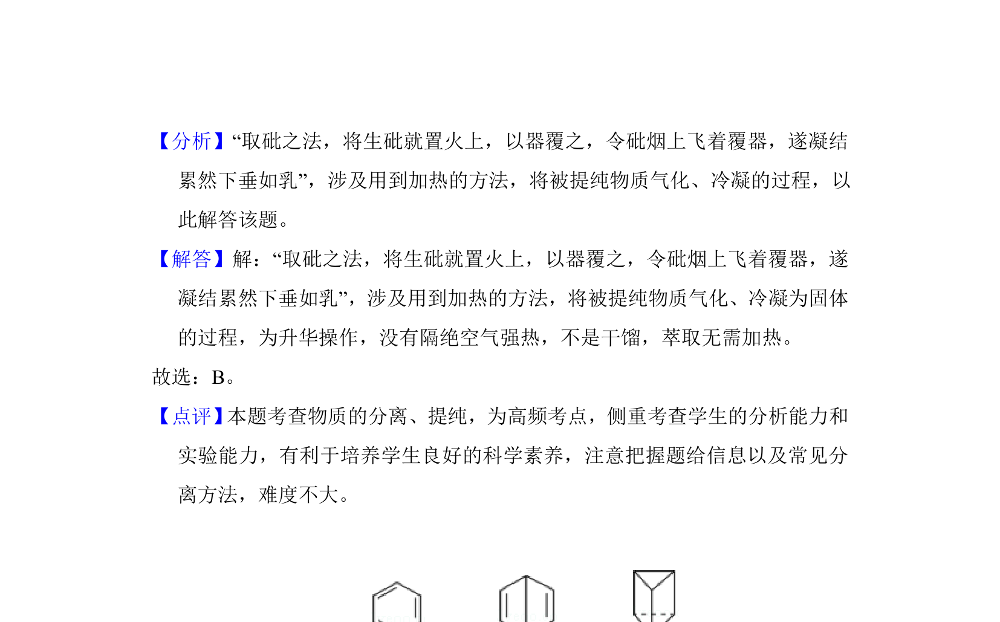

## 题面

## 摘要

本题考查古代文献中砒霜精制的操作原理，对应物质分离提纯方法。

## 关联考点

- [[升华]]
- [[773-物质分离提纯|物质分离提纯]]
- [[995-实验基本操作|实验基本操作]]

## 答案与解析

> 📄 原 PDF 第 1 页：`素材/真题/湖南/2008-2024·（湖南）化学高考真题/2017年高考化学试卷（新课标Ⅰ）（解析卷）.pdf`
