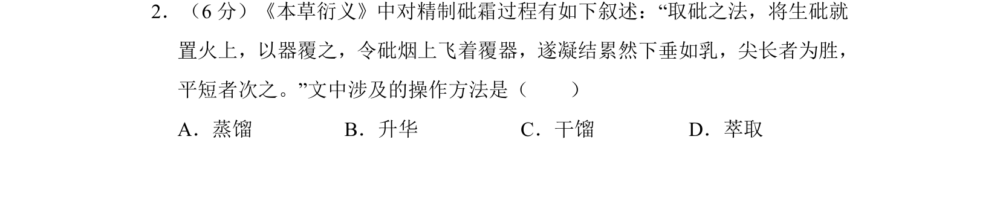
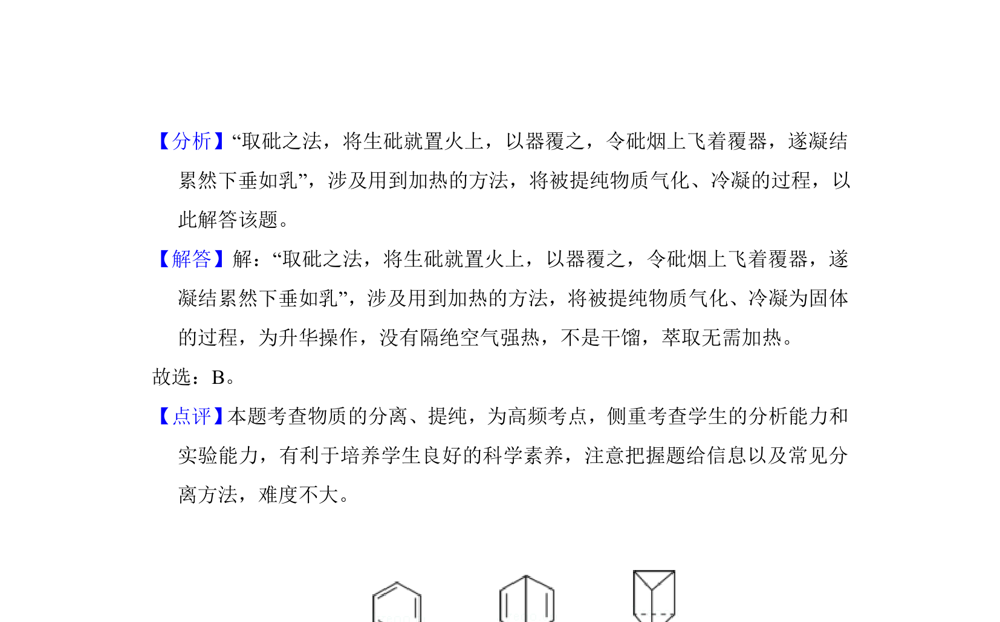

## 题面

## 摘要

本题考查古代文献中砒霜精制的操作原理，对应物质分离提纯方法。

## 关联考点

- [[升华]]
- [[773-物质分离提纯|物质分离提纯]]
- [[995-实验基本操作|实验基本操作]]

## 答案与解析

> 📄 原 PDF 第 1 页：`素材/真题/湖南/2008-2024·（湖南）化学高考真题/2017年高考化学试卷（新课标Ⅰ）（解析卷）.pdf`

<!-- 题干文本-start -->
## 题干文本
2．（6分）《本草衍义》中对精制砒霜过程有如下叙述：“取砒之法，将生砒就
置火上，以器覆之，令砒烟上飞着覆器，遂凝结累然下垂如乳，尖长者为胜，
平短者次之。”文中涉及的操作方法是（　　）
A．蒸馏B．升华C．干馏D．萃取
<!-- 题干文本-end -->

<!-- 解析文本-start -->
## 解析文本
【考点】P9：物质的分离、提纯的基本方法选择与应用．菁优网版权所有
【专题】545：物质的分离提纯和鉴别．
<!-- 解析文本-end -->
