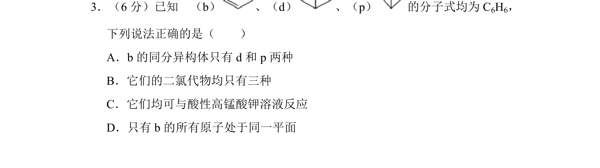
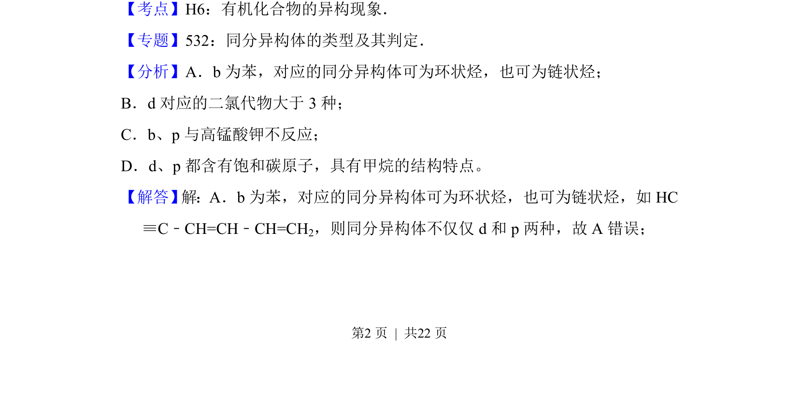
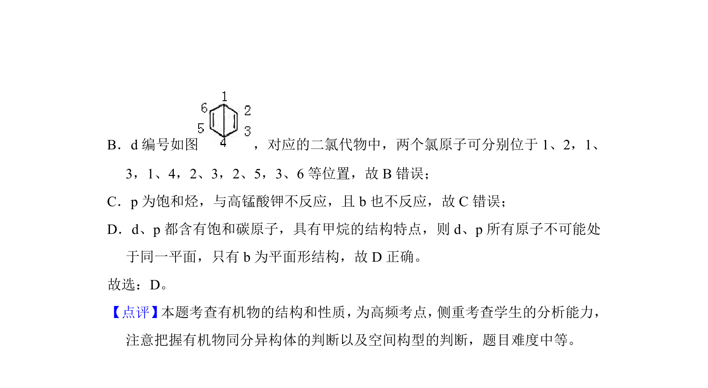

## 题面

## 摘要

考查苯及其同分异构体的结构、二氯代物数目、与酸性高锰酸钾反应及原子共面。

## 关联考点

- [[447-同分异构现象|同分异构现象]]
- [[二氯代物数目]]
- [[529-原子共面|原子共面]]
- [[1003-苯的同系物性质|苯的同系物性质]]

## 答案与解析

> 📄 原 PDF 第 2 页：`素材/真题/湖南/2008-2024·（湖南）化学高考真题/2017年高考化学试卷（新课标Ⅰ）（解析卷）.pdf`
