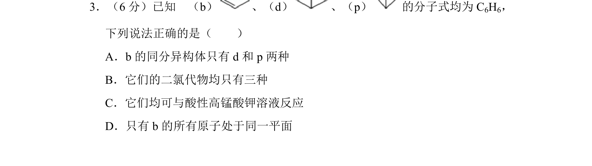
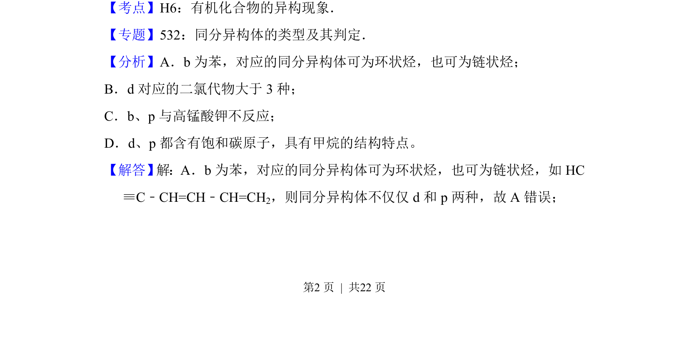
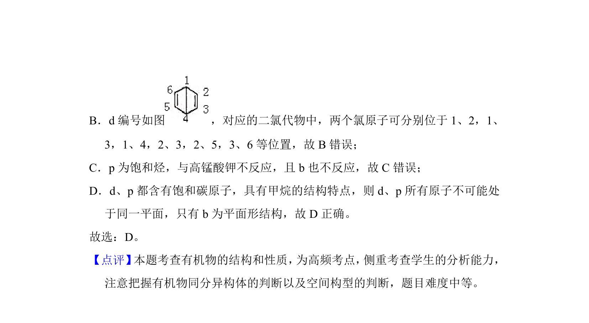

## 题面

## 摘要

考查苯及其同分异构体的结构、二氯代物数目、与酸性高锰酸钾反应及原子共面。

## 关联考点

- [[447-同分异构现象|同分异构现象]]
- [[二氯代物数目]]
- [[529-原子共面|原子共面]]
- [[1003-苯的同系物性质|苯的同系物性质]]

## 答案与解析

> 📄 原 PDF 第 2 页：`素材/真题/湖南/2008-2024·（湖南）化学高考真题/2017年高考化学试卷（新课标Ⅰ）（解析卷）.pdf`

<!-- 题干文本-start -->
## 题干文本
3．（6分）已知  （b） 、（d） 、（p） 的分子式均为C 6H6，
下列说法正确的是（　　）
A．b的同分异构体只有d和p两种
B．它们的二氯代物均只有三种
C．它们均可与酸性高锰酸钾溶液反应
D．只有b的所有原子处于同一平面
<!-- 题干文本-end -->

<!-- 解析文本-start -->
## 解析文本
【考点】H6：有机化合物的异构现象．菁优网版权所有
【专题】532：同分异构体的类型及其判定．
【分析】A．b为苯，对应的同分异构体可为环状烃，也可为链状烃；
B．d对应的二氯代物大于3种；
C．b、p与高锰酸钾不反应；
D．d、p都含有饱和碳原子，具有甲烷的结构特点。
【解答】 解：A．b为苯，对应的同分异构体可为环状烃，也可为链状烃，如HC
≡C﹣CH=CH﹣CH=CH2，则同分异构体不仅仅d和p两种，故A错误；
<!-- 解析文本-end -->
